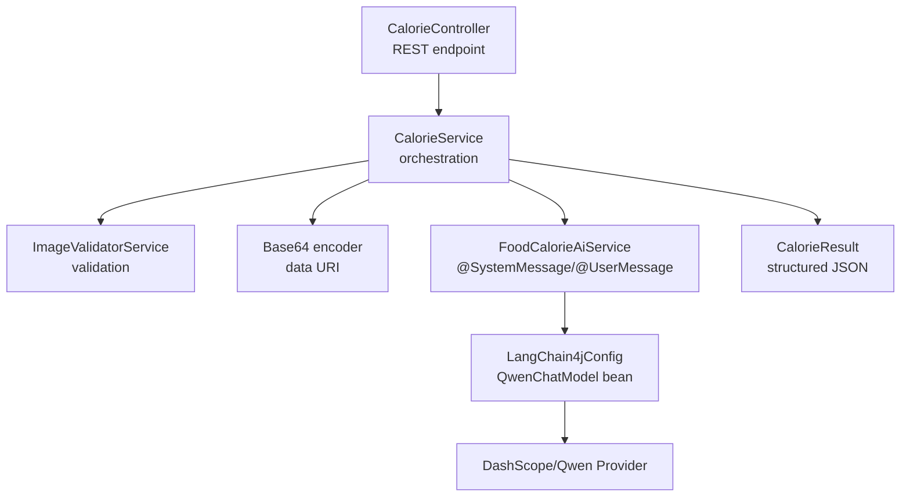
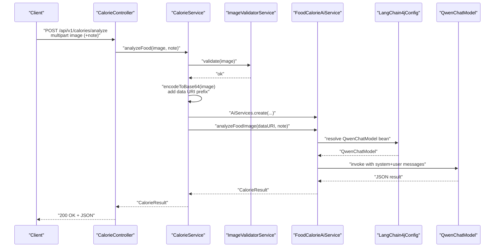
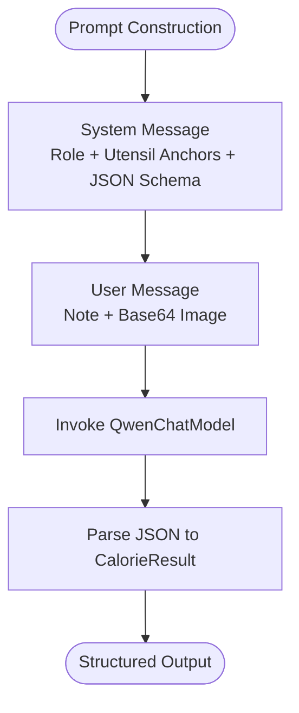
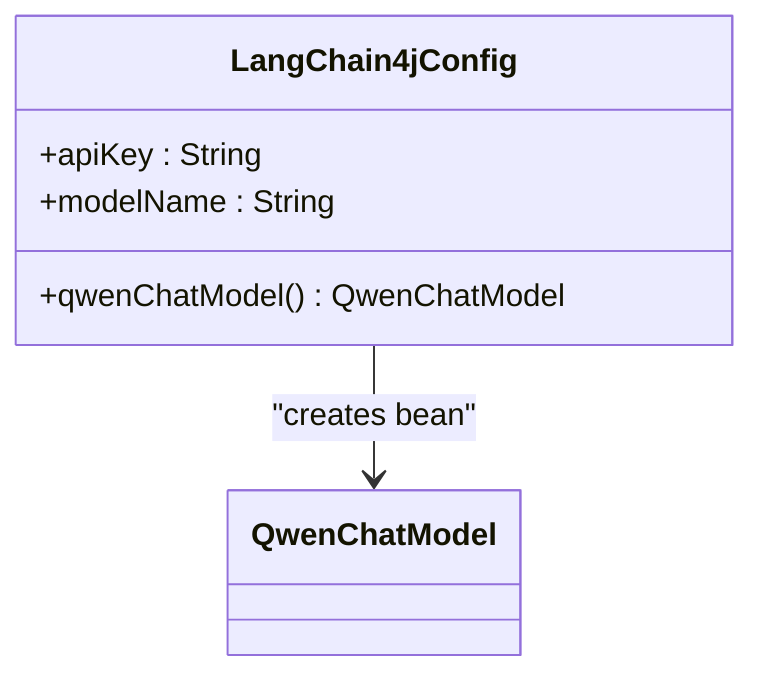
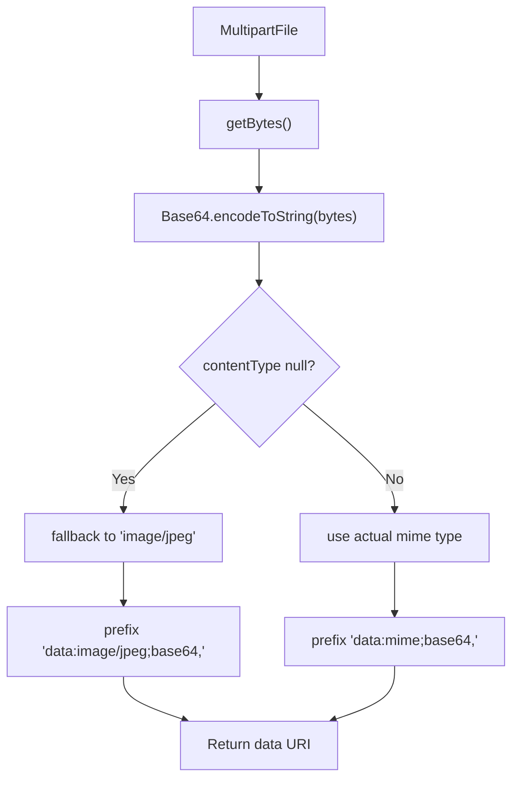
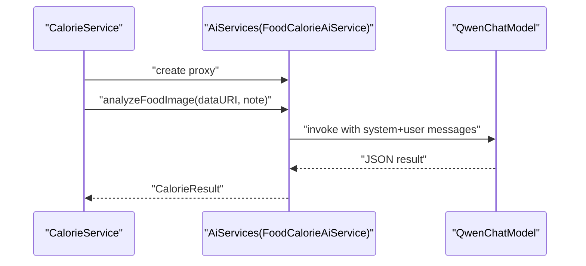
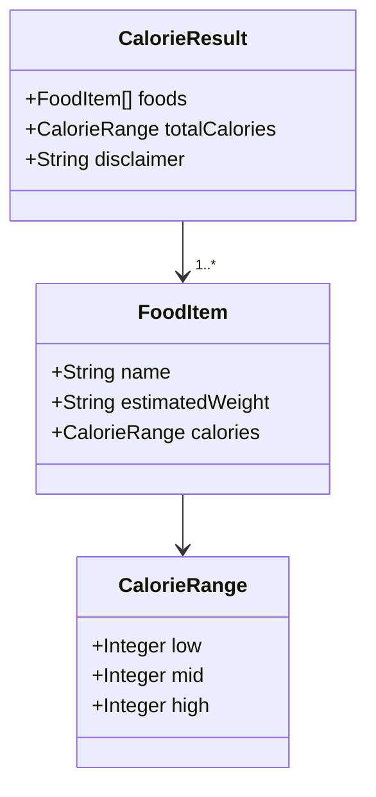
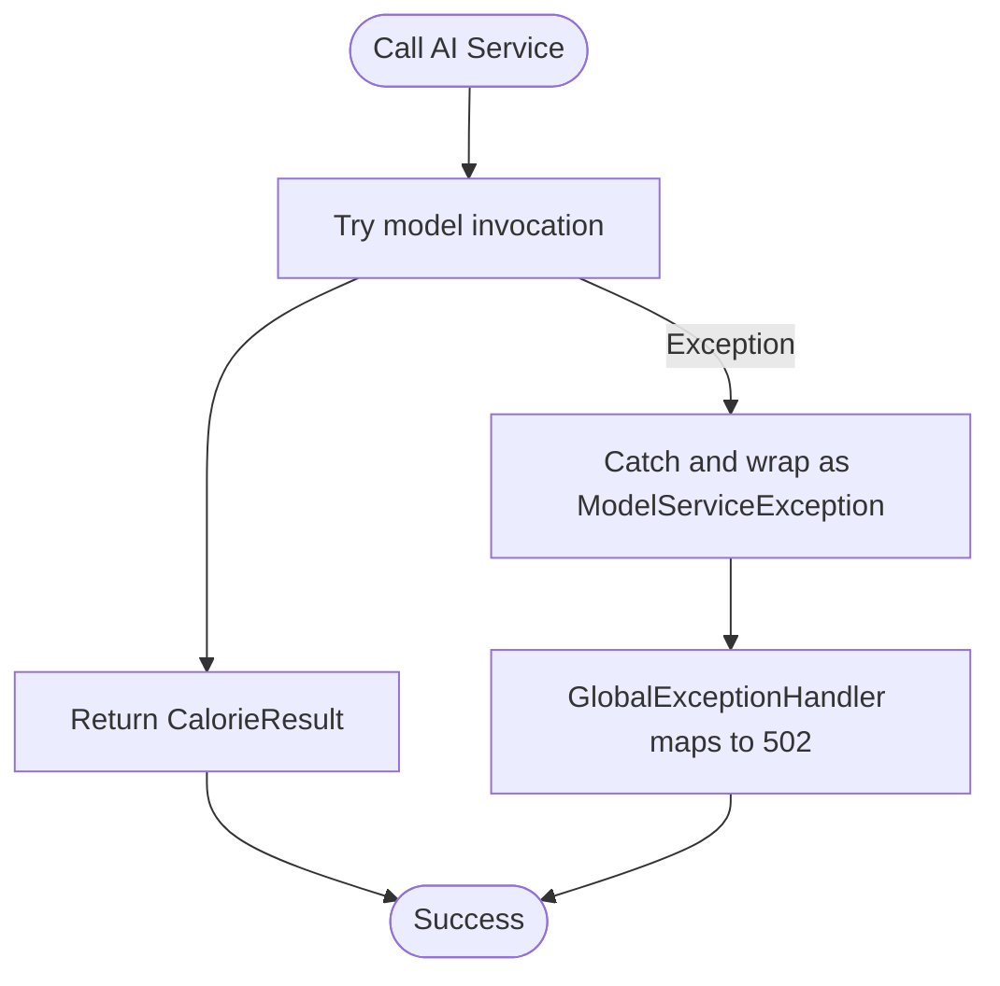
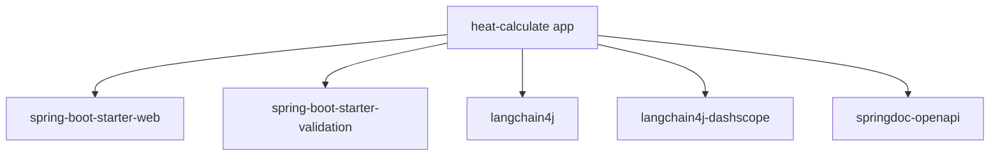

# AI Integration

<cite>
**Referenced Files in This Document**
- [FoodCalorieAiService.java](file://src/main/java/com/example/heatcalculate/ai/FoodCalorieAiService.java)
- [LangChain4jConfig.java](file://src/main/java/com/example/heatcalculate/config/LangChain4jConfig.java)
- [CalorieController.java](file://src/main/java/com/example/heatcalculate/controller/CalorieController.java)
- [CalorieService.java](file://src/main/java/com/example/heatcalculate/service/CalorieService.java)
- [ImageValidatorService.java](file://src/main/java/com/example/heatcalculate/service/ImageValidatorService.java)
- [application.yml](file://src/main/resources/application.yml)
- [CalorieResult.java](file://src/main/java/com/example/heatcalculate/model/CalorieResult.java)
- [FoodItem.java](file://src/main/java/com/example/heatcalculate/model/FoodItem.java)
- [CalorieRange.java](file://src/main/java/com/example/heatcalculate/model/CalorieRange.java)
- [GlobalExceptionHandler.java](file://src/main/java/com/example/heatcalculate/exception/GlobalExceptionHandler.java)
- [ModelServiceException.java](file://src/main/java/com/example/heatcalculate/exception/ModelServiceException.java)
- [ImageValidationException.java](file://src/main/java/com/example/heatcalculate/exception/ImageValidationException.java)
- [ModelParseException.java](file://src/main/java/com/example/heatcalculate/exception/ModelParseException.java)
- [pom.xml](file://pom.xml)
</cite>

## Table of Contents
1. [Introduction](#introduction)
2. [Project Structure](#project-structure)
3. [Core Components](#core-components)
4. [Architecture Overview](#architecture-overview)
5. [Detailed Component Analysis](#detailed-component-analysis)
6. [Dependency Analysis](#dependency-analysis)
7. [Performance Considerations](#performance-considerations)
8. [Troubleshooting Guide](#troubleshooting-guide)
9. [Conclusion](#conclusion)

## Introduction
This document explains the AI integration built on the LangChain4j framework and the Tongyi Qianwen-VL (Qwen Vision-Language) model. It covers the AI service architecture, prompt engineering strategy with utensil anchors, image encoding to Base64 data URIs, model configuration and API key management, response processing, error handling, and operational guidance including performance, rate limiting, and cost optimization.

## Project Structure
The AI integration spans a small set of focused components:
- AI service interface and prompts
- LangChain4j configuration for the DashScope/Tongyi provider
- Controller exposing the public API endpoint
- Service orchestrating validation, encoding, and model invocation
- Model classes representing structured results
- Exception handling and global error mapping
- Application configuration for API keys and limits

**Diagram sources**
- [CalorieController.java:81-94](file://src/main/java/com/example/heatcalculate/controller/CalorieController.java#L81-L94)
- [CalorieService.java:40-69](file://src/main/java/com/example/heatcalculate/service/CalorieService.java#L40-L69)
- [FoodCalorieAiService.java:14-57](file://src/main/java/com/example/heatcalculate/ai/FoodCalorieAiService.java#L14-L57)
- [LangChain4jConfig.java:23-29](file://src/main/java/com/example/heatcalculate/config/LangChain4jConfig.java#L23-L29)
- [application.yml:11-14](file://src/main/resources/application.yml#L11-L14)

**Section sources**
- [CalorieController.java:22-96](file://src/main/java/com/example/heatcalculate/controller/CalorieController.java#L22-L96)
- [CalorieService.java:20-85](file://src/main/java/com/example/heatcalculate/service/CalorieService.java#L20-L85)
- [FoodCalorieAiService.java:8-58](file://src/main/java/com/example/heatcalculate/ai/FoodCalorieAiService.java#L8-L58)
- [LangChain4jConfig.java:8-31](file://src/main/java/com/example/heatcalculate/config/LangChain4jConfig.java#L8-L31)
- [application.yml:1-21](file://src/main/resources/application.yml#L1-L21)

## Core Components
- FoodCalorieAiService: Declares the AI contract with system and user messages, including a JSON schema requirement and utensil anchors for portion estimation.
- LangChain4jConfig: Creates a QwenChatModel bean wired to the DashScope provider using configured API key and model name.
- CalorieService: Orchestrates image validation, Base64 encoding with data URI scheme, AI service proxy creation, and invocation.
- CalorieController: Exposes a multipart/form-data endpoint to accept images and optional notes, returning structured results.
- Model classes: CalorieResult, FoodItem, and CalorieRange define the shape of the AI-generated JSON response.
- Exception handling: Centralized mapping of domain exceptions to HTTP responses.

**Section sources**
- [FoodCalorieAiService.java:12-58](file://src/main/java/com/example/heatcalculate/ai/FoodCalorieAiService.java#L12-L58)
- [LangChain4jConfig.java:14-29](file://src/main/java/com/example/heatcalculate/config/LangChain4jConfig.java#L14-L29)
- [CalorieService.java:40-83](file://src/main/java/com/example/heatcalculate/service/CalorieService.java#L40-L83)
- [CalorieController.java:81-94](file://src/main/java/com/example/heatcalculate/controller/CalorieController.java#L81-L94)
- [CalorieResult.java:10-57](file://src/main/java/com/example/heatcalculate/model/CalorieResult.java#L10-L57)
- [FoodItem.java:8-54](file://src/main/java/com/example/heatcalculate/model/FoodItem.java#L8-L54)
- [CalorieRange.java:8-54](file://src/main/java/com/example/heatcalculate/model/CalorieRange.java#L8-L54)
- [GlobalExceptionHandler.java:19-61](file://src/main/java/com/example/heatcalculate/exception/GlobalExceptionHandler.java#L19-L61)

## Architecture Overview
The AI pipeline follows a clear flow:
- Client uploads an image via the controller.
- CalorieService validates the image and encodes it to a Base64 data URI.
- An AiServices proxy wraps the QwenChatModel and invokes the model with the prepared system and user messages.
- The model returns a JSON matching the CalorieResult schema, which is returned to the client.

**Diagram sources**
- [CalorieController.java:81-94](file://src/main/java/com/example/heatcalculate/controller/CalorieController.java#L81-L94)
- [CalorieService.java:40-69](file://src/main/java/com/example/heatcalculate/service/CalorieService.java#L40-L69)
- [FoodCalorieAiService.java:56-57](file://src/main/java/com/example/heatcalculate/ai/FoodCalorieAiService.java#L56-L57)
- [LangChain4jConfig.java:23-29](file://src/main/java/com/example/heatcalculate/config/LangChain4jConfig.java#L23-L29)

## Detailed Component Analysis

### AI Service Interface and Prompt Engineering
- The system message establishes the role, provides utensil anchors (standard dinner bowl, plate, soup bowl, chopsticks) to aid portion estimation, and mandates a strict JSON schema in the response.
- The user message requests analysis, injects optional note, and passes the Base64 image payload.
- This design ensures deterministic JSON output suitable for downstream parsing.

**Diagram sources**
- [FoodCalorieAiService.java:14-57](file://src/main/java/com/example/heatcalculate/ai/FoodCalorieAiService.java#L14-L57)

**Section sources**
- [FoodCalorieAiService.java:14-57](file://src/main/java/com/example/heatcalculate/ai/FoodCalorieAiService.java#L14-L57)

### LangChain4j Configuration and Model Wiring
- The configuration reads API key and model name from application properties and builds a QwenChatModel bean.
- The model name defaults to a VL-capable variant suitable for vision-language tasks.

**Diagram sources**
- [LangChain4jConfig.java:14-29](file://src/main/java/com/example/heatcalculate/config/LangChain4jConfig.java#L14-L29)

**Section sources**
- [LangChain4jConfig.java:14-29](file://src/main/java/com/example/heatcalculate/config/LangChain4jConfig.java#L14-L29)
- [application.yml:11-14](file://src/main/resources/application.yml#L11-L14)

### Image Encoding to Base64 Data URI
- The service converts the uploaded file to raw bytes, Base64-encodes them, and prefixes with a data URI containing the detected MIME type.
- If the MIME type is missing, a default is applied to ensure compatibility.

**Diagram sources**
- [CalorieService.java:74-83](file://src/main/java/com/example/heatcalculate/service/CalorieService.java#L74-L83)

**Section sources**
- [CalorieService.java:74-83](file://src/main/java/com/example/heatcalculate/service/CalorieService.java#L74-L83)

### Model Invocation and Response Processing
- The service creates an AiServices proxy bound to the QwenChatModel.
- It invokes the analyzeFoodImage method with the encoded image and optional note.
- The response is parsed into CalorieResult, which includes per-item and total calorie ranges.

**Diagram sources**
- [CalorieService.java:56-68](file://src/main/java/com/example/heatcalculate/service/CalorieService.java#L56-L68)
- [FoodCalorieAiService.java:56-57](file://src/main/java/com/example/heatcalculate/ai/FoodCalorieAiService.java#L56-L57)

**Section sources**
- [CalorieService.java:56-68](file://src/main/java/com/example/heatcalculate/service/CalorieService.java#L56-L68)
- [FoodCalorieAiService.java:56-57](file://src/main/java/com/example/heatcalculate/ai/FoodCalorieAiService.java#L56-L57)

### Data Models and JSON Schema Compliance
- CalorieResult aggregates a list of FoodItem entries and a totalCalories range, plus a disclaimer.
- FoodItem captures name, estimated weight range, and a CalorieRange.
- CalorieRange holds low, mid, and high estimates.

**Diagram sources**
- [CalorieResult.java:10-57](file://src/main/java/com/example/heatcalculate/model/CalorieResult.java#L10-L57)
- [FoodItem.java:8-54](file://src/main/java/com/example/heatcalculate/model/FoodItem.java#L8-L54)
- [CalorieRange.java:8-54](file://src/main/java/com/example/heatcalculate/model/CalorieRange.java#L8-L54)

**Section sources**
- [CalorieResult.java:10-57](file://src/main/java/com/example/heatcalculate/model/CalorieResult.java#L10-L57)
- [FoodItem.java:8-54](file://src/main/java/com/example/heatcalculate/model/FoodItem.java#L8-L54)
- [CalorieRange.java:8-54](file://src/main/java/com/example/heatcalculate/model/CalorieRange.java#L8-L54)

### Error Handling and Timeout Management
- Image validation errors are mapped to 400 Bad Request.
- Model service failures are mapped to 502 Bad Gateway.
- Model parse failures are mapped to 500 Internal Server Error.
- The service wraps model invocation in a try/catch to convert provider errors into ModelServiceException.

**Diagram sources**
- [CalorieService.java:60-68](file://src/main/java/com/example/heatcalculate/service/CalorieService.java#L60-L68)
- [GlobalExceptionHandler.java:30-39](file://src/main/java/com/example/heatcalculate/exception/GlobalExceptionHandler.java#L30-L39)

**Section sources**
- [GlobalExceptionHandler.java:19-61](file://src/main/java/com/example/heatcalculate/exception/GlobalExceptionHandler.java#L19-L61)
- [ModelServiceException.java:6-15](file://src/main/java/com/example/heatcalculate/exception/ModelServiceException.java#L6-L15)
- [ImageValidationException.java:6-11](file://src/main/java/com/example/heatcalculate/exception/ImageValidationException.java#L6-L11)
- [ModelParseException.java:6-15](file://src/main/java/com/example/heatcalculate/exception/ModelParseException.java#L6-L15)

## Dependency Analysis
External dependencies relevant to AI integration:
- LangChain4j core and DashScope integration are declared in the Maven POM.
- The application relies on Spring Boot’s web starter and OpenAPI documentation.

**Diagram sources**
- [pom.xml:28-67](file://pom.xml#L28-L67)

**Section sources**
- [pom.xml:23-67](file://pom.xml#L23-L67)

## Performance Considerations
- Image size and format: Enforce client-side constraints (≤10 MB) and supported formats (JPG, PNG, WEBP) to reduce bandwidth and model latency.
- Base64 overhead: Large images increase payload size; consider compressing images before upload when feasible.
- Model invocation: Batch or rate-limit requests at the gateway if traffic increases; monitor provider quotas.
- Memory footprint: Avoid holding large byte arrays longer than necessary; encode and immediately pass to the model.
- Network timeouts: Configure appropriate client timeouts and retry policies at the infrastructure layer.
- Cost optimization: Choose appropriate model variants; use lower-cost models for non-critical paths; enable caching for repeated identical images.

[No sources needed since this section provides general guidance]

## Troubleshooting Guide
Common issues and resolutions:
- Unsupported image format or size: Ensure the image is JPG, PNG, or WEBP and under 10 MB. The validator enforces these rules.
- Missing API key or invalid model name: Verify the API key and model name in application properties; ensure the environment variable is set.
- Model service temporarily unavailable: Expect 502 responses during provider outages; implement client retries with exponential backoff.
- JSON parsing failures: Confirm the model returns the exact JSON schema required by the system message; adjust prompts if the model deviates.
- Logging and observability: Enable INFO logs for the package and review structured logs around image validation, encoding, and model invocation.

**Section sources**
- [ImageValidatorService.java:17-46](file://src/main/java/com/example/heatcalculate/service/ImageValidatorService.java#L17-L46)
- [application.yml:11-14](file://src/main/resources/application.yml#L11-L14)
- [GlobalExceptionHandler.java:30-39](file://src/main/java/com/example/heatcalculate/exception/GlobalExceptionHandler.java#L30-L39)
- [CalorieService.java:40-68](file://src/main/java/com/example/heatcalculate/service/CalorieService.java#L40-L68)

## Conclusion
The AI integration leverages LangChain4j with the Tongyi Qianwen-VL model to deliver robust food recognition and calorie estimation. The system emphasizes strong prompt engineering with utensil anchors, strict JSON schema compliance, and a clean orchestration pipeline. With proper configuration, validation, and error handling, it provides a reliable foundation for production use while enabling performance tuning and cost-conscious operation.