# AI Integration

<cite>
**Referenced Files in This Document**
- [RefinedAnalysisController.java](file://src/main/java/com/example/heatcalculate/controller/RefinedAnalysisController.java)
- [RefinedAnalysisService.java](file://src/main/java/com/example/heatcalculate/service/RefinedAnalysisService.java)
- [AnalysisSession.java](file://src/main/java/com/example/heatcalculate/model/AnalysisSession.java)
- [RefinedAnalysisResponse.java](file://src/main/java/com/example/heatcalculate/model/RefinedAnalysisResponse.java)
- [SessionStatus.java](file://src/main/java/com/example/heatcalculate/model/SessionStatus.java)
- [SessionStore.java](file://src/main/java/com/example/heatcalculate/service/SessionStore.java)
- [LangChain4jConfig.java](file://src/main/java/com/example/heatcalculate/config/LangChain4jConfig.java)
- [CalorieController.java](file://src/main/java/com/example/heatcalculate/controller/CalorieController.java)
- [CalorieService.java](file://src/main/java/com/example/heatcalculate/service/CalorieService.java)
- [ImageValidatorService.java](file://src/main/java/com/example/heatcalculate/service/ImageValidatorService.java)
- [application.yml](file://src/main/resources/application.yml)
- [CalorieResult.java](file://src/main/java/com/example/heatcalculate/model/CalorieResult.java)
- [FoodItem.java](file://src/main/java/com/example/heatcalculate/model/FoodItem.java)
- [CalorieRange.java](file://src/main/java/com/example/heatcalculate/model/CalorieRange.java)
- [GlobalExceptionHandler.java](file://src/main/java/com/example/heatcalculate/exception/GlobalExceptionHandler.java)
- [ModelServiceException.java](file://src/main/java/com/example/heatcalculate/exception/ModelServiceException.java)
- [ImageValidationException.java](file://src/main/java/com/example/heatcalculate/exception/ImageValidationException.java)
- [ModelParseException.java](file://src/main/java/com/example/heatcalculate/exception/ModelParseException.java)
- [SessionExpiredException.java](file://src/main/java/com/example/heatcalculate/exception/SessionExpiredException.java)
- [pom.xml](file://pom.xml)
</cite>

## Update Summary
**Changes Made**
- Added comprehensive documentation for the new refined analysis mode with multi-turn conversation capabilities
- Documented the new RefinedAnalysisController and RefinedAnalysisService architecture
- Added AnalysisSession model and SessionStore integration for conversation flow management
- Updated AI service architecture to include session-based interactions and conversation history
- Enhanced prompt engineering strategy with dynamic questioning based on calorie uncertainty thresholds
- Added documentation for conversation flow management, session lifecycle, and multi-turn questioning capabilities

## Table of Contents
1. [Introduction](#introduction)
2. [Project Structure](#project-structure)
3. [Core Components](#core-components)
4. [Architecture Overview](#architecture-overview)
5. [Detailed Component Analysis](#detailed-component-analysis)
6. [Refined Analysis Mode](#refined-analysis-mode)
7. [Conversation Flow Management](#conversation-flow-management)
8. [Dependency Analysis](#dependency-analysis)
9. [Performance Considerations](#performance-considerations)
10. [Troubleshooting Guide](#troubleshooting-guide)
11. [Conclusion](#conclusion)

## Introduction
This document explains the AI integration built on the LangChain4j framework and the Tongyi Qianwen-VL (Qwen Vision-Language) model. The system now supports two analysis modes: coarse analysis for quick results and refined analysis for multi-turn conversation-based precision enhancement. It covers the AI service architecture, prompt engineering strategy with utensil anchors, image encoding to Base64 data URIs, model configuration and API key management, response processing, error handling, and operational guidance including performance, rate limiting, and cost optimization.

## Project Structure
The AI integration now spans multiple focused components organized into two distinct analysis modes:
- Coarse analysis mode: Single-shot analysis with FoodCalorieAiService interface and prompt engineering
- Refined analysis mode: Multi-turn conversation with session management and iterative questioning

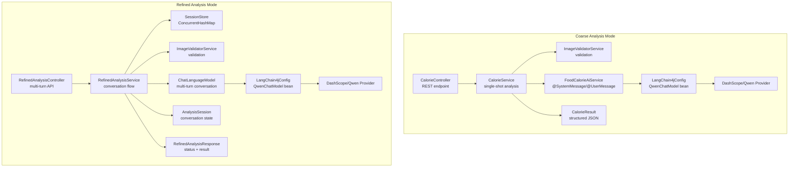

**Diagram sources**
- [CalorieController.java:81-94](file://src/main/java/com/example/heatcalculate/controller/CalorieController.java#L81-L94)
- [CalorieService.java:40-69](file://src/main/java/com/example/heatcalculate/service/CalorieService.java#L40-L69)
- [RefinedAnalysisController.java:36-70](file://src/main/java/com/example/heatcalculate/controller/RefinedAnalysisController.java#L36-L70)
- [RefinedAnalysisService.java:88-154](file://src/main/java/com/example/heatcalculate/service/RefinedAnalysisService.java#L88-L154)
- [SessionStore.java:15-60](file://src/main/java/com/example/heatcalculate/service/SessionStore.java#L15-L60)

**Section sources**
- [CalorieController.java:22-96](file://src/main/java/com/example/heatcalculate/controller/CalorieController.java#L22-L96)
- [CalorieService.java:20-85](file://src/main/java/com/example/heatcalculate/service/CalorieService.java#L20-L85)
- [RefinedAnalysisController.java:17-72](file://src/main/java/com/example/heatcalculate/controller/RefinedAnalysisController.java#L17-L72)
- [RefinedAnalysisService.java:17-83](file://src/main/java/com/example/heatcalculate/service/RefinedAnalysisService.java#L17-L83)
- [SessionStore.java:11-60](file://src/main/java/com/example/heatcalculate/service/SessionStore.java#L11-L60)

## Core Components
- **Coarse Analysis Components**: FoodCalorieAiService, CalorieService, CalorieController for single-shot analysis
- **Refined Analysis Components**: RefinedAnalysisController, RefinedAnalysisService, AnalysisSession, SessionStore for multi-turn conversations
- **Shared Components**: LangChain4jConfig, ImageValidatorService, model classes for both modes
- **Session Management**: Concurrent storage with lazy expiration checking for conversation state persistence
- **Exception Handling**: Centralized mapping of domain exceptions to HTTP responses across both modes

**Section sources**
- [RefinedAnalysisController.java:17-72](file://src/main/java/com/example/heatcalculate/controller/RefinedAnalysisController.java#L17-L72)
- [RefinedAnalysisService.java:17-83](file://src/main/java/com/example/heatcalculate/service/RefinedAnalysisService.java#L17-L83)
- [AnalysisSession.java:8-97](file://src/main/java/com/example/heatcalculate/model/AnalysisSession.java#L8-L97)
- [SessionStore.java:11-60](file://src/main/java/com/example/heatcalculate/service/SessionStore.java#L11-L60)
- [RefinedAnalysisResponse.java:5-77](file://src/main/java/com/example/heatcalculate/model/RefinedAnalysisResponse.java#L5-L77)

## Architecture Overview
The AI pipeline now supports two distinct flows depending on the analysis mode:
- **Coarse Analysis Flow**: Direct single-shot analysis with immediate results
- **Refined Analysis Flow**: Multi-turn conversation with iterative questioning until sufficient precision is achieved

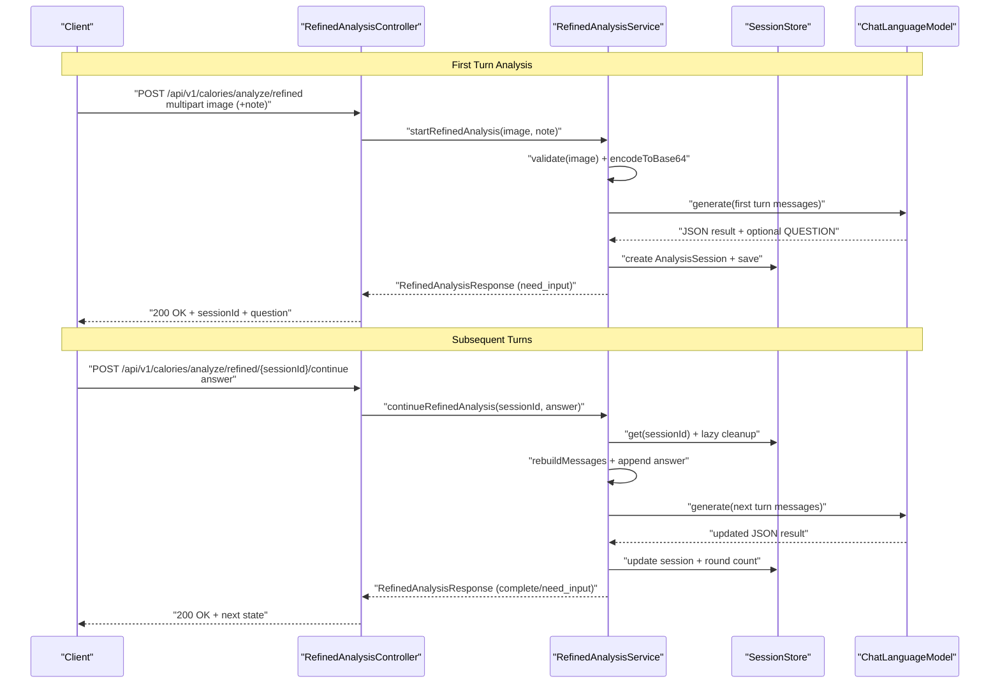

**Diagram sources**
- [RefinedAnalysisController.java:36-70](file://src/main/java/com/example/heatcalculate/controller/RefinedAnalysisController.java#L36-L70)
- [RefinedAnalysisService.java:88-154](file://src/main/java/com/example/heatcalculate/service/RefinedAnalysisService.java#L88-L154)
- [RefinedAnalysisService.java:159-218](file://src/main/java/com/example/heatcalculate/service/RefinedAnalysisService.java#L159-L218)
- [SessionStore.java:33-44](file://src/main/java/com/example/heatcalculate/service/SessionStore.java#L33-L44)

## Detailed Component Analysis

### Coarse Analysis Mode (Legacy)
The original coarse analysis mode maintains the same architecture as before, providing single-shot analysis without conversation history.

**Section sources**
- [CalorieController.java:81-94](file://src/main/java/com/example/heatcalculate/controller/CalorieController.java#L81-L94)
- [CalorieService.java:79-117](file://src/main/java/com/example/heatcalculate/service/CalorieService.java#L79-L117)

### LangChain4j Configuration and Model Wiring
- The configuration reads API key and model name from application properties and builds a ChatLanguageModel bean
- Both analysis modes share the same QwenChatModel configuration for consistency
- The model name defaults to qwen-vl-max, a vision-language capable variant

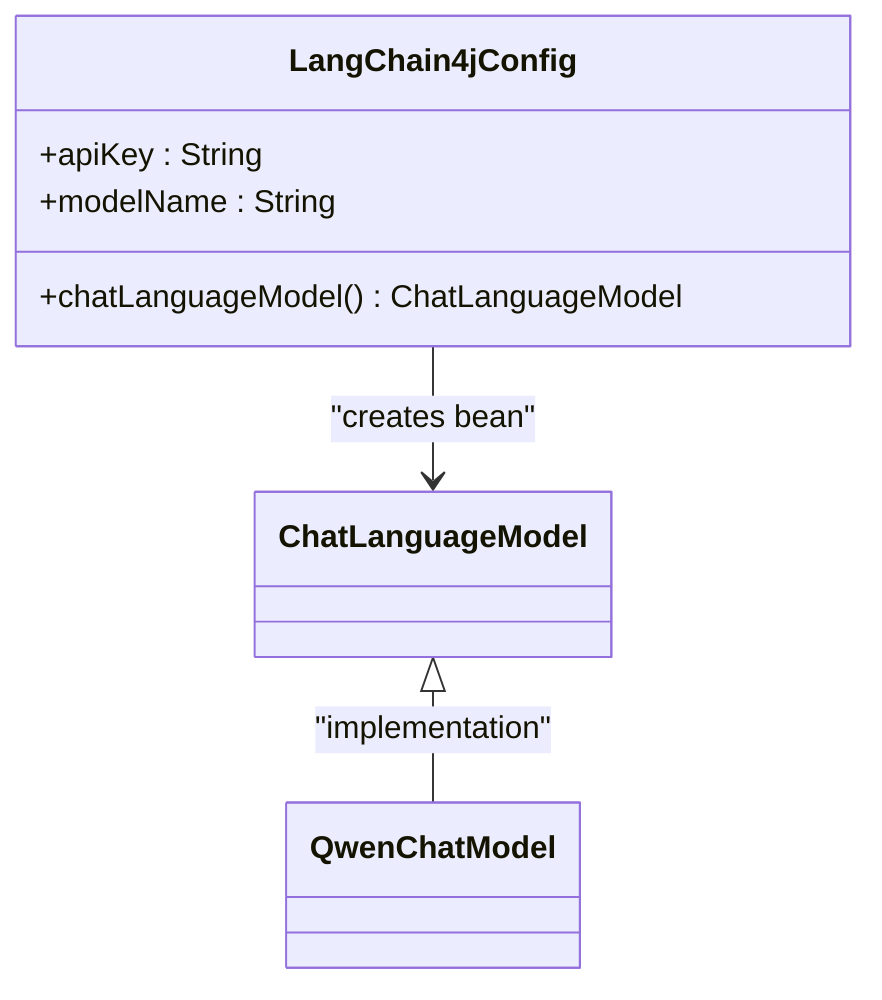

**Diagram sources**
- [LangChain4jConfig.java:15-30](file://src/main/java/com/example/heatcalculate/config/LangChain4jConfig.java#L15-L30)

**Section sources**
- [LangChain4jConfig.java:15-30](file://src/main/java/com/example/heatcalculate/config/LangChain4jConfig.java#L15-L30)
- [application.yml:11-14](file://src/main/resources/application.yml#L11-L14)

### Image Encoding to Base64 Data URI
- The service converts the uploaded file to raw bytes, Base64-encodes them, and prefixes with a data URI containing the detected MIME type
- If the MIME type is missing, a default is applied to ensure compatibility

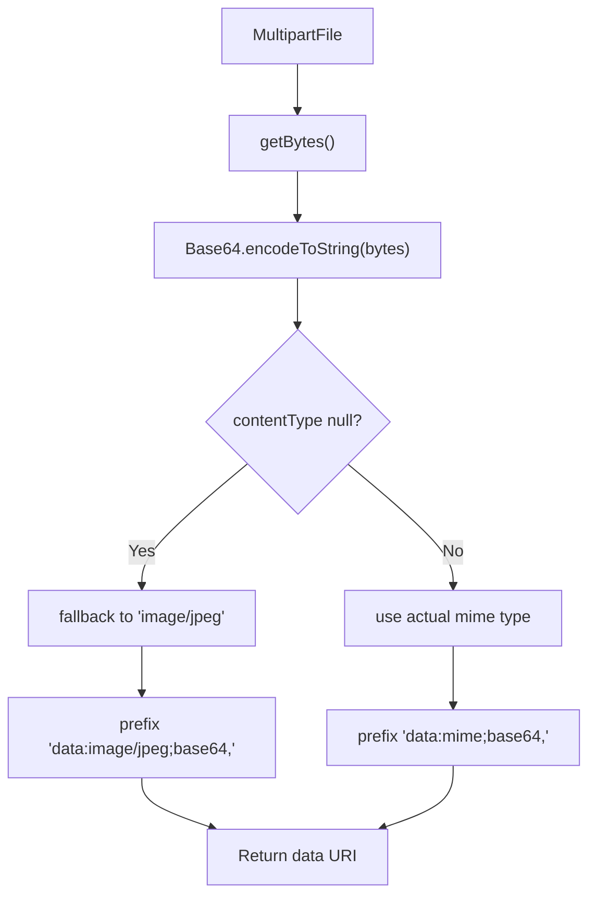

**Diagram sources**
- [CalorieService.java:84-93](file://src/main/java/com/example/heatcalculate/service/CalorieService.java#L84-L93)

**Section sources**
- [CalorieService.java:84-93](file://src/main/java/com/example/heatcalculate/service/CalorieService.java#L84-L93)

### Model Invocation and Response Processing
- The service creates a ChatLanguageModel instance and invokes generate with constructed message lists
- The response is parsed into CalorieResult, which includes per-item and total calorie ranges
- Both analysis modes use the same JSON schema compliance approach

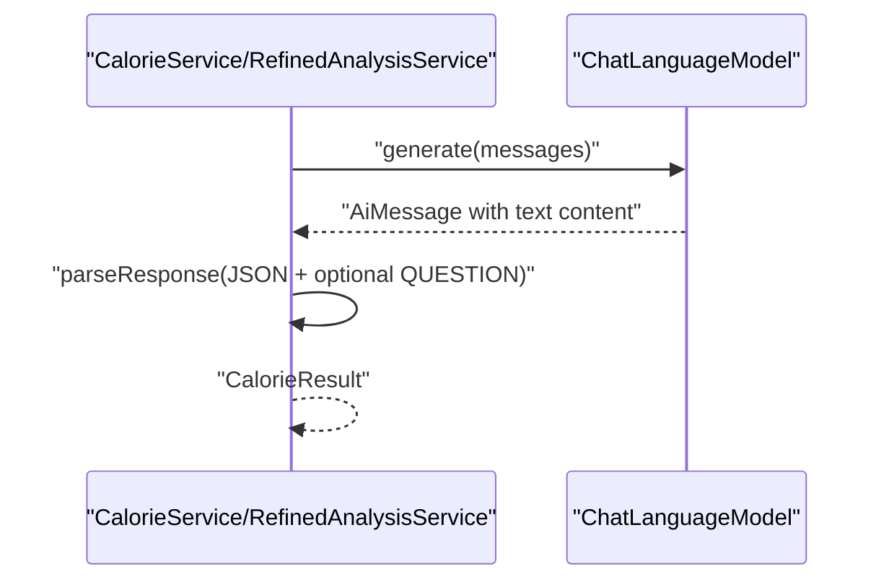

**Diagram sources**
- [CalorieService.java:108-117](file://src/main/java/com/example/heatcalculate/service/CalorieService.java#L108-L117)
- [RefinedAnalysisService.java:116-122](file://src/main/java/com/example/heatcalculate/service/RefinedAnalysisService.java#L116-L122)

**Section sources**
- [CalorieService.java:108-117](file://src/main/java/com/example/heatcalculate/service/CalorieService.java#L108-L117)
- [RefinedAnalysisService.java:116-122](file://src/main/java/com/example/heatcalculate/service/RefinedAnalysisService.java#L116-L122)

### Data Models and JSON Schema Compliance
- CalorieResult aggregates a list of FoodItem entries and a totalCalories range, plus a disclaimer
- FoodItem captures name, estimated weight range, and a CalorieRange
- CalorieRange holds low, mid, and high estimates
- Both analysis modes rely on the same structured response format

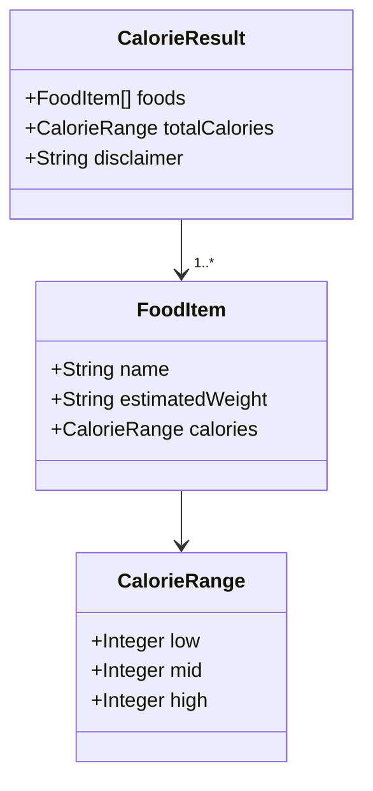

**Diagram sources**
- [CalorieResult.java:10-57](file://src/main/java/com/example/heatcalculate/model/CalorieResult.java#L10-L57)
- [FoodItem.java:8-54](file://src/main/java/com/example/heatcalculate/model/FoodItem.java#L8-L54)
- [CalorieRange.java:8-54](file://src/main/java/com/example/heatcalculate/model/CalorieRange.java#L8-L54)

**Section sources**
- [CalorieResult.java:10-57](file://src/main/java/com/example/heatcalculate/model/CalorieResult.java#L10-L57)
- [FoodItem.java:8-54](file://src/main/java/com/example/heatcalculate/model/FoodItem.java#L8-L54)
- [CalorieRange.java:8-54](file://src/main/java/com/example/heatcalculate/model/CalorieRange.java#L8-L54)

### Error Handling and Timeout Management
- Image validation errors are mapped to 400 Bad Request
- Model service failures are mapped to 502 Bad Gateway
- Model parse failures are mapped to 500 Internal Server Error
- Session expiration throws SessionExpiredException handled by GlobalExceptionHandler
- The service wraps model invocation in a try/catch to convert provider errors into ModelServiceException

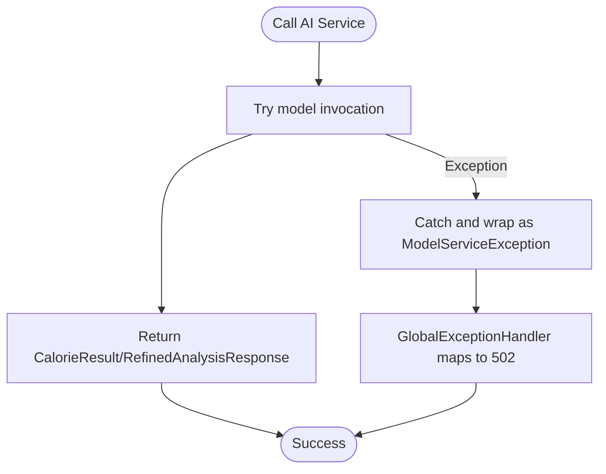

**Diagram sources**
- [CalorieService.java:113-117](file://src/main/java/com/example/heatcalculate/service/CalorieService.java#L113-L117)
- [RefinedAnalysisService.java:150-153](file://src/main/java/com/example/heatcalculate/service/RefinedAnalysisService.java#L150-L153)
- [GlobalExceptionHandler.java:30-39](file://src/main/java/com/example/heatcalculate/exception/GlobalExceptionHandler.java#L30-L39)

**Section sources**
- [GlobalExceptionHandler.java:19-61](file://src/main/java/com/example/heatcalculate/exception/GlobalExceptionHandler.java#L19-L61)
- [ModelServiceException.java:6-15](file://src/main/java/com/example/heatcalculate/exception/ModelServiceException.java#L6-L15)
- [ImageValidationException.java:6-11](file://src/main/java/com/example/heatcalculate/exception/ImageValidationException.java#L6-L11)
- [ModelParseException.java:6-15](file://src/main/java/com/example/heatcalculate/exception/ModelParseException.java#L6-L15)
- [SessionExpiredException.java:6-11](file://src/main/java/com/example/heatcalculate/exception/SessionExpiredException.java#L6-L11)

## Refined Analysis Mode

### Multi-Turn Conversation Architecture
The refined analysis mode introduces sophisticated conversation flow management with session-based interactions:

- **Session Lifecycle**: Each conversation starts with a unique sessionId and maintains state across multiple turns
- **Conversation History**: Stores all messages including images, user answers, and AI responses
- **Dynamic Questioning**: AI can ask clarifying questions when calorie estimates are uncertain (>200kcal range)
- **Round Limiting**: Maximum 5 rounds to prevent infinite loops and manage costs

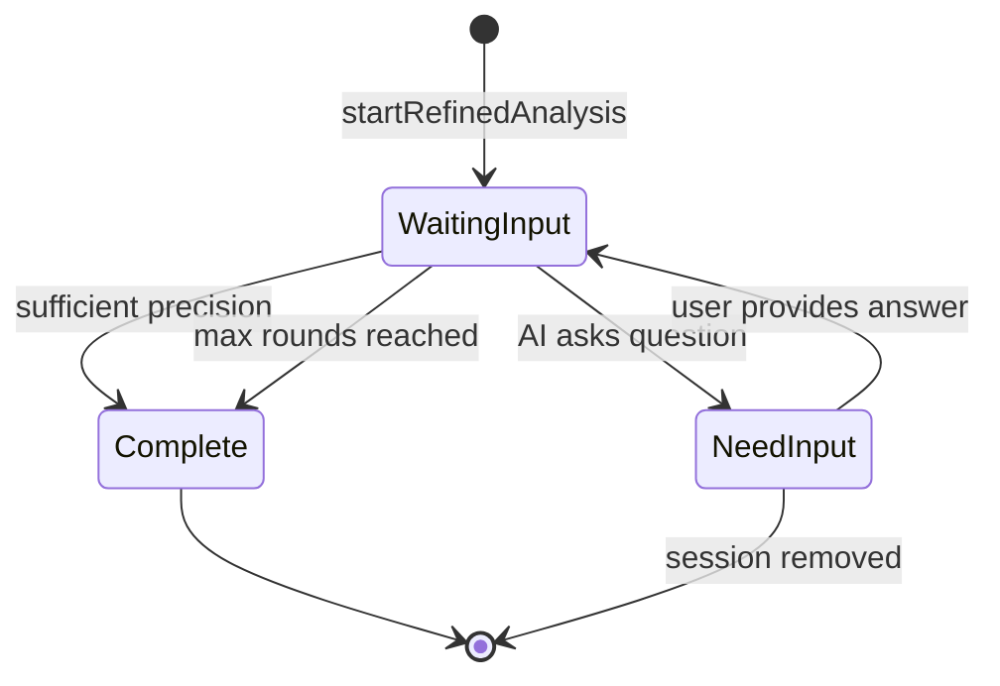

**Diagram sources**
- [RefinedAnalysisService.java:222-232](file://src/main/java/com/example/heatcalculate/service/RefinedAnalysisService.java#L222-L232)
- [RefinedAnalysisService.java:169-174](file://src/main/java/com/example/heatcalculate/service/RefinedAnalysisService.java#L169-L174)

### AnalysisSession Model Integration
The AnalysisSession class manages conversation state with comprehensive fields:

- **Session Identity**: Unique sessionId with automatic timestamp creation
- **Conversation State**: Current question, round count, and status tracking
- **Message History**: Complete conversation transcript for context preservation
- **Result Tracking**: Last best result for fallback scenarios
- **Expiration Logic**: Automatic cleanup after 3 minutes of inactivity

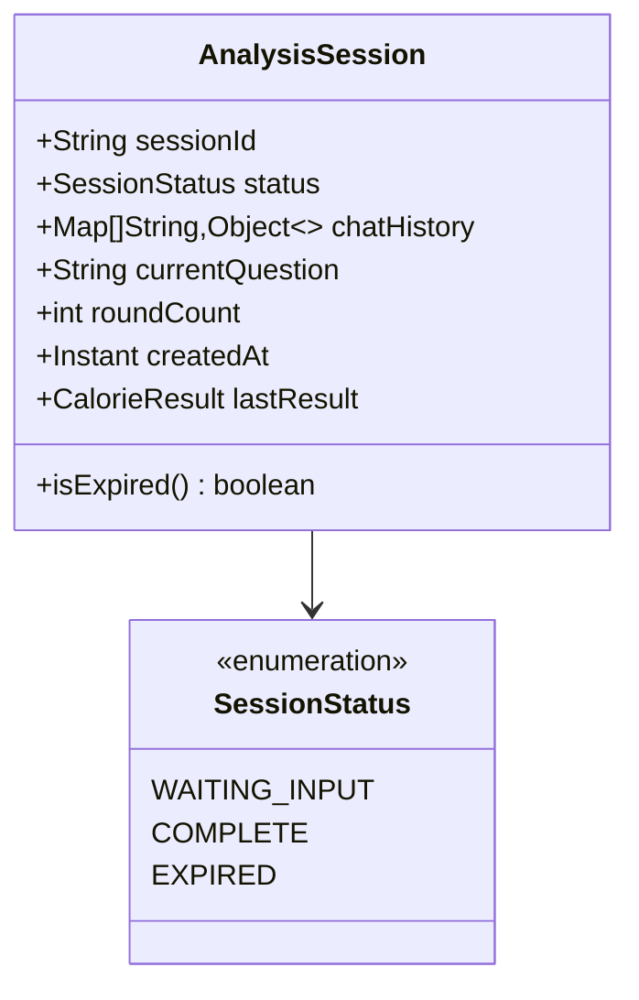

**Diagram sources**
- [AnalysisSession.java:14-95](file://src/main/java/com/example/heatcalculate/model/AnalysisSession.java#L14-L95)
- [SessionStatus.java:6-10](file://src/main/java/com/example/heatcalculate/model/SessionStatus.java#L6-L10)

**Section sources**
- [AnalysisSession.java:14-95](file://src/main/java/com/example/heatcalculate/model/AnalysisSession.java#L14-L95)
- [SessionStatus.java:6-10](file://src/main/java/com/example/heatcalculate/model/SessionStatus.java#L6-L10)

### SessionStore Implementation
The SessionStore provides thread-safe session management with lazy expiration:

- **Concurrent Storage**: Uses ConcurrentHashMap for high-performance concurrent access
- **Lazy Cleanup**: Removes expired sessions during get() operations to minimize overhead
- **Monitoring Support**: Provides size() method for active session tracking
- **Error Handling**: Returns Optional.empty() for missing/expired sessions

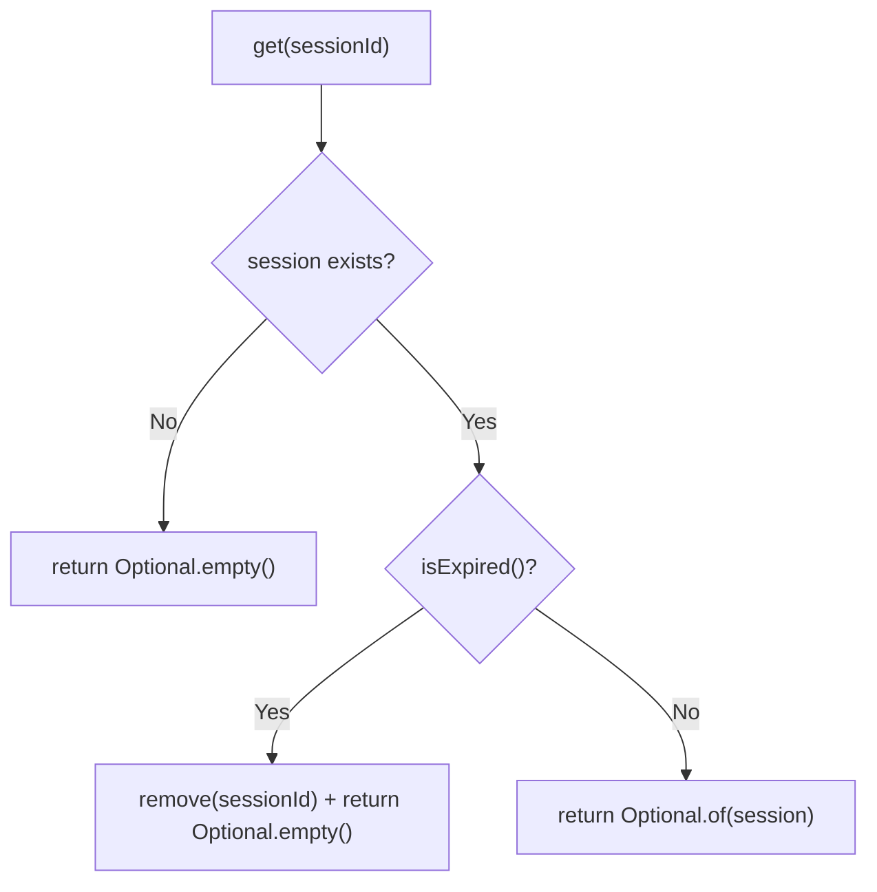

**Diagram sources**
- [SessionStore.java:33-44](file://src/main/java/com/example/heatcalculate/service/SessionStore.java#L33-L44)

**Section sources**
- [SessionStore.java:15-60](file://src/main/java/com/example/heatcalculate/service/SessionStore.java#L15-L60)

### RefinedAnalysisResponse Structure
The response DTO encapsulates conversation state with flexible fields:

- **Status Tracking**: "need_input" or "complete" states for UI flow control
- **Session Management**: sessionId for continuation requests
- **Partial Results**: Best available result during intermediate rounds
- **Question Provision**: Clarifying question when precision is insufficient

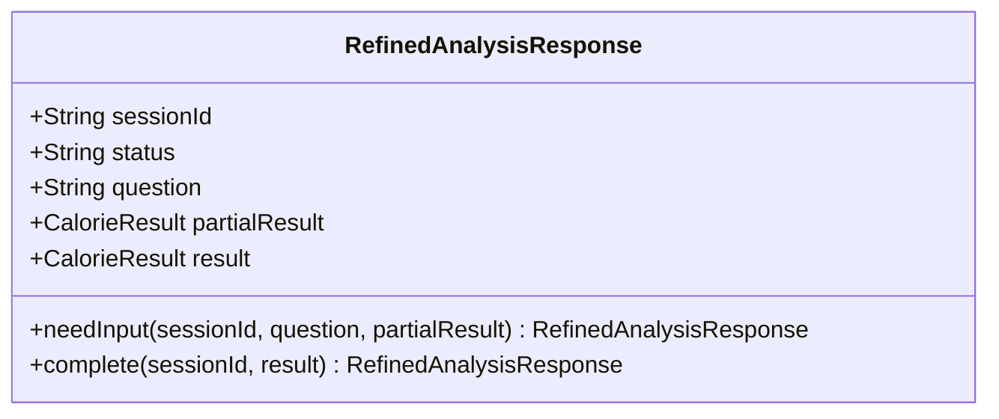

**Diagram sources**
- [RefinedAnalysisResponse.java:20-35](file://src/main/java/com/example/heatcalculate/model/RefinedAnalysisResponse.java#L20-L35)

**Section sources**
- [RefinedAnalysisResponse.java:5-77](file://src/main/java/com/example/heatcalculate/model/RefinedAnalysisResponse.java#L5-L77)

### Dynamic Prompt Engineering
The refined analysis uses sophisticated prompt engineering with conditional questioning:

- **Uncertainty Threshold**: Questions when total calorie range width exceeds 200kcal
- **Context Preservation**: Rebuilds complete message history for each turn
- **Answer Integration**: Incorporates user responses into subsequent prompts
- **Template-Based**: Uses CONTINUE_PROMPT_TEMPLATE for consistent conversation flow

**Section sources**
- [RefinedAnalysisService.java:222-232](file://src/main/java/com/example/heatcalculate/service/RefinedAnalysisService.java#L222-L232)
- [RefinedAnalysisService.java:68-71](file://src/main/java/com/example/heatcalculate/service/RefinedAnalysisService.java#L68-L71)
- [RefinedAnalysisService.java:282-312](file://src/main/java/com/example/heatcalculate/service/RefinedAnalysisService.java#L282-L312)

## Conversation Flow Management

### Start Analysis Process
The conversation begins with image validation and initial model invocation:

1. **Image Validation**: Ensures file size and format compliance
2. **Base64 Encoding**: Converts image to data URI format
3. **Initial Prompt**: System prompt + image + optional note
4. **Response Parsing**: Extracts JSON result and optional QUESTION line
5. **Session Creation**: Stores conversation state if questioning is needed

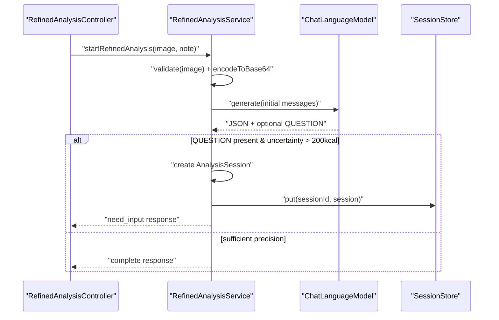

**Diagram sources**
- [RefinedAnalysisService.java:88-154](file://src/main/java/com/example/heatcalculate/service/RefinedAnalysisService.java#L88-L154)

### Continue Analysis Process
Subsequent turns handle user responses and continue the conversation:

1. **Session Retrieval**: Fetches session with lazy expiration check
2. **Round Validation**: Ensures maximum 5 rounds limit
3. **Message Reconstruction**: Builds complete conversation history
4. **Answer Integration**: Appends user response to conversation
5. **Result Update**: Updates session with new best result
6. **State Management**: Continues or completes based on precision

**Section sources**
- [RefinedAnalysisService.java:159-218](file://src/main/java/com/example/heatcalculate/service/RefinedAnalysisService.java#L159-L218)

### Session Expiration and Cleanup
The system implements robust session lifecycle management:

- **Automatic Cleanup**: Expired sessions removed during get() operations
- **Graceful Degradation**: Returns best available result if session expires
- **Resource Management**: Prevents memory leaks from abandoned conversations
- **Monitoring**: Size tracking for operational insights

**Section sources**
- [SessionStore.java:33-44](file://src/main/java/com/example/heatcalculate/service/SessionStore.java#L33-L44)
- [AnalysisSession.java:93-95](file://src/main/java/com/example/heatcalculate/model/AnalysisSession.java#L93-L95)

## Dependency Analysis
External dependencies relevant to AI integration:
- LangChain4j core and DashScope integration are declared in the Maven POM
- The application relies on Spring Boot's web starter and OpenAPI documentation
- Both analysis modes share the same ChatLanguageModel dependency

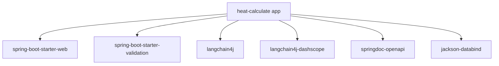

**Diagram sources**
- [pom.xml:28-67](file://pom.xml#L28-L67)

**Section sources**
- [pom.xml:23-67](file://pom.xml#L23-L67)

## Performance Considerations
- **Image size and format**: Enforce client-side constraints (≤10 MB) and supported formats (JPG, PNG, WEBP) to reduce bandwidth and model latency
- **Base64 overhead**: Large images increase payload size; consider compressing images before upload when feasible
- **Session memory management**: ConcurrentHashMap provides efficient concurrent access; monitor active session counts
- **Conversation history**: Each turn stores complete message history; consider trimming for long conversations
- **Round limiting**: Maximum 5 rounds prevents excessive API calls and controls costs
- **Lazy cleanup**: SessionStore removes expired sessions during get() operations to minimize memory usage
- **Model invocation**: Batch or rate-limit requests at the gateway if traffic increases; monitor provider quotas
- **Memory footprint**: Avoid holding large byte arrays longer than necessary; encode and immediately pass to the model
- **Network timeouts**: Configure appropriate client timeouts and retry policies at the infrastructure layer
- **Cost optimization**: Choose appropriate model variants; use lower-cost models for non-critical paths; enable caching for repeated identical images

## Troubleshooting Guide
Common issues and resolutions:
- **Unsupported image format or size**: Ensure the image is JPG, PNG, or WEBP and under 10 MB. The validator enforces these rules.
- **Missing API key or invalid model name**: Verify the API key and model name in application properties; ensure the environment variable is set.
- **Model service temporarily unavailable**: Expect 502 responses during provider outages; implement client retries with exponential backoff.
- **JSON parsing failures**: Confirm the model returns the exact JSON schema required by the system message; adjust prompts if the model deviates.
- **Session expiration errors**: Sessions expire after 3 minutes; restart analysis if encountering SessionExpiredException.
- **Too many rounds**: Conversations are limited to 5 rounds; consider simplifying questions or using coarse analysis.
- **Memory issues**: Monitor active session count; expired sessions are automatically cleaned up but may indicate client-side problems.
- **Logging and observability**: Enable INFO logs for the package and review structured logs around image validation, encoding, and model invocation.

**Section sources**
- [ImageValidatorService.java:17-46](file://src/main/java/com/example/heatcalculate/service/ImageValidatorService.java#L17-L46)
- [application.yml:11-14](file://src/main/resources/application.yml#L11-L14)
- [GlobalExceptionHandler.java:30-39](file://src/main/java/com/example/heatcalculate/exception/GlobalExceptionHandler.java#L30-L39)
- [SessionStore.java:33-44](file://src/main/java/com/example/heatcalculate/service/SessionStore.java#L33-L44)
- [RefinedAnalysisService.java:169-174](file://src/main/java/com/example/heatcalculate/service/RefinedAnalysisService.java#L169-L174)

## Conclusion
The AI integration now provides a comprehensive dual-mode analysis system leveraging LangChain4j with the Tongyi Qianwen-VL model. The coarse analysis mode delivers fast single-shot results, while the refined analysis mode enables sophisticated multi-turn conversations with session-based state management. The system emphasizes strong prompt engineering with utensil anchors, strict JSON schema compliance, dynamic questioning based on uncertainty thresholds, and robust conversation flow management. With proper configuration, validation, and error handling, it provides a reliable foundation for production use while enabling performance tuning, cost-conscious operation, and enhanced user experience through interactive precision improvement.