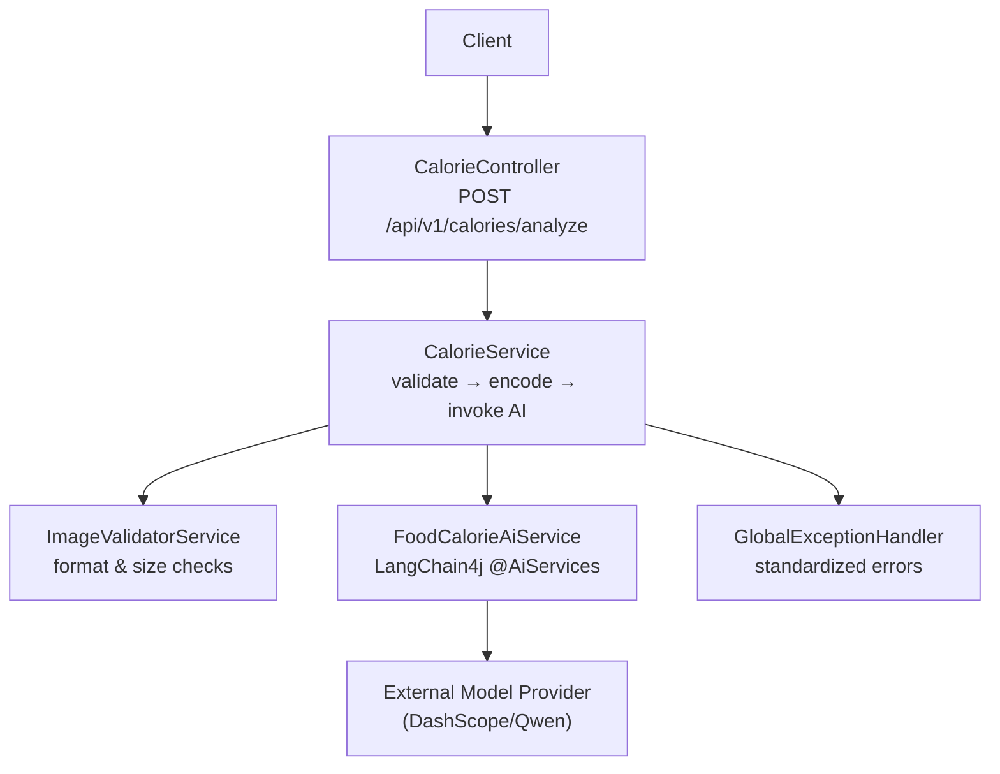
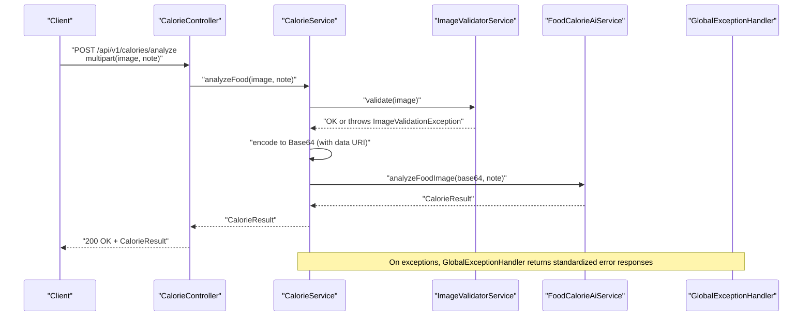
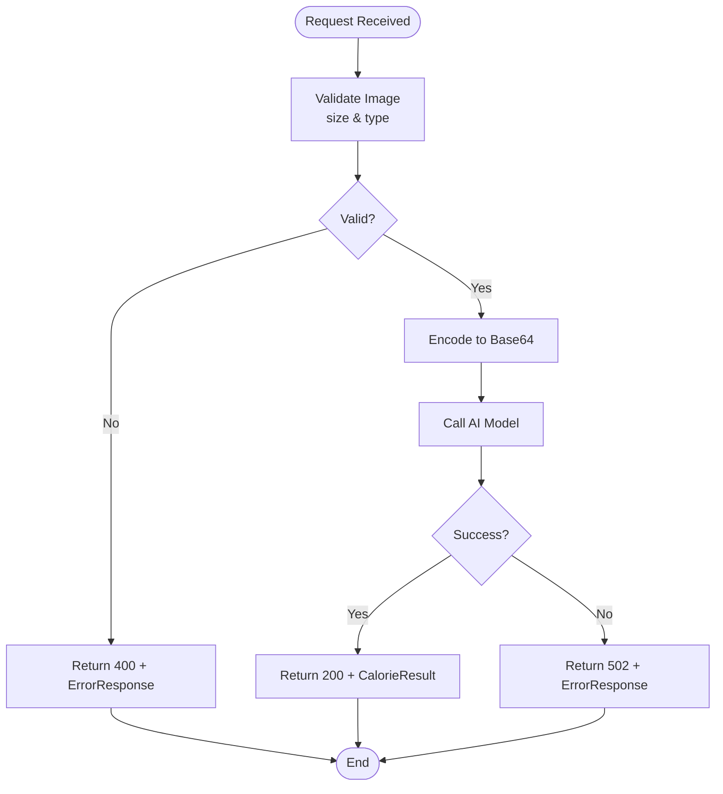
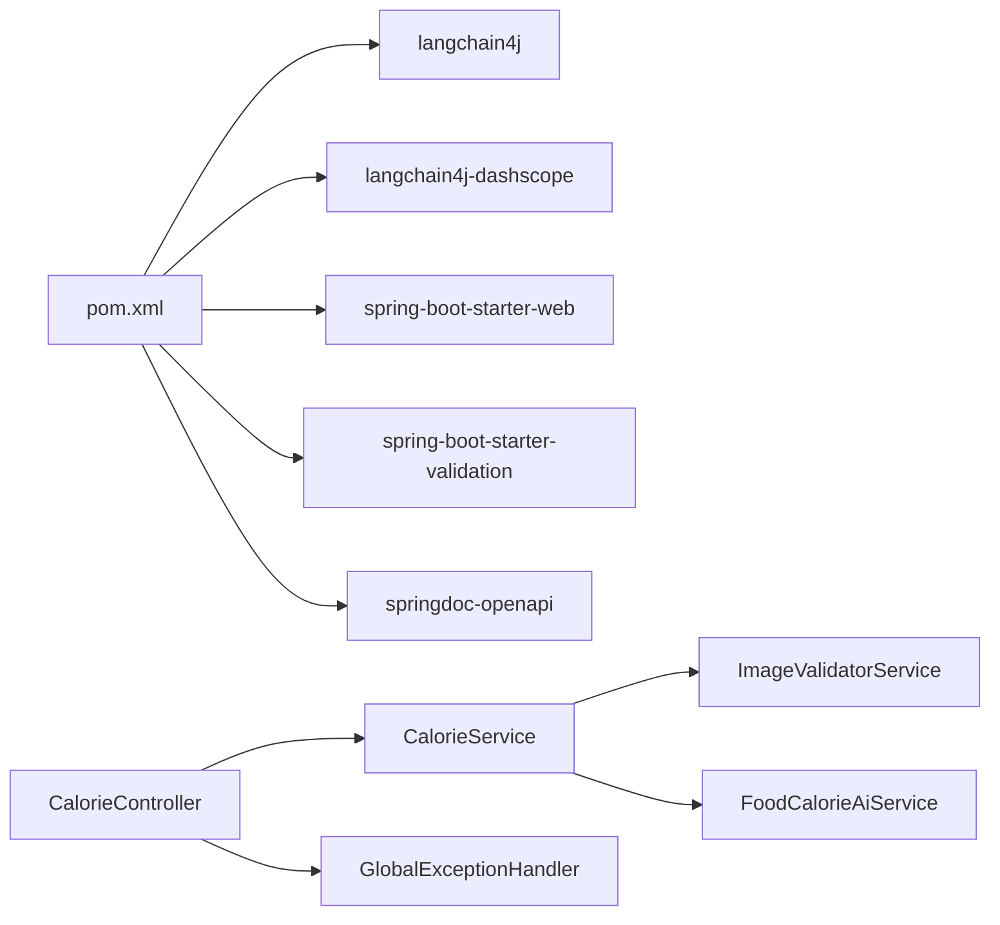

# API Reference

<cite>
**Referenced Files in This Document**
- [CalorieController.java](file://src/main/java/com/example/heatcalculate/controller/CalorieController.java)
- [CalorieService.java](file://src/main/java/com/example/heatcalculate/service/CalorieService.java)
- [ImageValidatorService.java](file://src/main/java/com/example/heatcalculate/service/ImageValidatorService.java)
- [FoodCalorieAiService.java](file://src/main/java/com/example/heatcalculate/ai/FoodCalorieAiService.java)
- [GlobalExceptionHandler.java](file://src/main/java/com/example/heatcalculate/exception/GlobalExceptionHandler.java)
- [ImageValidationException.java](file://src/main/java/com/example/heatcalculate/exception/ImageValidationException.java)
- [ModelServiceException.java](file://src/main/java/com/example/heatcalculate/exception/ModelServiceException.java)
- [CalorieResult.java](file://src/main/java/com/example/heatcalculate/model/CalorieResult.java)
- [FoodItem.java](file://src/main/java/com/example/heatcalculate/model/FoodItem.java)
- [CalorieRange.java](file://src/main/java/com/example/heatcalculate/model/CalorieRange.java)
- [application.yml](file://src/main/resources/application.yml)
- [spec.md](file://openspec/changes/food-calorie-recognition/specs/food-calorie-recognition/spec.md)
- [pom.xml](file://pom.xml)
</cite>

## Table of Contents
1. [Introduction](#introduction)
2. [Project Structure](#project-structure)
3. [Core Components](#core-components)
4. [Architecture Overview](#architecture-overview)
5. [Detailed Component Analysis](#detailed-component-analysis)
6. [Dependency Analysis](#dependency-analysis)
7. [Performance Considerations](#performance-considerations)
8. [Troubleshooting Guide](#troubleshooting-guide)
9. [Conclusion](#conclusion)
10. [Appendices](#appendices)

## Introduction
This document describes the RESTful API for the Heat Calculate service, focusing on the primary endpoint POST /api/v1/calories/analyze. It defines the request format (multipart/form-data), supported image formats and sizes, response schemas, error handling, and operational guidance. Authentication is configured via an API key property, and the service integrates with a vision-language model provider for food recognition and calorie estimation.

## Project Structure
The API is implemented as a Spring Boot web application with:
- A controller exposing the /api/v1/calories/analyze endpoint
- A service orchestrating image validation, base64 encoding, and AI model invocation
- An AI service interface defining prompts and structured output expectations
- Exception handling and global error responses
- Configuration for multipart limits and external model API key

**Diagram sources**
- [CalorieController.java:22-96](file://src/main/java/com/example/heatcalculate/controller/CalorieController.java#L22-L96)
- [CalorieService.java:20-85](file://src/main/java/com/example/heatcalculate/service/CalorieService.java#L20-L85)
- [ImageValidatorService.java:14-48](file://src/main/java/com/example/heatcalculate/service/ImageValidatorService.java#L14-L48)
- [FoodCalorieAiService.java:12-59](file://src/main/java/com/example/heatcalculate/ai/FoodCalorieAiService.java#L12-L59)
- [GlobalExceptionHandler.java:14-122](file://src/main/java/com/example/heatcalculate/exception/GlobalExceptionHandler.java#L14-L122)

**Section sources**
- [CalorieController.java:22-96](file://src/main/java/com/example/heatcalculate/controller/CalorieController.java#L22-L96)
- [CalorieService.java:20-85](file://src/main/java/com/example/heatcalculate/service/CalorieService.java#L20-L85)
- [application.yml:1-21](file://src/main/resources/application.yml#L1-L21)

## Core Components
- Endpoint: POST /api/v1/calories/analyze
- Request body: multipart/form-data
  - Required field: image (JPG, PNG, or WEBP; up to 10 MB)
  - Optional field: note (string)
- Response body: application/json
  - Success: CalorieResult object containing foods, totalCalories, and disclaimer
  - Error: standardized ErrorResponse object with code and message
- Authentication: DASHSCOPE_API_KEY via environment variable
- Content-Type: multipart/form-data for requests; application/json for responses

**Section sources**
- [CalorieController.java:42-94](file://src/main/java/com/example/heatcalculate/controller/CalorieController.java#L42-L94)
- [application.yml:11-14](file://src/main/resources/application.yml#L11-L14)
- [spec.md:3-48](file://openspec/changes/food-calorie-recognition/specs/food-calorie-recognition/spec.md#L3-L48)

## Architecture Overview
The request lifecycle for /api/v1/calories/analyze:

**Diagram sources**
- [CalorieController.java:81-94](file://src/main/java/com/example/heatcalculate/controller/CalorieController.java#L81-L94)
- [CalorieService.java:40-69](file://src/main/java/com/example/heatcalculate/service/CalorieService.java#L40-L69)
- [ImageValidatorService.java:31-46](file://src/main/java/com/example/heatcalculate/service/ImageValidatorService.java#L31-L46)
- [FoodCalorieAiService.java:57-57](file://src/main/java/com/example/heatcalculate/ai/FoodCalorieAiService.java#L57-L57)
- [GlobalExceptionHandler.java:19-61](file://src/main/java/com/example/heatcalculate/exception/GlobalExceptionHandler.java#L19-L61)

## Detailed Component Analysis

### Endpoint Definition
- Method: POST
- Path: /api/v1/calories/analyze
- Consumes: multipart/form-data
- Produces: application/json
- Authentication: Requires DASHSCOPE_API_KEY environment variable

Request parameters:
- image (required): multipart file; supported types: image/jpeg, image/jpg, image/png, image/webp; max size: 10 MB
- note (optional): string; free-form annotation passed to the AI model

Response:
- 200 OK: CalorieResult
- 400 Bad Request: ErrorResponse (validation failures)
- 502 Bad Gateway: ErrorResponse (model service unavailable)
- 500 Internal Server Error: ErrorResponse (unexpected errors)

**Section sources**
- [CalorieController.java:42-80](file://src/main/java/com/example/heatcalculate/controller/CalorieController.java#L42-L80)
- [application.yml:6-9](file://src/main/resources/application.yml#L6-L9)
- [GlobalExceptionHandler.java:19-61](file://src/main/java/com/example/heatcalculate/exception/GlobalExceptionHandler.java#L19-L61)

### Data Models

#### CalorieResult
- foods: array of FoodItem
- totalCalories: CalorieRange
- disclaimer: string (notice about estimation)

**Section sources**
- [CalorieResult.java:10-84](file://src/main/java/com/example/heatcalculate/model/CalorieResult.java#L10-L84)

#### FoodItem
- name: string
- estimatedWeight: string (range format)
- calories: CalorieRange

**Section sources**
- [FoodItem.java:8-82](file://src/main/java/com/example/heatcalculate/model/FoodItem.java#L8-L82)

#### CalorieRange
- low: integer (kcal)
- mid: integer (kcal)
- high: integer (kcal)

**Section sources**
- [CalorieRange.java:8-82](file://src/main/java/com/example/heatcalculate/model/CalorieRange.java#L8-L82)

#### ErrorResponse
- code: integer
- message: string

**Section sources**
- [GlobalExceptionHandler.java:66-122](file://src/main/java/com/example/heatcalculate/exception/GlobalExceptionHandler.java#L66-L122)

### Processing Logic

#### Image Validation
- Enforces non-empty file, size ≤ 10 MB, and allowed content types (case-insensitive match)
- Throws ImageValidationException on failure

**Section sources**
- [ImageValidatorService.java:31-46](file://src/main/java/com/example/heatcalculate/service/ImageValidatorService.java#L31-L46)
- [ImageValidationException.java:6-11](file://src/main/java/com/example/heatcalculate/exception/ImageValidationException.java#L6-L11)

#### Base64 Encoding and Model Invocation
- Encodes image to Base64 with a data URI prefix (defaults to image/jpeg if content type is missing)
- Creates an AI service proxy and invokes analyzeFoodImage with note and base64 image
- Wraps model invocation failures in ModelServiceException

**Section sources**
- [CalorieService.java:74-83](file://src/main/java/com/example/heatcalculate/service/CalorieService.java#L74-L83)
- [FoodCalorieAiService.java:57-57](file://src/main/java/com/example/heatcalculate/ai/FoodCalorieAiService.java#L57-L57)
- [ModelServiceException.java:6-15](file://src/main/java/com/example/heatcalculate/exception/ModelServiceException.java#L6-L15)

### Error Handling Flow

**Diagram sources**
- [ImageValidatorService.java:31-46](file://src/main/java/com/example/heatcalculate/service/ImageValidatorService.java#L31-L46)
- [CalorieService.java:60-68](file://src/main/java/com/example/heatcalculate/service/CalorieService.java#L60-L68)
- [GlobalExceptionHandler.java:19-39](file://src/main/java/com/example/heatcalculate/exception/GlobalExceptionHandler.java#L19-L39)

## Dependency Analysis
External dependencies relevant to the API:
- LangChain4j and DashScope integration for vision-language model
- Spring Boot Web and Validation
- SpringDoc OpenAPI for documentation

**Diagram sources**
- [pom.xml:28-67](file://pom.xml#L28-L67)
- [CalorieController.java:22-96](file://src/main/java/com/example/heatcalculate/controller/CalorieController.java#L22-L96)
- [CalorieService.java:20-85](file://src/main/java/com/example/heatcalculate/service/CalorieService.java#L20-L85)
- [ImageValidatorService.java:14-48](file://src/main/java/com/example/heatcalculate/service/ImageValidatorService.java#L14-L48)
- [FoodCalorieAiService.java:12-59](file://src/main/java/com/example/heatcalculate/ai/FoodCalorieAiService.java#L12-L59)
- [GlobalExceptionHandler.java:14-122](file://src/main/java/com/example/heatcalculate/exception/GlobalExceptionHandler.java#L14-L122)

**Section sources**
- [pom.xml:28-67](file://pom.xml#L28-L67)

## Performance Considerations
- Batch processing: Submit multiple images in separate requests rather than combining into a single multipart request, as the current controller expects a single image per request.
- Image optimization: Prefer JPG or PNG for smaller payload sizes; ensure images are well-compressed to stay under 10 MB.
- Network efficiency: Reuse HTTP connections and avoid unnecessary retries on client side until server-side rate limiting is confirmed.
- Model latency: Expect latency proportional to image size and model response time; implement client-side timeouts and exponential backoff for 502/500 responses.

[No sources needed since this section provides general guidance]

## Troubleshooting Guide
Common issues and resolutions:
- 400 Bad Request
  - Cause: Unsupported image format, file too large (>10 MB), or empty file
  - Resolution: Verify content type among image/jpeg, image/jpg, image/png, image/webp; reduce file size; ensure non-empty upload
- 502 Bad Gateway
  - Cause: Model service temporarily unavailable
  - Resolution: Retry with exponential backoff; monitor provider health
- 500 Internal Server Error
  - Cause: Unexpected error or model output parsing failure
  - Resolution: Inspect server logs; retry after a delay
- Authentication
  - Cause: Missing or invalid DASHSCOPE_API_KEY
  - Resolution: Set environment variable DASHSCOPE_API_KEY before starting the service

**Section sources**
- [ImageValidatorService.java:31-46](file://src/main/java/com/example/heatcalculate/service/ImageValidatorService.java#L31-L46)
- [GlobalExceptionHandler.java:30-61](file://src/main/java/com/example/heatcalculate/exception/GlobalExceptionHandler.java#L30-L61)
- [application.yml:11-14](file://src/main/resources/application.yml#L11-L14)

## Conclusion
The POST /api/v1/calories/analyze endpoint provides a straightforward multipart upload interface for food image analysis. Responses conform to a structured schema with per-item and total calorie ranges, while standardized error responses simplify client handling. Proper configuration of the model API key and adherence to image constraints ensure reliable operation.

[No sources needed since this section summarizes without analyzing specific files]

## Appendices

### API Definition
- Base URL: http://host:port
- Endpoint: POST /api/v1/calories/analyze
- Content-Type for requests: multipart/form-data
- Content-Type for responses: application/json

Parameters:
- image (required): file; allowed types: image/jpeg, image/jpg, image/png, image/webp; max size: 10 MB
- note (optional): string

Example request (conceptual):
- multipart body with field image pointing to a JPG/PNG/WEBP file
- optional field note with a string value

Example successful response (conceptual):
- HTTP 200 OK
- Body includes:
  - foods: array of items with name, estimatedWeight, and calories (low/mid/high)
  - totalCalories: low/mid/high range
  - disclaimer: explanatory notice

Example error response (conceptual):
- HTTP 400/502/500
- Body includes code and message fields

Status codes:
- 200: Success
- 400: Validation error
- 502: Model service unavailable
- 500: Internal error

Authentication:
- Configure environment variable DASHSCOPE_API_KEY for the model provider

**Section sources**
- [CalorieController.java:42-80](file://src/main/java/com/example/heatcalculate/controller/CalorieController.java#L42-L80)
- [application.yml:11-14](file://src/main/resources/application.yml#L11-L14)
- [spec.md:6-48](file://openspec/changes/food-calorie-recognition/specs/food-calorie-recognition/spec.md#L6-L48)

### Client Implementation Guidelines
- Java (OkHttp/Spring WebClient): Use multipart requests with a single image field; attach optional note field; parse JSON response into CalorieResult
- Python (requests): Build multipart form data with image and optional note; handle JSON decoding into model objects
- JavaScript (fetch/XMLHttpRequest): Construct FormData with image and note; process JSON response accordingly
- Best practices:
  - Validate image type and size client-side before upload
  - Implement retry with exponential backoff for 502/500
  - Set appropriate timeouts for network and model processing
  - Batch requests sequentially if throughput requires multiple images

[No sources needed since this section provides general guidance]