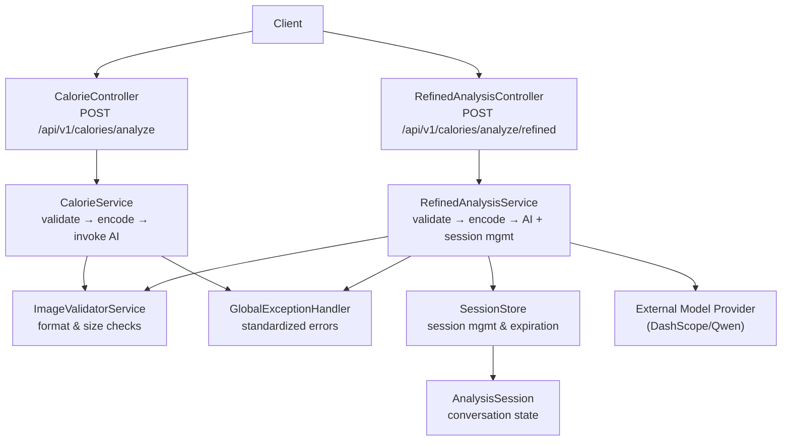
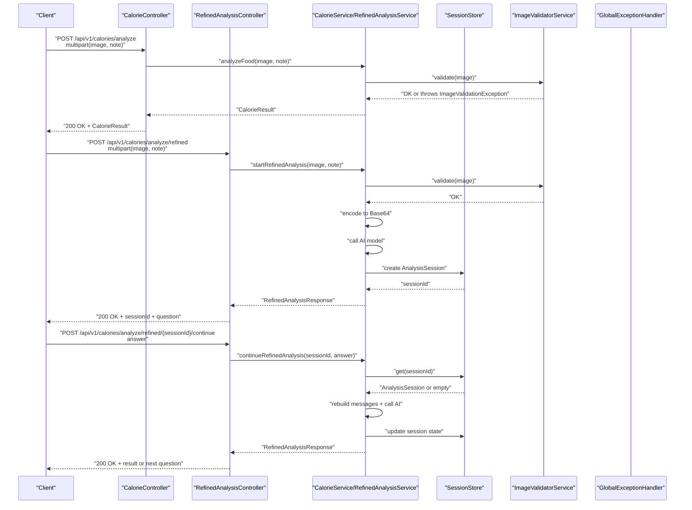
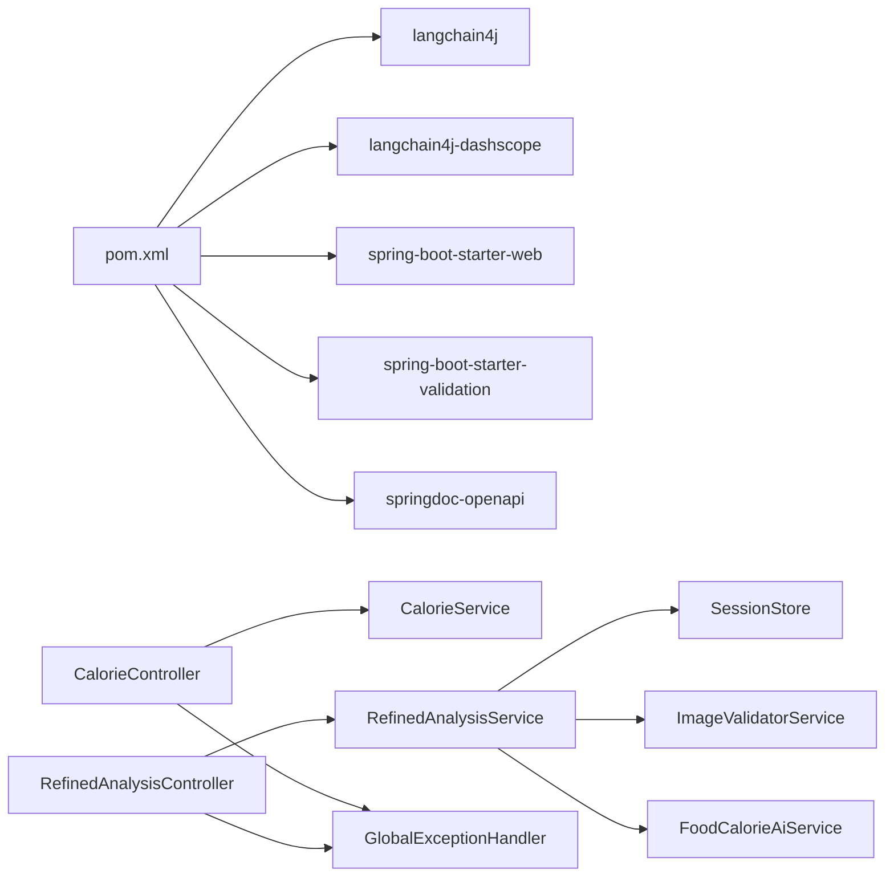

# API Reference

<cite>
**Referenced Files in This Document**
- [CalorieController.java](file://src/main/java/com/example/heatcalculate/controller/CalorieController.java)
- [RefinedAnalysisController.java](file://src/main/java/com/example/heatcalculate/controller/RefinedAnalysisController.java)
- [CalorieService.java](file://src/main/java/com/example/heatcalculate/service/CalorieService.java)
- [RefinedAnalysisService.java](file://src/main/java/com/example/heatcalculate/service/RefinedAnalysisService.java)
- [ImageValidatorService.java](file://src/main/java/com/example/heatcalculate/service/ImageValidatorService.java)
- [SessionStore.java](file://src/main/java/com/example/heatcalculate/service/SessionStore.java)
- [AnalysisSession.java](file://src/main/java/com/example/heatcalculate/model/AnalysisSession.java)
- [RefinedAnalysisResponse.java](file://src/main/java/com/example/heatcalculate/model/RefinedAnalysisResponse.java)
- [SessionStatus.java](file://src/main/java/com/example/heatcalculate/model/SessionStatus.java)
- [GlobalExceptionHandler.java](file://src/main/java/com/example/heatcalculate/exception/GlobalExceptionHandler.java)
- [SessionExpiredException.java](file://src/main/java/com/example/heatcalculate/exception/SessionExpiredException.java)
- [ImageValidationException.java](file://src/main/java/com/example/heatcalculate/exception/ImageValidationException.java)
- [ModelServiceException.java](file://src/main/java/com/example/heatcalculate/exception/ModelServiceException.java)
- [CalorieResult.java](file://src/main/java/com/example/heatcalculate/model/CalorieResult.java)
- [FoodItem.java](file://src/main/java/com/example/heatcalculate/model/FoodItem.java)
- [CalorieRange.java](file://src/main/java/com/example/heatcalculate/model/CalorieRange.java)
- [application.yml](file://src/main/resources/application.yml)
- [spec.md](file://openspec/changes/food-calorie-recognition/specs/food-calorie-recognition/spec.md)
- [pom.xml](file://pom.xml)
</cite>

## Update Summary
**Changes Made**
- Added new refined analysis mode with multi-turn conversation capabilities
- Documented new RefinedAnalysisController endpoints POST /api/v1/calories/analyze/refined and POST /api/v1/calories/analyze/refined/{sessionId}/continue
- Added session management documentation with automatic expiration handling
- Enhanced API documentation with interactive analysis workflows
- Updated error handling to include session expiration scenarios

## Table of Contents
1. [Introduction](#introduction)
2. [Project Structure](#project-structure)
3. [Core Components](#core-components)
4. [Architecture Overview](#architecture-overview)
5. [Detailed Component Analysis](#detailed-component-analysis)
6. [Refined Analysis Mode](#refined-analysis-mode)
7. [Session Management](#session-management)
8. [Dependency Analysis](#dependency-analysis)
9. [Performance Considerations](#performance-considerations)
10. [Troubleshooting Guide](#troubleshooting-guide)
11. [Conclusion](#conclusion)
12. [Appendices](#appendices)

## Introduction
This document describes the RESTful API for the Heat Calculate service, covering both the basic calorie analysis endpoint and the new refined analysis mode with multi-turn conversation capabilities. The service provides two primary analysis modes: simple one-shot analysis via POST /api/v1/calories/analyze and advanced interactive analysis via POST /api/v1/calories/analyze/refined with session-based multi-turn conversations.

## Project Structure
The API is implemented as a Spring Boot web application with dual analysis modes:
- Basic controller exposing the /api/v1/calories/analyze endpoint for one-shot analysis
- Refined analysis controller exposing /api/v1/calories/analyze/refined for multi-turn conversation
- Shared services for image validation and AI model integration
- Session management for interactive workflows
- Exception handling and global error responses
- Configuration for multipart limits and external model API key



**Diagram sources**
- [CalorieController.java:22-96](file://src/main/java/com/example/heatcalculate/controller/CalorieController.java#L22-L96)
- [RefinedAnalysisController.java:20-72](file://src/main/java/com/example/heatcalculate/controller/RefinedAnalysisController.java#L20-L72)
- [CalorieService.java:20-145](file://src/main/java/com/example/heatcalculate/service/CalorieService.java#L20-L145)
- [RefinedAnalysisService.java:21-322](file://src/main/java/com/example/heatcalculate/service/RefinedAnalysisService.java#L21-L322)
- [SessionStore.java:15-61](file://src/main/java/com/example/heatcalculate/service/SessionStore.java#L15-L61)
- [AnalysisSession.java:12-97](file://src/main/java/com/example/heatcalculate/model/AnalysisSession.java#L12-L97)

**Section sources**
- [CalorieController.java:22-96](file://src/main/java/com/example/heatcalculate/controller/CalorieController.java#L22-L96)
- [RefinedAnalysisController.java:20-72](file://src/main/java/com/example/heatcalculate/controller/RefinedAnalysisController.java#L20-L72)
- [CalorieService.java:20-145](file://src/main/java/com/example/heatcalculate/service/CalorieService.java#L20-L145)
- [RefinedAnalysisService.java:21-322](file://src/main/java/com/example/heatcalculate/service/RefinedAnalysisService.java#L21-L322)
- [application.yml:1-21](file://src/main/resources/application.yml#L1-L21)

## Core Components
- **Basic Analysis Endpoint**: POST /api/v1/calories/analyze
  - Request body: multipart/form-data with required image field (JPG, PNG, or WEBP; up to 10 MB)
  - Response: CalorieResult object with foods, totalCalories, and disclaimer
- **Refined Analysis Endpoints**: 
  - POST /api/v1/calories/analyze/refined (start analysis)
  - POST /api/v1/calories/analyze/refined/{sessionId}/continue (continue conversation)
  - Session-based multi-turn conversation with automatic expiration
- **Authentication**: DASHSCOPE_API_KEY via environment variable
- **Content-Type**: multipart/form-data for requests; application/json for responses

**Section sources**
- [CalorieController.java:42-94](file://src/main/java/com/example/heatcalculate/controller/CalorieController.java#L42-L94)
- [RefinedAnalysisController.java:36-70](file://src/main/java/com/example/heatcalculate/controller/RefinedAnalysisController.java#L36-L70)
- [application.yml:11-14](file://src/main/resources/application.yml#L11-L14)
- [spec.md:3-48](file://openspec/changes/food-calorie-recognition/specs/food-calorie-recognition/spec.md#L3-L48)

## Architecture Overview
The request lifecycle differs between basic and refined analysis modes:



**Diagram sources**
- [CalorieController.java:81-94](file://src/main/java/com/example/heatcalculate/controller/CalorieController.java#L81-L94)
- [RefinedAnalysisController.java:38-70](file://src/main/java/com/example/heatcalculate/controller/RefinedAnalysisController.java#L38-L70)
- [CalorieService.java:79-117](file://src/main/java/com/example/heatcalculate/service/CalorieService.java#L79-L117)
- [RefinedAnalysisService.java:88-154](file://src/main/java/com/example/heatcalculate/service/RefinedAnalysisService.java#L88-L154)
- [SessionStore.java:33-44](file://src/main/java/com/example/heatcalculate/service/SessionStore.java#L33-L44)
- [GlobalExceptionHandler.java:19-61](file://src/main/java/com/example/heatcalculate/exception/GlobalExceptionHandler.java#L19-L61)

## Detailed Component Analysis

### Basic Analysis Endpoint
- **Method**: POST
- **Path**: /api/v1/calories/analyze
- **Consumes**: multipart/form-data
- **Produces**: application/json
- **Authentication**: Requires DASHSCOPE_API_KEY environment variable

Request parameters:
- image (required): multipart file; supported types: image/jpeg, image/jpg, image/png, image/webp; max size: 10 MB
- note (optional): string; free-form annotation passed to the AI model

Response:
- 200 OK: CalorieResult
- 400 Bad Request: ErrorResponse (validation failures)
- 502 Bad Gateway: ErrorResponse (model service unavailable)
- 500 Internal Server Error: ErrorResponse (unexpected errors)

**Section sources**
- [CalorieController.java:42-80](file://src/main/java/com/example/heatcalculate/controller/CalorieController.java#L42-L80)
- [application.yml:6-9](file://src/main/resources/application.yml#L6-L9)
- [GlobalExceptionHandler.java:19-61](file://src/main/java/com/example/heatcalculate/exception/GlobalExceptionHandler.java#L19-L61)

### Data Models

#### CalorieResult
- foods: array of FoodItem
- totalCalories: CalorieRange
- disclaimer: string (notice about estimation)

**Section sources**
- [CalorieResult.java:10-84](file://src/main/java/com/example/heatcalculate/model/CalorieResult.java#L10-L84)

#### FoodItem
- name: string
- estimatedWeight: string (range format)
- calories: CalorieRange

**Section sources**
- [FoodItem.java:8-82](file://src/main/java/com/example/heatcalculate/model/FoodItem.java#L8-L82)

#### CalorieRange
- low: integer (kcal)
- mid: integer (kcal)
- high: integer (kcal)

**Section sources**
- [CalorieRange.java:8-82](file://src/main/java/com/example/heatcalculate/model/CalorieRange.java#L8-L82)

#### ErrorResponse
- code: integer
- message: string

**Section sources**
- [GlobalExceptionHandler.java:78-133](file://src/main/java/com/example/heatcalculate/exception/GlobalExceptionHandler.java#L78-L133)

### Processing Logic

#### Image Validation
- Enforces non-empty file, size ≤ 10 MB, and allowed content types (case-insensitive match)
- Throws ImageValidationException on failure

**Section sources**
- [ImageValidatorService.java:31-46](file://src/main/java/com/example/heatcalculate/service/ImageValidatorService.java#L31-L46)
- [ImageValidationException.java:6-11](file://src/main/java/com/example/heatcalculate/exception/ImageValidationException.java#L6-L11)

#### Base64 Encoding and Model Invocation
- Encodes image to Base64 with a data URI prefix (defaults to image/jpeg if content type is missing)
- Creates an AI service proxy and invokes analyzeFoodImage with note and base64 image
- Wraps model invocation failures in ModelServiceException

**Section sources**
- [CalorieService.java:84-99](file://src/main/java/com/example/heatcalculate/service/CalorieService.java#L84-L99)
- [ModelServiceException.java:6-15](file://src/main/java/com/example/heatcalculate/exception/ModelServiceException.java#L6-L15)

### Error Handling Flow


**Diagram sources**
- [ImageValidatorService.java:31-46](file://src/main/java/com/example/heatcalculate/service/ImageValidatorService.java#L31-L46)
- [CalorieService.java:60-68](file://src/main/java/com/example/heatcalculate/service/CalorieService.java#L60-L68)
- [GlobalExceptionHandler.java:19-39](file://src/main/java/com/example/heatcalculate/exception/GlobalExceptionHandler.java#L19-L39)

## Refined Analysis Mode

### Overview
The refined analysis mode provides an interactive, multi-turn conversation approach to food calorie estimation. When the AI model detects insufficient certainty in its initial analysis (defined by a wide calorie range threshold), it generates a clarifying question and creates a session for continued interaction.

### Key Features
- **Multi-turn Conversation**: Automatic questioning when calorie uncertainty exceeds 200 kcal range
- **Session Management**: Unique session IDs with automatic 3-minute expiration
- **Progressive Refinement**: Iterative questioning reduces estimation uncertainty
- **Maximum Rounds**: Limits conversation to 5 rounds to prevent infinite loops

### Endpoints

#### Start Refined Analysis
- **Method**: POST
- **Path**: /api/v1/calories/analyze/refined
- **Consumes**: multipart/form-data
- **Produces**: application/json

Request parameters:
- image (required): multipart file; supported types: image/jpeg, image/jpg, image/png, image/webp; max size: 10 MB
- note (optional): string; free-form annotation passed to the AI model

Response formats:
- **Need Input**: When AI requires clarification
  ```json
  {
    "sessionId": "string",
    "status": "need_input",
    "question": "clarifying question text",
    "partialResult": {
      "foods": [...],
      "totalCalories": {...},
      "disclaimer": "string"
    }
  }
  ```
- **Complete**: When analysis is sufficiently certain
  ```json
  {
    "sessionId": "string", 
    "status": "complete",
    "result": {
      "foods": [...],
      "totalCalories": {...},
      "disclaimer": "string"
    }
  }
  ```

#### Continue Refined Analysis
- **Method**: POST
- **Path**: /api/v1/calories/analyze/refined/{sessionId}/continue
- **Consumes**: application/json
- **Produces**: application/json

Request body:
```json
{
  "answer": "user's response to the clarifying question"
}
```

Response formats:
- **Need Input**: Additional questions may be needed
- **Complete**: Final analysis result
- **Not Found**: Session expired or doesn't exist

**Section sources**
- [RefinedAnalysisController.java:36-70](file://src/main/java/com/example/heatcalculate/controller/RefinedAnalysisController.java#L36-L70)
- [RefinedAnalysisService.java:88-218](file://src/main/java/com/example/heatcalculate/service/RefinedAnalysisService.java#L88-L218)
- [RefinedAnalysisResponse.java:20-35](file://src/main/java/com/example/heatcalculate/model/RefinedAnalysisResponse.java#L20-L35)

### Workflow Examples

#### Successful Multi-Turn Analysis
1. **Initial Request**: POST /api/v1/calories/analyze/refined
2. **Response**: Need Input with sessionId and question
3. **Follow-up**: POST /api/v1/calories/analyze/refined/{sessionId}/continue
4. **Repeat**: Continue until Complete status or maximum rounds reached

#### Single-Round Completion
- If initial analysis is sufficiently certain, returns Complete immediately without questions

#### Session Expiration
- Sessions expire after 3 minutes of inactivity
- Expired sessions return 404 Not Found

**Section sources**
- [RefinedAnalysisService.java:124-149](file://src/main/java/com/example/heatcalculate/service/RefinedAnalysisService.java#L124-L149)
- [AnalysisSession.java:93-95](file://src/main/java/com/example/heatcalculate/model/AnalysisSession.java#L93-L95)

## Session Management

### Session Lifecycle
- **Creation**: Generated when initial analysis requires clarification
- **State Tracking**: Stores conversation history, current question, and round count
- **Expiration**: Automatically removed after 3 minutes of inactivity
- **Cleanup**: Lazy cleanup during get operations removes expired sessions

### Session Store Operations
- **put(sessionId, session)**: Store new session
- **get(sessionId)**: Retrieve session with automatic expiration check
- **remove(sessionId)**: Explicit removal (on completion or error)
- **size()**: Current active session count

### Conversation History
Each session maintains a complete conversation history including:
- Original image with base64 data and MIME type
- AI responses and user answers
- Round-by-round progression tracking

**Section sources**
- [SessionStore.java:24-59](file://src/main/java/com/example/heatcalculate/service/SessionStore.java#L24-L59)
- [AnalysisSession.java:14-88](file://src/main/java/com/example/heatcalculate/model/AnalysisSession.java#L14-L88)
- [RefinedAnalysisService.java:134-139](file://src/main/java/com/example/heatcalculate/service/RefinedAnalysisService.java#L134-L139)

## Dependency Analysis
External dependencies relevant to the API:
- LangChain4j and DashScope integration for vision-language model
- Spring Boot Web and Validation
- SpringDoc OpenAPI for documentation



**Diagram sources**
- [pom.xml:28-67](file://pom.xml#L28-L67)
- [CalorieController.java:22-96](file://src/main/java/com/example/heatcalculate/controller/CalorieController.java#L22-L96)
- [RefinedAnalysisController.java:20-72](file://src/main/java/com/example/heatcalculate/controller/RefinedAnalysisController.java#L20-L72)
- [CalorieService.java:20-145](file://src/main/java/com/example/heatcalculate/service/CalorieService.java#L20-L145)
- [RefinedAnalysisService.java:21-322](file://src/main/java/com/example/heatcalculate/service/RefinedAnalysisService.java#L21-L322)
- [SessionStore.java:15-61](file://src/main/java/com/example/heatcalculate/service/SessionStore.java#L15-L61)
- [ImageValidatorService.java:14-48](file://src/main/java/com/example/heatcalculate/service/ImageValidatorService.java#L14-L48)

**Section sources**
- [pom.xml:28-67](file://pom.xml#L28-L67)

## Performance Considerations
- **Batch Processing**: Submit multiple images in separate requests rather than combining into a single multipart request, as the current controllers expect a single image per request.
- **Image Optimization**: Prefer JPG or PNG for smaller payload sizes; ensure images are well-compressed to stay under 10 MB.
- **Network Efficiency**: Reuse HTTP connections and avoid unnecessary retries on client side until server-side rate limiting is confirmed.
- **Model Latency**: Expect latency proportional to image size and model response time; implement client-side timeouts and exponential backoff for 502/500 responses.
- **Session Management**: Monitor active session counts and implement client-side session cleanup to prevent memory leaks.
- **Conversation Efficiency**: Limit maximum rounds to 5 to control resource usage; consider implementing client-side timeout for user responses.

## Troubleshooting Guide
Common issues and resolutions:

### Basic Analysis Issues
- **400 Bad Request**
  - Cause: Unsupported image format, file too large (>10 MB), or empty file
  - Resolution: Verify content type among image/jpeg, image/jpg, image/png, image/webp; reduce file size; ensure non-empty upload

### Refined Analysis Issues
- **400 Bad Request (Continue Endpoint)**
  - Cause: Missing or empty answer in request body
  - Resolution: Ensure JSON contains non-empty "answer" field

- **404 Not Found (Continue Endpoint)**
  - Cause: Session expired, doesn't exist, or already completed
  - Resolution: Start new analysis with fresh image upload

- **404 Not Found (Session Expired)**
  - Cause: Session exceeded 3-minute timeout
  - Resolution: Restart analysis with new image

- **502 Bad Gateway**
  - Cause: Model service temporarily unavailable
  - Resolution: Retry with exponential backoff; monitor provider health

- **500 Internal Server Error**
  - Cause: Unexpected error or model output parsing failure
  - Resolution: Inspect server logs; retry after a delay

### Authentication
- **Missing or Invalid DASHSCOPE_API_KEY**
  - Resolution: Set environment variable DASHSCOPE_API_KEY before starting the service

**Section sources**
- [ImageValidatorService.java:31-46](file://src/main/java/com/example/heatcalculate/service/ImageValidatorService.java#L31-L46)
- [RefinedAnalysisController.java:59-68](file://src/main/java/com/example/heatcalculate/controller/RefinedAnalysisController.java#L59-L68)
- [GlobalExceptionHandler.java:52-61](file://src/main/java/com/example/heatcalculate/exception/GlobalExceptionHandler.java#L52-L61)
- [application.yml:11-14](file://src/main/resources/application.yml#L11-L14)

## Conclusion
The Heat Calculate service now offers two complementary analysis modes. The basic endpoint provides straightforward one-shot analysis suitable for simple use cases, while the refined analysis mode enables sophisticated multi-turn conversations for higher accuracy. Both modes share the same authentication and validation infrastructure while the refined mode adds robust session management and progressive refinement capabilities.

## Appendices

### API Definition

#### Basic Analysis Endpoint
- **Base URL**: http://host:port
- **Endpoint**: POST /api/v1/calories/analyze
- **Content-Type for requests**: multipart/form-data
- **Content-Type for responses**: application/json

Parameters:
- image (required): file; allowed types: image/jpeg, image/jpg, image/png, image/webp; max size: 10 MB
- note (optional): string

Response:
- 200 OK: CalorieResult with foods array and totalCalories range

#### Refined Analysis Endpoints
- **Base URL**: http://host:port
- **Start Analysis**: POST /api/v1/calories/analyze/refined
- **Continue Analysis**: POST /api/v1/calories/analyze/refined/{sessionId}/continue
- **Content-Type for requests**: multipart/form-data (start) or application/json (continue)
- **Content-Type for responses**: application/json

Start Parameters:
- image (required): file; allowed types: image/jpeg, image/jpg, image/png, image/webp; max size: 10 MB
- note (optional): string

Continue Request Body:
```json
{
  "answer": "user's response to clarifying question"
}
```

Start Response (Need Input):
```json
{
  "sessionId": "unique-session-id",
  "status": "need_input",
  "question": "clarifying question text",
  "partialResult": {
    "foods": [...],
    "totalCalories": {...},
    "disclaimer": "string"
  }
}
```

Start Response (Complete):
```json
{
  "sessionId": "unique-session-id",
  "status": "complete",
  "result": {
    "foods": [...],
    "totalCalories": {...},
    "disclaimer": "string"
  }
}
```

Continue Response:
- Same as start responses (need_input or complete)

Status Codes:
- **200**: Success (analysis result or continuation prompt)
- **400**: Validation error (invalid request format)
- **404**: Session not found/expired
- **502**: Model service unavailable
- **500**: Internal error

### Client Implementation Guidelines

#### Basic Analysis (Java)
```java
// Using OkHttp
RequestBody requestBody = new MultipartBody.Builder()
    .setType(MultipartBody.FORM)
    .addFormDataPart("image", "food.jpg", RequestBody.create(imageBytes, MediaType.parse("image/jpeg")))
    .addFormDataPart("note", "lunch at restaurant")
    .build();

Request request = new Request.Builder()
    .url("http://localhost:8080/api/v1/calories/analyze")
    .post(requestBody)
    .build();
```

#### Refined Analysis (Java)
```java
// Start analysis
RequestBody startBody = new MultipartBody.Builder()
    .setType(MultipartBody.FORM)
    .addFormDataPart("image", "food.jpg", RequestBody.create(imageBytes, MediaType.parse("image/jpeg")))
    .build();

Response startResponse = client.newCall(new Request.Builder()
    .url("http://localhost:8080/api/v1/calories/analyze/refined")
    .post(startBody)
    .build()).execute();

// Parse sessionId and question from response
// Continue analysis
RequestBody continueBody = RequestBody.create(
    "{\"answer\":\"more details about the dish\"}", 
    MediaType.parse("application/json")
);

Response continueResponse = client.newCall(new Request.Builder()
    .url("http://localhost:8080/api/v1/calories/analyze/refined/" + sessionId + "/continue")
    .post(continueBody)
    .build()).execute();
```

#### Python Implementation
```python
import requests

# Basic analysis
files = {'image': open('food.jpg', 'rb'), 'note': 'lunch'}
response = requests.post('http://localhost:8080/api/v1/calories/analyze', files=files)

# Refined analysis
# Start
files = {'image': open('food.jpg', 'rb')}
response = requests.post('http://localhost:8080/api/v1/calories/analyze/refined', files=files)
data = response.json()

# Continue
if data['status'] == 'need_input':
    answer = {'answer': 'your response to the question'}
    response = requests.post(
        f'http://localhost:8080/api/v1/calories/analyze/refined/{data["sessionId"]}/continue',
        json=answer
    )
```

#### JavaScript Implementation
```javascript
// Basic analysis
const formData = new FormData();
formData.append('image', fileInput.files[0]);
formData.append('note', 'lunch');

fetch('/api/v1/calories/analyze', {
    method: 'POST',
    body: formData
});

// Refined analysis
// Start
const startResponse = await fetch('/api/v1/calories/analyze/refined', {
    method: 'POST',
    body: formData
});
const {sessionId, status, question} = await startResponse.json();

// Continue
if (status === 'need_input') {
    const continueResponse = await fetch(`/api/v1/calories/analyze/refined/${sessionId}/continue`, {
        method: 'POST',
        headers: {'Content-Type': 'application/json'},
        body: JSON.stringify({answer: 'user response'})
    });
}
```

#### Best Practices
- **Image Validation**: Validate image type and size client-side before upload
- **Session Management**: Store sessionId securely and handle session expiration gracefully
- **Retry Strategy**: Implement exponential backoff for 502/500 responses
- **Timeout Handling**: Set appropriate timeouts for network requests and user responses
- **Batch Processing**: Process multiple images sequentially rather than in single requests
- **Error Recovery**: Implement fallback mechanisms for session expiration and model failures

### Session Management Best Practices
- **Automatic Cleanup**: Implement client-side session cleanup after 3 minutes
- **User Experience**: Provide clear feedback when sessions expire and offer restart option
- **State Persistence**: Store conversation history locally for user convenience
- **Resource Monitoring**: Track active session counts and implement monitoring alerts
- **Graceful Degradation**: Handle session expiration by restarting analysis flow

**Section sources**
- [CalorieController.java:42-80](file://src/main/java/com/example/heatcalculate/controller/CalorieController.java#L42-L80)
- [RefinedAnalysisController.java:36-70](file://src/main/java/com/example/heatcalculate/controller/RefinedAnalysisController.java#L36-L70)
- [application.yml:11-14](file://src/main/resources/application.yml#L11-L14)
- [spec.md:6-48](file://openspec/changes/food-calorie-recognition/specs/food-calorie-recognition/spec.md#L6-L48)