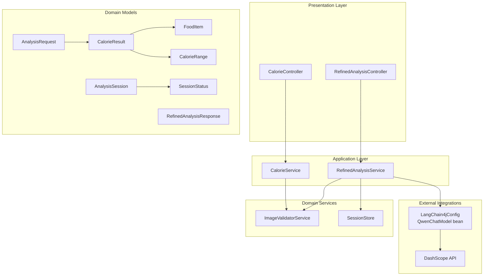
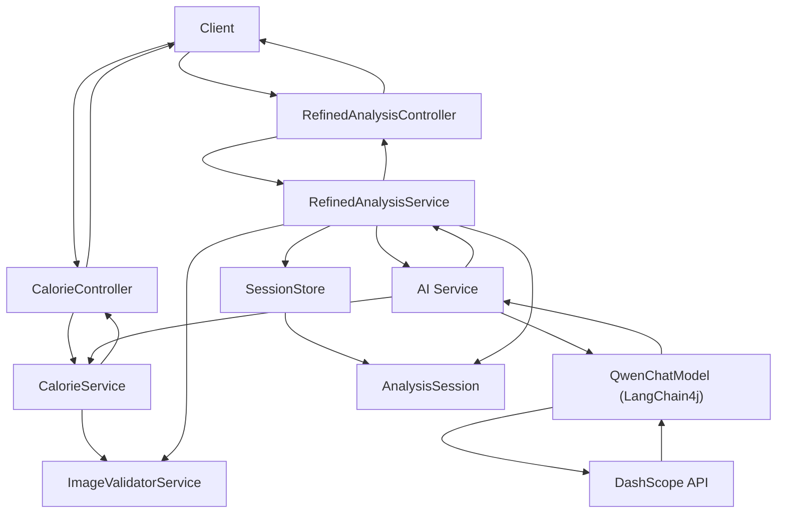
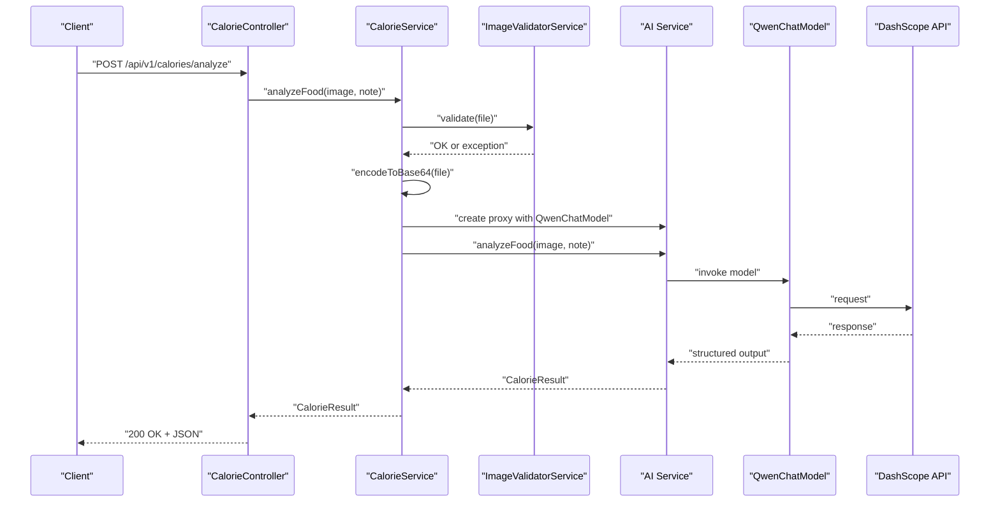
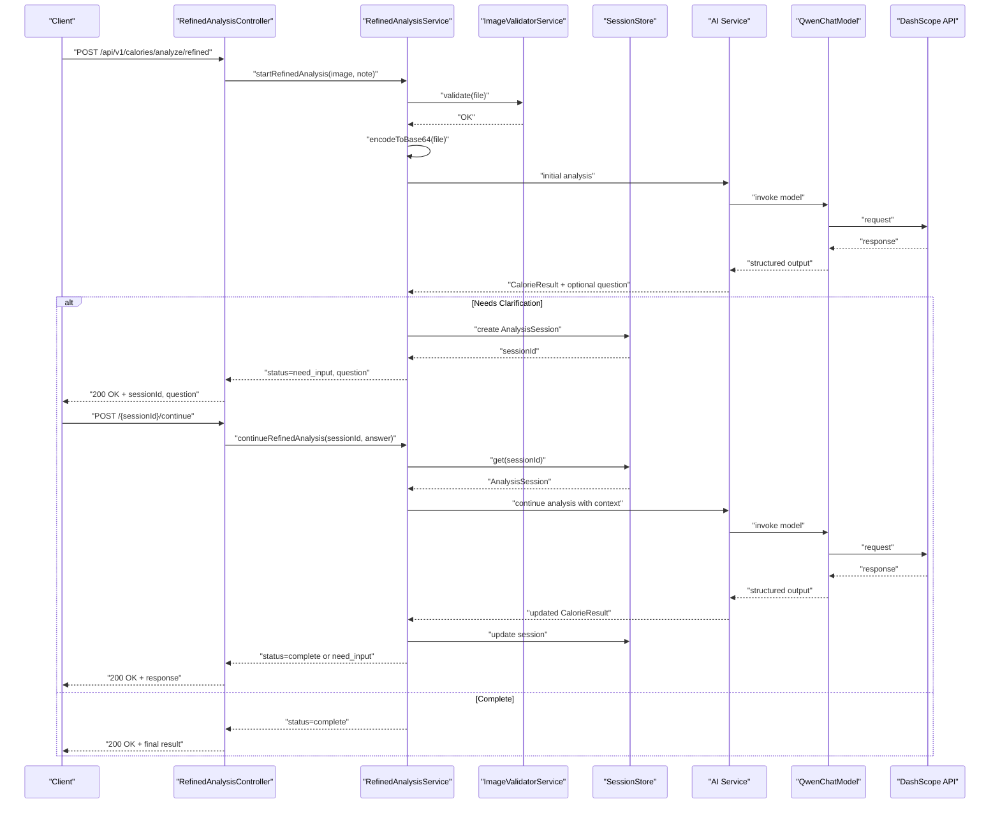
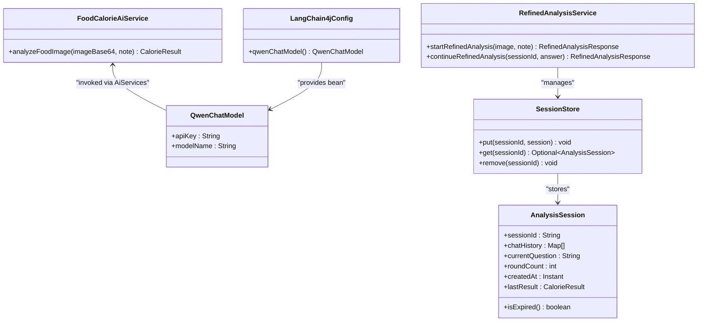
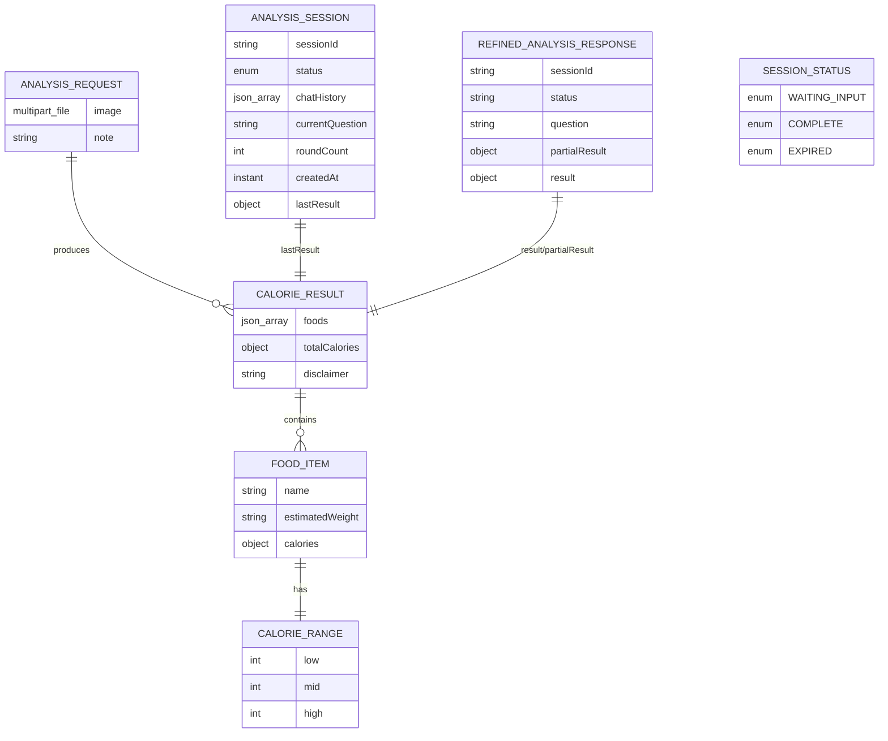
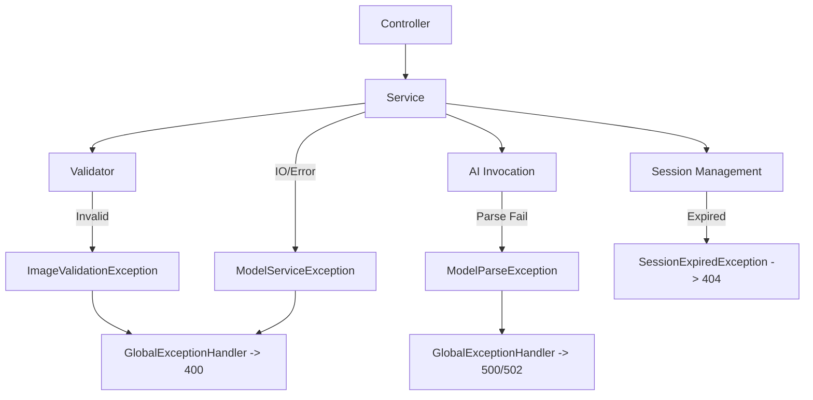
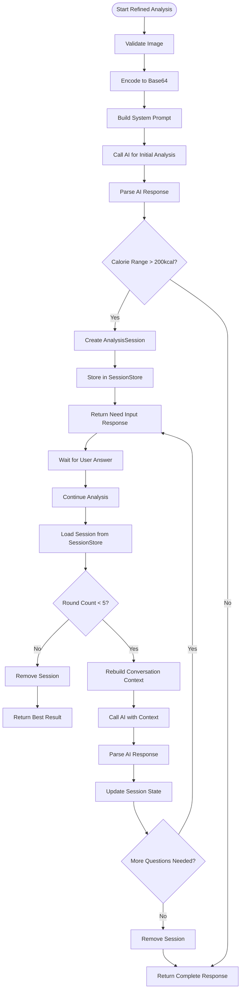
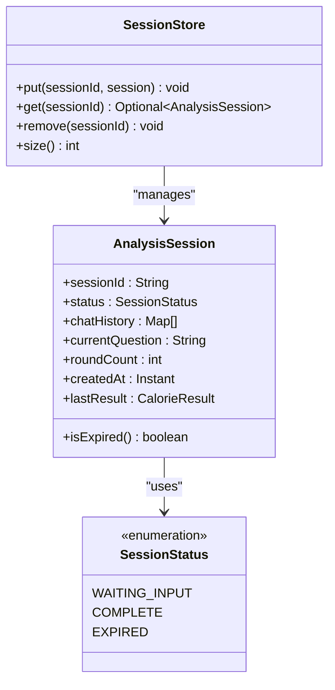
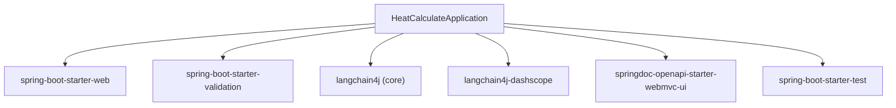

# Business Logic Architecture

<cite>
**Referenced Files in This Document**
- [CalorieController.java](file://src/main/java/com/example/heatcalculate/controller/CalorieController.java)
- [RefinedAnalysisController.java](file://src/main/java/com/example/heatcalculate/controller/RefinedAnalysisController.java)
- [CalorieService.java](file://src/main/java/com/example/heatcalculate/service/CalorieService.java)
- [RefinedAnalysisService.java](file://src/main/java/com/example/heatcalculate/service/RefinedAnalysisService.java)
- [ImageValidatorService.java](file://src/main/java/com/example/heatcalculate/service/ImageValidatorService.java)
- [SessionStore.java](file://src/main/java/com/example/heatcalculate/service/SessionStore.java)
- [AnalysisSession.java](file://src/main/java/com/example/heatcalculate/model/AnalysisSession.java)
- [RefinedAnalysisResponse.java](file://src/main/java/com/example/heatcalculate/model/RefinedAnalysisResponse.java)
- [SessionStatus.java](file://src/main/java/com/example/heatcalculate/model/SessionStatus.java)
- [LangChain4jConfig.java](file://src/main/java/com/example/heatcalculate/config/LangChain4jConfig.java)
- [CalorieResult.java](file://src/main/java/com/example/heatcalculate/model/CalorieResult.java)
- [FoodItem.java](file://src/main/java/com/example/heatcalculate/model/FoodItem.java)
- [CalorieRange.java](file://src/main/java/com/example/heatcalculate/model/CalorieRange.java)
- [AnalysisRequest.java](file://src/main/java/com/example/heatcalculate/model/AnalysisRequest.java)
- [GlobalExceptionHandler.java](file://src/main/java/com/example/heatcalculate/exception/GlobalExceptionHandler.java)
- [ImageValidationException.java](file://src/main/java/com/example/heatcalculate/exception/ImageValidationException.java)
- [ModelServiceException.java](file://src/main/java/com/example/heatcalculate/exception/ModelServiceException.java)
- [ModelParseException.java](file://src/main/java/com/example/heatcalculate/exception/ModelParseException.java)
- [SessionExpiredException.java](file://src/main/java/com/example/heatcalculate/exception/SessionExpiredException.java)
- [HeatCalculateApplication.java](file://src/main/java/com/example/heatcalculate/HeatCalculateApplication.java)
- [pom.xml](file://pom.xml)
</cite>

## Update Summary
**Changes Made**
- Added documentation for the new refined analysis service layer with multi-round conversation capabilities
- Documented SessionStore component for managing AnalysisSession instances
- Added AnalysisSession model with conversation flow orchestration
- Updated CalorieService to include both coarse and refined analysis modes
- Enhanced error handling with SessionExpiredException
- Added comprehensive multi-round analysis workflow documentation

## Table of Contents
1. [Introduction](#introduction)
2. [Project Structure](#project-structure)
3. [Core Components](#core-components)
4. [Architecture Overview](#architecture-overview)
5. [Detailed Component Analysis](#detailed-component-analysis)
6. [Multi-Round Analysis Workflow](#multi-round-analysis-workflow)
7. [Session Management System](#session-management-system)
8. [Dependency Analysis](#dependency-analysis)
9. [Performance Considerations](#performance-considerations)
10. [Troubleshooting Guide](#troubleshooting-guide)
11. [Conclusion](#conclusion)

## Introduction
This document describes the business logic architecture of the Heat Calculate service with a focus on the enhanced service-oriented architecture and component interactions. The system now supports both coarse and refined analysis modes, featuring sophisticated conversation flow orchestration through multi-round AI interactions. The architecture follows a layered pattern where CalorieController and RefinedAnalysisController expose HTTP endpoints, delegating to CalorieService and RefinedAnalysisService respectively for orchestration, coordinating specialized services including ImageValidatorService, SessionStore for conversation state management, and AI services for analysis via LangChain4j and the DashScope API using the Tongyi Qianwen-VL model.

## Project Structure
The project is organized into packages aligned with a layered architecture:
- controller: HTTP entry points and request/response contracts for both coarse and refined analysis modes
- service: business orchestration and coordination including session management
- model: domain data transfer objects (DTOs) for analysis sessions and responses
- config: Spring configuration beans for external integrations
- exception: custom exceptions and global error handling
- resources: application configuration

**Diagram sources**
- [CalorieController.java:22-96](file://src/main/java/com/example/heatcalculate/controller/CalorieController.java#L22-L96)
- [RefinedAnalysisController.java:17-72](file://src/main/java/com/example/heatcalculate/controller/RefinedAnalysisController.java#L17-L72)
- [CalorieService.java:24-145](file://src/main/java/com/example/heatcalculate/service/CalorieService.java#L24-L145)
- [RefinedAnalysisService.java:21-322](file://src/main/java/com/example/heatcalculate/service/RefinedAnalysisService.java#L21-L322)
- [ImageValidatorService.java:14-48](file://src/main/java/com/example/heatcalculate/service/ImageValidatorService.java#L14-L48)
- [SessionStore.java:15-60](file://src/main/java/com/example/heatcalculate/service/SessionStore.java#L15-L60)
- [AnalysisSession.java:12-97](file://src/main/java/com/example/heatcalculate/model/AnalysisSession.java#L12-L97)
- [RefinedAnalysisResponse.java:8-77](file://src/main/java/com/example/heatcalculate/model/RefinedAnalysisResponse.java#L8-L77)
- [SessionStatus.java:6-10](file://src/main/java/com/example/heatcalculate/model/SessionStatus.java#L6-L10)
- [AnalysisRequest.java:9-65](file://src/main/java/com/example/heatcalculate/model/AnalysisRequest.java#L9-L65)

**Section sources**
- [CalorieController.java:1-96](file://src/main/java/com/example/heatcalculate/controller/CalorieController.java#L1-L96)
- [RefinedAnalysisController.java:1-72](file://src/main/java/com/example/heatcalculate/controller/RefinedAnalysisController.java#L1-L72)
- [CalorieService.java:1-145](file://src/main/java/com/example/heatcalculate/service/CalorieService.java#L1-L145)
- [RefinedAnalysisService.java:1-322](file://src/main/java/com/example/heatcalculate/service/RefinedAnalysisService.java#L1-L322)
- [ImageValidatorService.java:1-48](file://src/main/java/com/example/heatcalculate/service/ImageValidatorService.java#L1-L48)
- [SessionStore.java:1-60](file://src/main/java/com/example/heatcalculate/service/SessionStore.java#L1-L60)
- [AnalysisSession.java:1-97](file://src/main/java/com/example/heatcalculate/model/AnalysisSession.java#L1-L97)
- [RefinedAnalysisResponse.java:1-77](file://src/main/java/com/example/heatcalculate/model/RefinedAnalysisResponse.java#L1-L77)
- [SessionStatus.java:1-11](file://src/main/java/com/example/heatcalculate/model/SessionStatus.java#L1-L11)
- [AnalysisRequest.java:1-65](file://src/main/java/com/example/heatcalculate/model/AnalysisRequest.java#L1-L65)

## Core Components
- **CalorieController**: REST endpoint exposing POST /api/v1/calories/analyze for coarse analysis mode, validating request parameters, logging incoming requests, and delegating to CalorieService for basic image analysis.
- **RefinedAnalysisController**: REST endpoint exposing POST /api/v1/calories/analyze/refined for refined analysis mode, managing multi-round conversation flows with session-based state management.
- **CalorieService**: Orchestrates coarse analysis flow: validates image, encodes to Base64, creates AI service proxy via LangChain4j, invokes AI analysis, and returns CalorieResult.
- **RefinedAnalysisService**: Orchestrates refined analysis flow with multi-round conversations: validates image, manages session state, coordinates AI interactions, and returns RefinedAnalysisResponse with either completion or continuation requests.
- **ImageValidatorService**: Enforces image constraints (non-empty, size ≤ 10 MB, allowed content types: JPEG, JPG, PNG, WEBP).
- **SessionStore**: Manages AnalysisSession instances with lazy expiration cleanup, thread-safe concurrent storage, and automatic session lifecycle management.
- **AnalysisSession**: Represents conversation state with sessionId, chat history, current question, round count, creation timestamp, and last result tracking.
- **RefinedAnalysisResponse**: DTO for refined analysis responses with sessionId, status indicators, question prompts, partial results, and final results.
- **SessionStatus**: Enum defining session states: WAITING_INPUT, COMPLETE, EXPIRED.
- **LangChain4jConfig**: Provides QwenChatModel bean configured via application properties for DashScope integration.
- **Domain Models**: CalorieResult aggregates per-food items and total calorie range; FoodItem captures name, estimated weight, and CalorieRange; CalorieRange holds low/mid/high estimates; AnalysisRequest encapsulates multipart image and optional note.
- **Exception Handling**: GlobalExceptionHandler translates domain exceptions into standardized HTTP responses, including new SessionExpiredException for refined analysis flows.

**Section sources**
- [CalorieController.java:22-96](file://src/main/java/com/example/heatcalculate/controller/CalorieController.java#L22-L96)
- [RefinedAnalysisController.java:17-72](file://src/main/java/com/example/heatcalculate/controller/RefinedAnalysisController.java#L17-L72)
- [CalorieService.java:24-145](file://src/main/java/com/example/heatcalculate/service/CalorieService.java#L24-L145)
- [RefinedAnalysisService.java:21-322](file://src/main/java/com/example/heatcalculate/service/RefinedAnalysisService.java#L21-L322)
- [ImageValidatorService.java:14-48](file://src/main/java/com/example/heatcalculate/service/ImageValidatorService.java#L14-L48)
- [SessionStore.java:15-60](file://src/main/java/com/example/heatcalculate/service/SessionStore.java#L15-L60)
- [AnalysisSession.java:12-97](file://src/main/java/com/example/heatcalculate/model/AnalysisSession.java#L12-L97)
- [RefinedAnalysisResponse.java:8-77](file://src/main/java/com/example/heatcalculate/model/RefinedAnalysisResponse.java#L8-L77)
- [SessionStatus.java:6-10](file://src/main/java/com/example/heatcalculate/model/SessionStatus.java#L6-L10)
- [LangChain4jConfig.java:11-31](file://src/main/java/com/example/heatcalculate/config/LangChain4jConfig.java#L11-L31)
- [CalorieResult.java:10-84](file://src/main/java/com/example/heatcalculate/model/CalorieResult.java#L10-L84)
- [FoodItem.java:8-82](file://src/main/java/com/example/heatcalculate/model/FoodItem.java#L8-L82)
- [CalorieRange.java:8-82](file://src/main/java/com/example/heatcalculate/model/CalorieRange.java#L8-L82)
- [AnalysisRequest.java:9-65](file://src/main/java/com/example/heatcalculate/model/AnalysisRequest.java#L9-L65)
- [GlobalExceptionHandler.java:14-122](file://src/main/java/com/example/heatcalculate/exception/GlobalExceptionHandler.java#L14-L122)

## Architecture Overview
The system implements an enhanced service-oriented architecture with clear separation of concerns and dual analysis modes:
- **Presentation Layer**: CalorieController handles coarse analysis; RefinedAnalysisController handles refined analysis with multi-round conversation management.
- **Application Layer**: CalorieService coordinates basic validation and AI analysis; RefinedAnalysisService coordinates complex conversation flows with session management.
- **Domain Services**: ImageValidatorService enforces constraints; SessionStore manages conversation state; specialized AI services define analysis contracts.
- **Infrastructure**: LangChain4jConfig wires QwenChatModel to DashScope for inference.
- **Data**: Strongly typed models represent domain entities, conversation sessions, and analysis results.

**Diagram sources**
- [CalorieController.java:42-94](file://src/main/java/com/example/heatcalculate/controller/CalorieController.java#L42-L94)
- [RefinedAnalysisController.java:36-70](file://src/main/java/com/example/heatcalculate/controller/RefinedAnalysisController.java#L36-L70)
- [CalorieService.java:79-117](file://src/main/java/com/example/heatcalculate/service/CalorieService.java#L79-L117)
- [RefinedAnalysisService.java:88-154](file://src/main/java/com/example/heatcalculate/service/RefinedAnalysisService.java#L88-L154)
- [ImageValidatorService.java:31-46](file://src/main/java/com/example/heatcalculate/service/ImageValidatorService.java#L31-L46)
- [SessionStore.java:33-52](file://src/main/java/com/example/heatcalculate/service/SessionStore.java#L33-L52)
- [AnalysisSession.java:93-95](file://src/main/java/com/example/heatcalculate/model/AnalysisSession.java#L93-L95)
- [LangChain4jConfig.java:23-29](file://src/main/java/com/example/heatcalculate/config/LangChain4jConfig.java#L23-L29)

## Detailed Component Analysis

### Coarse Analysis Mode (CalorieService)
The coarse analysis mode provides straightforward single-round analysis:
1. CalorieController receives multipart/form-data with image and optional note.
2. CalorieService validates the image via ImageValidatorService.
3. CalorieService encodes the image to Base64 with data URI prefix.
4. CalorieService creates an AI service proxy using LangChain4j and QwenChatModel.
5. CalorieService invokes AI analysis with system prompt and image content.
6. AI service returns CalorieResult; CalorieController returns HTTP 200 with JSON body.

**Diagram sources**
- [CalorieController.java:81-94](file://src/main/java/com/example/heatcalculate/controller/CalorieController.java#L81-L94)
- [CalorieService.java:79-117](file://src/main/java/com/example/heatcalculate/service/CalorieService.java#L79-L117)
- [ImageValidatorService.java:31-46](file://src/main/java/com/example/heatcalculate/service/ImageValidatorService.java#L31-L46)
- [LangChain4jConfig.java:23-29](file://src/main/java/com/example/heatcalculate/config/LangChain4jConfig.java#L23-L29)

**Section sources**
- [CalorieController.java:42-94](file://src/main/java/com/example/heatcalculate/controller/CalorieController.java#L42-L94)
- [CalorieService.java:79-145](file://src/main/java/com/example/heatcalculate/service/CalorieService.java#L79-L145)
- [ImageValidatorService.java:31-46](file://src/main/java/com/example/heatcalculate/service/ImageValidatorService.java#L31-L46)

### Refined Analysis Mode (RefinedAnalysisService)
The refined analysis mode provides sophisticated multi-round conversation capabilities:
1. RefinedAnalysisController receives multipart/form-data with image and optional note.
2. RefinedAnalysisService validates the image via ImageValidatorService.
3. RefinedAnalysisService encodes the image to Base64 and creates initial conversation context.
4. RefinedAnalysisService calls AI service for initial analysis.
5. If AI response requires clarification, RefinedAnalysisService creates AnalysisSession with SessionStore.
6. Controller returns RefinedAnalysisResponse with status "need_input" and question.
7. Subsequent requests continue conversation until completion or maximum rounds reached.

**Diagram sources**
- [RefinedAnalysisController.java:36-70](file://src/main/java/com/example/heatcalculate/controller/RefinedAnalysisController.java#L36-L70)
- [RefinedAnalysisService.java:88-154](file://src/main/java/com/example/heatcalculate/service/RefinedAnalysisService.java#L88-L154)
- [RefinedAnalysisService.java:159-218](file://src/main/java/com/example/heatcalculate/service/RefinedAnalysisService.java#L159-L218)
- [SessionStore.java:33-52](file://src/main/java/com/example/heatcalculate/service/SessionStore.java#L33-L52)
- [AnalysisSession.java:93-95](file://src/main/java/com/example/heatcalculate/model/AnalysisSession.java#L93-L95)

**Section sources**
- [RefinedAnalysisController.java:36-70](file://src/main/java/com/example/heatcalculate/controller/RefinedAnalysisController.java#L36-L70)
- [RefinedAnalysisService.java:88-218](file://src/main/java/com/example/heatcalculate/service/RefinedAnalysisService.java#L88-L218)
- [SessionStore.java:33-52](file://src/main/java/com/example/heatcalculate/service/SessionStore.java#L33-L52)
- [AnalysisSession.java:93-95](file://src/main/java/com/example/heatcalculate/model/AnalysisSession.java#L93-L95)

### Image Validation Pipeline
The validation pipeline ensures robust input handling for both analysis modes:
- Non-empty check prevents null or empty files.
- Size limit enforcement at 10 MB to avoid excessive payloads.
- Content type verification against allowed MIME types: image/jpeg, image/jpg, image/png, image/webp.
- Throws ImageValidationException on failure, which is handled globally.

**Diagram sources**
- [ImageValidatorService.java:31-46](file://src/main/java/com/example/heatcalculate/service/ImageValidatorService.java#L31-L46)

**Section sources**
- [ImageValidatorService.java:17-46](file://src/main/java/com/example/heatcalculate/service/ImageValidatorService.java#L17-L46)
- [GlobalExceptionHandler.java:19-28](file://src/main/java/com/example/heatcalculate/exception/GlobalExceptionHandler.java#L19-L28)

### AI Integration Pattern with LangChain4j
The AI integration leverages LangChain4j's @AiServices to define a strongly-typed contract:
- FoodCalorieAiService declares system and user messages with explicit JSON schema expectations.
- CalorieService constructs a QwenChatModel bean via LangChain4jConfig and uses it to create an AI service proxy.
- The proxy invocation sends a Base64-encoded image plus optional note to the DashScope API through QwenChatModel.
- The model returns a structured CalorieResult, which CalorieController serializes to JSON.
- RefinedAnalysisService extends this pattern with conversation memory and multi-round interactions.

**Diagram sources**
- [RefinedAnalysisService.java:77-83](file://src/main/java/com/example/heatcalculate/service/RefinedAnalysisService.java#L77-L83)
- [SessionStore.java:19](file://src/main/java/com/example/heatcalculate/service/SessionStore.java#L19)
- [AnalysisSession.java:14-95](file://src/main/java/com/example/heatcalculate/model/AnalysisSession.java#L14-L95)
- [LangChain4jConfig.java:23-29](file://src/main/java/com/example/heatcalculate/config/LangChain4jConfig.java#L23-L29)

**Section sources**
- [RefinedAnalysisService.java:77-83](file://src/main/java/com/example/heatcalculate/service/RefinedAnalysisService.java#L77-L83)
- [SessionStore.java:19](file://src/main/java/com/example/heatcalculate/service/SessionStore.java#L19)
- [AnalysisSession.java:14-95](file://src/main/java/com/example/heatcalculate/model/AnalysisSession.java#L14-L95)
- [LangChain4jConfig.java:14-29](file://src/main/java/com/example/heatcalculate/config/LangChain4jConfig.java#L14-L29)

### Data Models and DTO Contracts
The domain models define the shape of the request and response for both analysis modes:
- **AnalysisRequest**: multipart image and optional note for coarse analysis.
- **CalorieResult**: list of FoodItem and totalCalories range with disclaimer for both analysis modes.
- **FoodItem**: name, estimatedWeight, and CalorieRange for both analysis modes.
- **CalorieRange**: low/mid/high integer estimates for both analysis modes.
- **AnalysisSession**: sessionId, chatHistory, currentQuestion, roundCount, createdAt, lastResult for refined analysis.
- **RefinedAnalysisResponse**: sessionId, status, question, partialResult, result for refined analysis.
- **SessionStatus**: enum values for refined analysis state management.

**Diagram sources**
- [AnalysisRequest.java:10-65](file://src/main/java/com/example/heatcalculate/model/AnalysisRequest.java#L10-L65)
- [CalorieResult.java:11-84](file://src/main/java/com/example/heatcalculate/model/CalorieResult.java#L11-L84)
- [FoodItem.java:9-82](file://src/main/java/com/example/heatcalculate/model/FoodItem.java#L9-L82)
- [CalorieRange.java:9-82](file://src/main/java/com/example/heatcalculate/model/CalorieRange.java#L9-L82)
- [AnalysisSession.java:14-95](file://src/main/java/com/example/heatcalculate/model/AnalysisSession.java#L14-L95)
- [RefinedAnalysisResponse.java:11-15](file://src/main/java/com/example/heatcalculate/model/RefinedAnalysisResponse.java#L11-L15)
- [SessionStatus.java:6-10](file://src/main/java/com/example/heatcalculate/model/SessionStatus.java#L6-L10)

**Section sources**
- [AnalysisRequest.java:10-65](file://src/main/java/com/example/heatcalculate/model/AnalysisRequest.java#L10-L65)
- [CalorieResult.java:11-84](file://src/main/java/com/example/heatcalculate/model/CalorieResult.java#L11-L84)
- [FoodItem.java:9-82](file://src/main/java/com/example/heatcalculate/model/FoodItem.java#L9-L82)
- [CalorieRange.java:9-82](file://src/main/java/com/example/heatcalculate/model/CalorieRange.java#L9-L82)
- [AnalysisSession.java:14-95](file://src/main/java/com/example/heatcalculate/model/AnalysisSession.java#L14-L95)
- [RefinedAnalysisResponse.java:11-15](file://src/main/java/com/example/heatcalculate/model/RefinedAnalysisResponse.java#L11-L15)
- [SessionStatus.java:6-10](file://src/main/java/com/example/heatcalculate/model/SessionStatus.java#L6-L10)

### Dependency Injection and Transaction Management
- **CalorieController** depends on CalorieService (constructor injection).
- **RefinedAnalysisController** depends on RefinedAnalysisService (constructor injection).
- **CalorieService** depends on ImageValidatorService and QwenChatModel (constructor injection).
- **RefinedAnalysisService** depends on ImageValidatorService, ChatLanguageModel, and SessionStore (constructor injection).
- **SessionStore** depends on ConcurrentHashMap for thread-safe storage management.
- **AnalysisSession** encapsulates conversation state with automatic expiration handling.
- QwenChatModel is a Spring bean configured in LangChain4jConfig.
- No explicit transaction demarcation is present; services are stateless and rely on HTTP session/sessionless behavior.

**Section sources**
- [CalorieController.java:29-33](file://src/main/java/com/example/heatcalculate/controller/CalorieController.java#L29-L33)
- [RefinedAnalysisController.java:27-31](file://src/main/java/com/example/heatcalculate/controller/RefinedAnalysisController.java#L27-L31)
- [CalorieService.java:71-74](file://src/main/java/com/example/heatcalculate/service/CalorieService.java#L71-L74)
- [RefinedAnalysisService.java:77-83](file://src/main/java/com/example/heatcalculate/service/RefinedAnalysisService.java#L77-L83)
- [SessionStore.java:19](file://src/main/java/com/example/heatcalculate/service/SessionStore.java#L19)
- [LangChain4jConfig.java:23-29](file://src/main/java/com/example/heatcalculate/config/LangChain4jConfig.java#L23-L29)

### Error Propagation and Global Exception Handling
- **ImageValidatorService** throws ImageValidationException for invalid inputs; handled by GlobalExceptionHandler returning HTTP 400.
- **CalorieService** and **RefinedAnalysisService** wrap IO and model invocation failures into ModelServiceException; handled by GlobalExceptionHandler returning HTTP 502.
- **ModelParseException** is handled by GlobalExceptionHandler returning HTTP 500.
- **SessionExpiredException** is thrown when refined analysis session is not found or expired; handled by RefinedAnalysisController returning HTTP 404.
- **GlobalExceptionHandler** provides a standardized ErrorResponse with code and message.

**Diagram sources**
- [GlobalExceptionHandler.java:19-61](file://src/main/java/com/example/heatcalculate/exception/GlobalExceptionHandler.java#L19-L61)
- [ImageValidationException.java:6-11](file://src/main/java/com/example/heatcalculate/exception/ImageValidationException.java#L6-L11)
- [ModelServiceException.java:6-15](file://src/main/java/com/example/heatcalculate/exception/ModelServiceException.java#L6-L15)
- [ModelParseException.java:6-15](file://src/main/java/com/example/heatcalculate/exception/ModelParseException.java#L6-L15)
- [SessionExpiredException.java:8-10](file://src/main/java/com/example/heatcalculate/exception/SessionExpiredException.java#L8-L10)

**Section sources**
- [GlobalExceptionHandler.java:19-61](file://src/main/java/com/example/heatcalculate/exception/GlobalExceptionHandler.java#L19-L61)
- [ImageValidationException.java:6-11](file://src/main/java/com/example/heatcalculate/exception/ImageValidationException.java#L6-L11)
- [ModelServiceException.java:6-15](file://src/main/java/com/example/heatcalculate/exception/ModelServiceException.java#L6-L15)
- [ModelParseException.java:6-15](file://src/main/java/com/example/heatcalculate/exception/ModelParseException.java#L6-L15)
- [SessionExpiredException.java:8-10](file://src/main/java/com/example/heatcalculate/exception/SessionExpiredException.java#L8-L10)

## Multi-Round Analysis Workflow
The refined analysis workflow supports sophisticated conversation management with up to 5 rounds of questioning:

### Initial Analysis Phase
1. **Image Validation**: Validates image constraints using ImageValidatorService.
2. **Base64 Encoding**: Encodes image to Base64 with proper MIME type detection.
3. **System Prompt**: Constructs comprehensive system prompt with cooking guidelines and JSON schema requirements.
4. **AI Analysis**: Calls QwenChatModel with image and system prompt.
5. **Response Parsing**: Parses JSON response and extracts optional clarifying question.

### Conversation Flow Orchestration
1. **Session Creation**: Creates AnalysisSession with unique sessionId and initial state.
2. **Question Generation**: AI generates clarifying question if calorie range uncertainty > 200 kcal.
3. **State Persistence**: Stores session in SessionStore with lazy expiration (3 minutes).
4. **Response Return**: Returns RefinedAnalysisResponse with status "need_input".

### Continued Analysis Phase
1. **Session Retrieval**: Retrieves AnalysisSession from SessionStore with automatic cleanup.
2. **Round Count Check**: Ensures maximum 5 rounds limit is not exceeded.
3. **Context Reconstruction**: Rebuilds conversation history with previous exchanges.
4. **User Answer Integration**: Adds user's answer to conversation context.
5. **AI Continuation**: Calls AI with enriched context for refined analysis.
6. **Result Update**: Updates session with new result and increments round count.
7. **Completion Decision**: Either continues questioning or completes analysis.

**Diagram sources**
- [RefinedAnalysisService.java:88-154](file://src/main/java/com/example/heatcalculate/service/RefinedAnalysisService.java#L88-L154)
- [RefinedAnalysisService.java:159-218](file://src/main/java/com/example/heatcalculate/service/RefinedAnalysisService.java#L159-L218)
- [SessionStore.java:33-52](file://src/main/java/com/example/heatcalculate/service/SessionStore.java#L33-L52)
- [AnalysisSession.java:93-95](file://src/main/java/com/example/heatcalculate/model/AnalysisSession.java#L93-L95)

**Section sources**
- [RefinedAnalysisService.java:88-218](file://src/main/java/com/example/heatcalculate/service/RefinedAnalysisService.java#L88-L218)
- [SessionStore.java:33-52](file://src/main/java/com/example/heatcalculate/service/SessionStore.java#L33-L52)
- [AnalysisSession.java:93-95](file://src/main/java/com/example/heatcalculate/model/AnalysisSession.java#L93-L95)

## Session Management System
The SessionStore component provides thread-safe session management with automatic cleanup:

### SessionStore Implementation
- **Thread Safety**: Uses ConcurrentHashMap for concurrent access safety.
- **Lazy Expiration**: Checks session expiration (3 minutes) during get() operations.
- **Automatic Cleanup**: Removes expired sessions automatically during retrieval.
- **Size Monitoring**: Provides size() method for session count monitoring.

### AnalysisSession Lifecycle
- **Creation**: Generated with random sessionId and WAITING_INPUT status.
- **State Tracking**: Maintains chat history, current question, round count, and timestamps.
- **Expiration**: Automatically expires after 3 minutes of inactivity.
- **Persistence**: Stored in SessionStore until completion or expiration.

### Conversation Memory Management
- **Message History**: Stores complete conversation context for continuation.
- **Image Preservation**: Retains original image data for multi-round consistency.
- **Context Reconstruction**: Rebuilds conversation context for each continuation round.
- **Round Limit Enforcement**: Prevents infinite conversation loops with 5-round maximum.

**Diagram sources**
- [SessionStore.java:24-59](file://src/main/java/com/example/heatcalculate/service/SessionStore.java#L24-L59)
- [AnalysisSession.java:14-95](file://src/main/java/com/example/heatcalculate/model/AnalysisSession.java#L14-L95)
- [SessionStatus.java:6-10](file://src/main/java/com/example/heatcalculate/model/SessionStatus.java#L6-L10)

**Section sources**
- [SessionStore.java:24-59](file://src/main/java/com/example/heatcalculate/service/SessionStore.java#L24-L59)
- [AnalysisSession.java:14-95](file://src/main/java/com/example/heatcalculate/model/AnalysisSession.java#L14-L95)
- [SessionStatus.java:6-10](file://src/main/java/com/example/heatcalculate/model/SessionStatus.java#L6-L10)

## Dependency Analysis
External dependencies and integration boundaries:
- Spring Boot Web and Validation for HTTP and validation support.
- LangChain4j core and DashScope integration for AI model access.
- SpringDoc OpenAPI for API documentation.
- Maven plugin for Spring Boot packaging.

**Diagram sources**
- [pom.xml:28-67](file://pom.xml#L28-L67)
- [HeatCalculateApplication.java:9-15](file://src/main/java/com/example/heatcalculate/HeatCalculateApplication.java#L9-L15)

**Section sources**
- [pom.xml:28-67](file://pom.xml#L28-L67)
- [HeatCalculateApplication.java:9-15](file://src/main/java/com/example/heatcalculate/HeatCalculateApplication.java#L9-L15)

## Performance Considerations
- **Image size limit (10 MB)** reduces payload processing overhead and network latency for both analysis modes.
- **Base64 encoding** increases size by approximately 33%; consider streaming or binary payloads if bandwidth is constrained.
- **AI model invocations** are external; implement retries with exponential backoff and circuit breaker patterns at the integration boundary.
- **Session storage** uses ConcurrentHashMap for efficient concurrent access; automatic cleanup prevents memory leaks.
- **Conversation context** is stored in memory; consider persistence for long-running sessions in production.
- **Logging spans** across controller, service, and AI invocation; ensure log levels are tuned for production to minimize I/O overhead.
- **Session expiration** (3 minutes) balances resource usage with user experience.
- **Round limit** (5 rounds) prevents infinite loops and excessive API calls.
- **Monitor response times** for image validation, encoding, AI model calls, and session management to identify bottlenecks.

## Troubleshooting Guide
Common issues and resolutions:
- **Image validation errors (HTTP 400)**: Verify file is not empty, under 10 MB, and has allowed content type (JPEG/JPG/PNG/WEBP).
- **Model service unavailable (HTTP 502)**: Confirm API key and model name configuration; retry with backoff.
- **Model parse errors (HTTP 500)**: Inspect AI output format compliance; ensure system prompt matches expected JSON schema.
- **Session expired errors (HTTP 404)**: In refined analysis, sessions expire after 3 minutes; restart analysis with new image upload.
- **Too many rounds error**: Refined analysis is limited to 5 rounds; complete analysis or restart with different image.
- **Unexpected null or empty results**: Validate that the image contains visible food items and sufficient resolution.
- **Conversation state issues**: SessionStore automatically cleans expired sessions; check server logs for cleanup events.

**Section sources**
- [ImageValidatorService.java:31-46](file://src/main/java/com/example/heatcalculate/service/ImageValidatorService.java#L31-L46)
- [GlobalExceptionHandler.java:19-61](file://src/main/java/com/example/heatcalculate/exception/GlobalExceptionHandler.java#L19-L61)
- [RefinedAnalysisService.java:169-174](file://src/main/java/com/example/heatcalculate/service/RefinedAnalysisService.java#L169-L174)
- [SessionStore.java:38-42](file://src/main/java/com/example/heatcalculate/service/SessionStore.java#L38-L42)

## Conclusion
The Heat Calculate service employs an enhanced service-oriented architecture with well-defined layers and dual analysis modes. CalorieController focuses on coarse analysis for quick results, while RefinedAnalysisController provides sophisticated multi-round conversation capabilities for precise analysis. Both CalorieService and RefinedAnalysisService orchestrate validation and AI analysis, with specialized services encapsulating domain concerns. The SessionStore component provides robust session management with automatic cleanup, enabling complex conversation flows. The LangChain4j integration with Tongyi Qianwen-VL via DashScope enables structured, reliable AI-driven food recognition. Robust validation, standardized error handling, clear data models, and comprehensive session management contribute to a maintainable and extensible business logic layer that supports both simple and complex analysis scenarios.