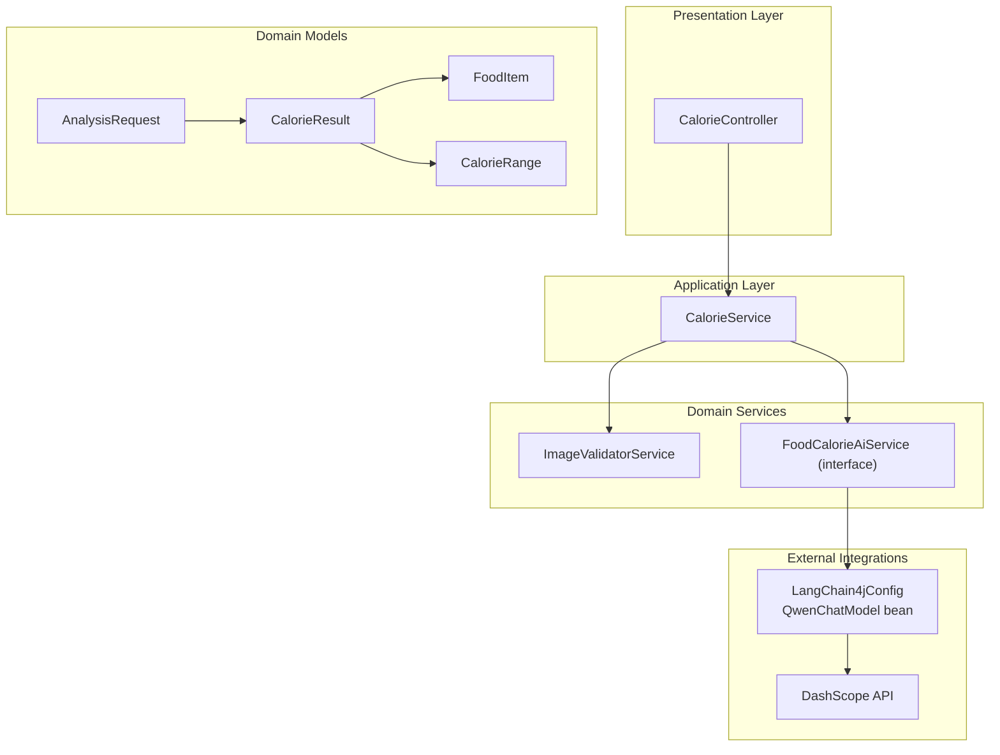
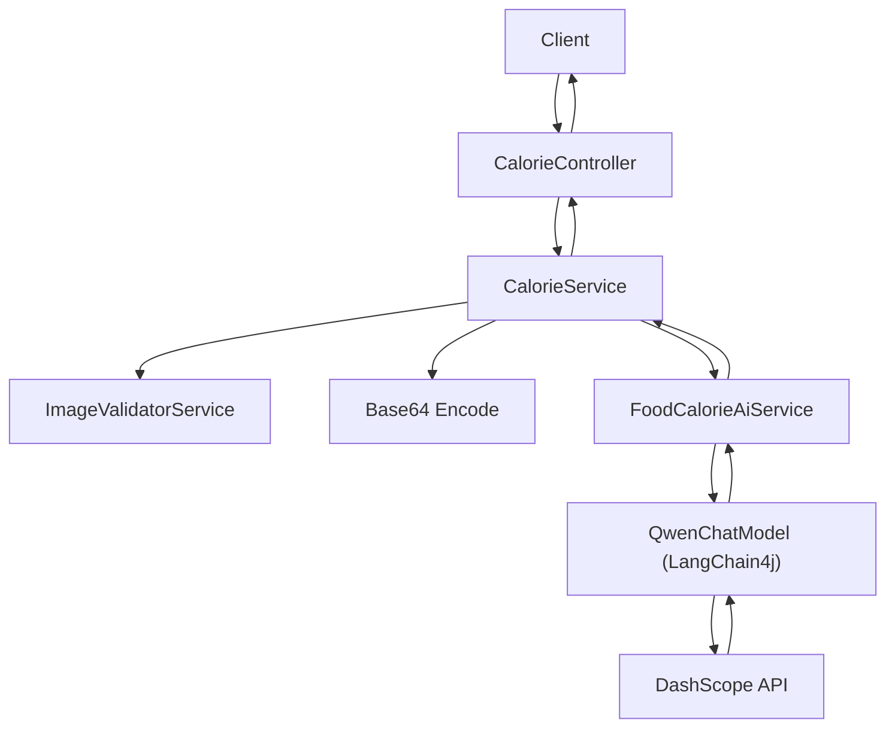
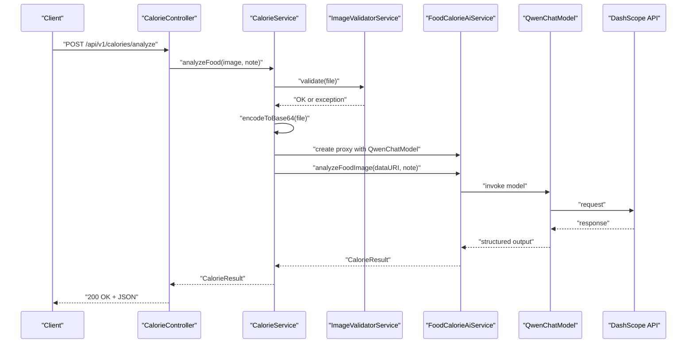
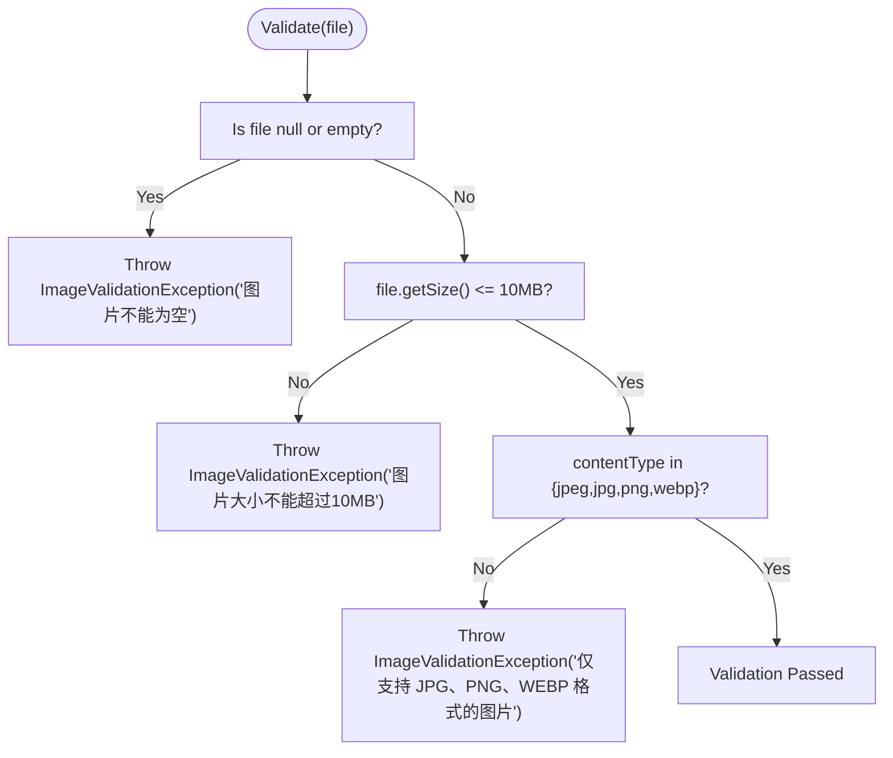
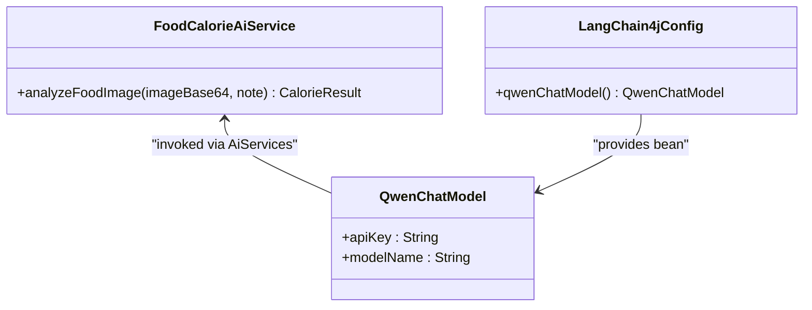
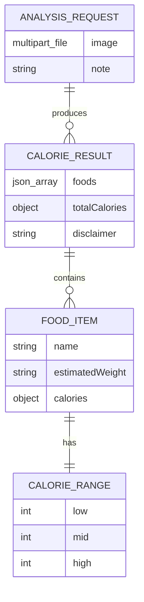
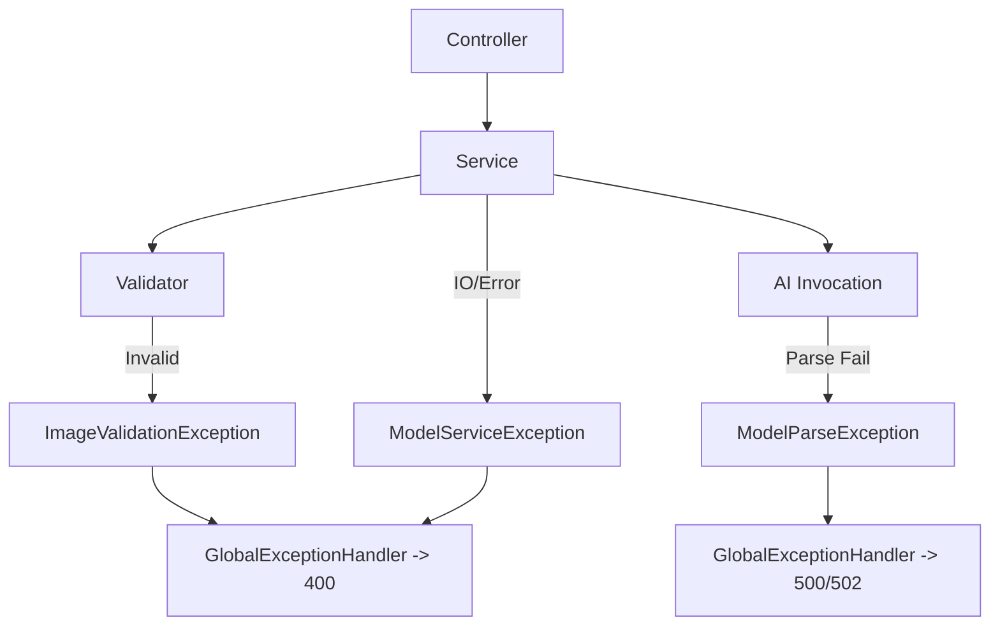
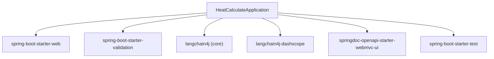

# Business Logic Architecture

<cite>
**Referenced Files in This Document**
- [CalorieController.java](file://src/main/java/com/example/heatcalculate/controller/CalorieController.java)
- [CalorieService.java](file://src/main/java/com/example/heatcalculate/service/CalorieService.java)
- [ImageValidatorService.java](file://src/main/java/com/example/heatcalculate/service/ImageValidatorService.java)
- [FoodCalorieAiService.java](file://src/main/java/com/example/heatcalculate/ai/FoodCalorieAiService.java)
- [LangChain4jConfig.java](file://src/main/java/com/example/heatcalculate/config/LangChain4jConfig.java)
- [CalorieResult.java](file://src/main/java/com/example/heatcalculate/model/CalorieResult.java)
- [FoodItem.java](file://src/main/java/com/example/heatcalculate/model/FoodItem.java)
- [CalorieRange.java](file://src/main/java/com/example/heatcalculate/model/CalorieRange.java)
- [AnalysisRequest.java](file://src/main/java/com/example/heatcalculate/model/AnalysisRequest.java)
- [GlobalExceptionHandler.java](file://src/main/java/com/example/heatcalculate/exception/GlobalExceptionHandler.java)
- [ImageValidationException.java](file://src/main/java/com/example/heatcalculate/exception/ImageValidationException.java)
- [ModelServiceException.java](file://src/main/java/com/example/heatcalculate/exception/ModelServiceException.java)
- [ModelParseException.java](file://src/main/java/com/example/heatcalculate/exception/ModelParseException.java)
- [HeatCalculateApplication.java](file://src/main/java/com/example/heatcalculate/HeatCalculateApplication.java)
- [pom.xml](file://pom.xml)
</cite>

## Table of Contents
1. [Introduction](#introduction)
2. [Project Structure](#project-structure)
3. [Core Components](#core-components)
4. [Architecture Overview](#architecture-overview)
5. [Detailed Component Analysis](#detailed-component-analysis)
6. [Dependency Analysis](#dependency-analysis)
7. [Performance Considerations](#performance-considerations)
8. [Troubleshooting Guide](#troubleshooting-guide)
9. [Conclusion](#conclusion)

## Introduction
This document describes the business logic architecture of the Heat Calculate service with a focus on the service-oriented architecture and component interactions. The system follows a layered pattern where CalorieController exposes HTTP endpoints, delegates to CalorieService for orchestration, and coordinates two specialized services: ImageValidatorService for image validation and FoodCalorieAiService for AI-powered analysis via LangChain4j and the DashScope API using the Tongyi Qianwen-VL model. The document explains the request processing workflow, dependency injection, error propagation, image validation pipeline, AI integration pattern, and cross-cutting concerns such as logging and monitoring.

## Project Structure
The project is organized into packages aligned with a layered architecture:
- controller: HTTP entry points and request/response contracts
- service: business orchestration and coordination
- ai: AI service interface definition for structured model output
- config: Spring configuration beans for external integrations
- model: domain data transfer objects (DTOs)
- exception: custom exceptions and global error handling
- resources: application configuration

**Diagram sources**
- [CalorieController.java:22-96](file://src/main/java/com/example/heatcalculate/controller/CalorieController.java#L22-L96)
- [CalorieService.java:20-85](file://src/main/java/com/example/heatcalculate/service/CalorieService.java#L20-L85)
- [ImageValidatorService.java:14-48](file://src/main/java/com/example/heatcalculate/service/ImageValidatorService.java#L14-L48)
- [FoodCalorieAiService.java:12-59](file://src/main/java/com/example/heatcalculate/ai/FoodCalorieAiService.java#L12-L59)
- [LangChain4jConfig.java:11-31](file://src/main/java/com/example/heatcalculate/config/LangChain4jConfig.java#L11-L31)
- [CalorieResult.java:10-84](file://src/main/java/com/example/heatcalculate/model/CalorieResult.java#L10-L84)
- [FoodItem.java:8-82](file://src/main/java/com/example/heatcalculate/model/FoodItem.java#L8-L82)
- [CalorieRange.java:8-82](file://src/main/java/com/example/heatcalculate/model/CalorieRange.java#L8-L82)
- [AnalysisRequest.java:9-65](file://src/main/java/com/example/heatcalculate/model/AnalysisRequest.java#L9-L65)

**Section sources**
- [CalorieController.java:1-96](file://src/main/java/com/example/heatcalculate/controller/CalorieController.java#L1-L96)
- [CalorieService.java:1-85](file://src/main/java/com/example/heatcalculate/service/CalorieService.java#L1-L85)
- [ImageValidatorService.java:1-48](file://src/main/java/com/example/heatcalculate/service/ImageValidatorService.java#L1-L48)
- [FoodCalorieAiService.java:1-59](file://src/main/java/com/example/heatcalculate/ai/FoodCalorieAiService.java#L1-L59)
- [LangChain4jConfig.java:1-31](file://src/main/java/com/example/heatcalculate/config/LangChain4jConfig.java#L1-L31)
- [CalorieResult.java:1-84](file://src/main/java/com/example/heatcalculate/model/CalorieResult.java#L1-L84)
- [FoodItem.java:1-82](file://src/main/java/com/example/heatcalculate/model/FoodItem.java#L1-L82)
- [CalorieRange.java:1-82](file://src/main/java/com/example/heatcalculate/model/CalorieRange.java#L1-L82)
- [AnalysisRequest.java:1-65](file://src/main/java/com/example/heatcalculate/model/AnalysisRequest.java#L1-L65)

## Core Components
- CalorieController: REST endpoint exposing POST /api/v1/calories/analyze, validates request parameters, logs incoming requests, and delegates to CalorieService.
- CalorieService: Orchestrates the business flow: validates image, encodes to Base64, creates an AI service proxy via LangChain4j, invokes AI analysis, and returns CalorieResult.
- ImageValidatorService: Enforces image constraints (non-empty, size ≤ 10 MB, allowed content types: JPEG, JPG, PNG, WEBP).
- FoodCalorieAiService: Defines the AI contract with system and user messages, accepting a Base64 image payload and optional note, returning CalorieResult.
- LangChain4jConfig: Provides a QwenChatModel bean configured via application properties for DashScope integration.
- Domain Models: CalorieResult aggregates per-food items and total calorie range; FoodItem captures name, estimated weight, and CalorieRange; CalorieRange holds low/mid/high estimates; AnalysisRequest encapsulates multipart image and optional note.
- Exception Handling: GlobalExceptionHandler translates domain exceptions into standardized HTTP responses.

**Section sources**
- [CalorieController.java:22-96](file://src/main/java/com/example/heatcalculate/controller/CalorieController.java#L22-L96)
- [CalorieService.java:20-85](file://src/main/java/com/example/heatcalculate/service/CalorieService.java#L20-L85)
- [ImageValidatorService.java:14-48](file://src/main/java/com/example/heatcalculate/service/ImageValidatorService.java#L14-L48)
- [FoodCalorieAiService.java:12-59](file://src/main/java/com/example/heatcalculate/ai/FoodCalorieAiService.java#L12-L59)
- [LangChain4jConfig.java:11-31](file://src/main/java/com/example/heatcalculate/config/LangChain4jConfig.java#L11-L31)
- [CalorieResult.java:10-84](file://src/main/java/com/example/heatcalculate/model/CalorieResult.java#L10-L84)
- [FoodItem.java:8-82](file://src/main/java/com/example/heatcalculate/model/FoodItem.java#L8-L82)
- [CalorieRange.java:8-82](file://src/main/java/com/example/heatcalculate/model/CalorieRange.java#L8-L82)
- [AnalysisRequest.java:9-65](file://src/main/java/com/example/heatcalculate/model/AnalysisRequest.java#L9-L65)
- [GlobalExceptionHandler.java:14-122](file://src/main/java/com/example/heatcalculate/exception/GlobalExceptionHandler.java#L14-L122)

## Architecture Overview
The system implements a service-oriented architecture with clear separation of concerns:
- Presentation: CalorieController handles HTTP requests and responses.
- Application: CalorieService coordinates validation and AI analysis.
- Domain Services: ImageValidatorService enforces constraints; FoodCalorieAiService defines AI contract.
- Infrastructure: LangChain4jConfig wires the QwenChatModel to DashScope for inference.
- Data: Strongly typed models represent domain entities and results.

**Diagram sources**
- [CalorieController.java:42-94](file://src/main/java/com/example/heatcalculate/controller/CalorieController.java#L42-L94)
- [CalorieService.java:40-69](file://src/main/java/com/example/heatcalculate/service/CalorieService.java#L40-L69)
- [ImageValidatorService.java:31-46](file://src/main/java/com/example/heatcalculate/service/ImageValidatorService.java#L31-L46)
- [FoodCalorieAiService.java:50-57](file://src/main/java/com/example/heatcalculate/ai/FoodCalorieAiService.java#L50-L57)
- [LangChain4jConfig.java:23-29](file://src/main/java/com/example/heatcalculate/config/LangChain4jConfig.java#L23-L29)

## Detailed Component Analysis

### Request Processing Workflow
End-to-end flow from HTTP request to response:
1. CalorieController receives multipart/form-data with image and optional note.
2. CalorieService validates the image via ImageValidatorService.
3. CalorieService encodes the image to Base64 with data URI prefix.
4. CalorieService creates an AI service proxy using LangChain4j and QwenChatModel.
5. CalorieService invokes FoodCalorieAiService.analyzeFoodImage with Base64 and note.
6. AI service returns CalorieResult; CalorieController returns HTTP 200 with JSON body.

**Diagram sources**
- [CalorieController.java:81-94](file://src/main/java/com/example/heatcalculate/controller/CalorieController.java#L81-L94)
- [CalorieService.java:40-69](file://src/main/java/com/example/heatcalculate/service/CalorieService.java#L40-L69)
- [ImageValidatorService.java:31-46](file://src/main/java/com/example/heatcalculate/service/ImageValidatorService.java#L31-L46)
- [FoodCalorieAiService.java:50-57](file://src/main/java/com/example/heatcalculate/ai/FoodCalorieAiService.java#L50-L57)
- [LangChain4jConfig.java:23-29](file://src/main/java/com/example/heatcalculate/config/LangChain4jConfig.java#L23-L29)

**Section sources**
- [CalorieController.java:42-94](file://src/main/java/com/example/heatcalculate/controller/CalorieController.java#L42-L94)
- [CalorieService.java:40-83](file://src/main/java/com/example/heatcalculate/service/CalorieService.java#L40-L83)
- [ImageValidatorService.java:31-46](file://src/main/java/com/example/heatcalculate/service/ImageValidatorService.java#L31-L46)
- [FoodCalorieAiService.java:50-57](file://src/main/java/com/example/heatcalculate/ai/FoodCalorieAiService.java#L50-L57)

### Image Validation Pipeline
The validation pipeline ensures robust input handling:
- Non-empty check prevents null or empty files.
- Size limit enforcement at 10 MB to avoid excessive payloads.
- Content type verification against allowed MIME types: image/jpeg, image/jpg, image/png, image/webp.
- Throws ImageValidationException on failure, which is handled globally.

**Diagram sources**
- [ImageValidatorService.java:31-46](file://src/main/java/com/example/heatcalculate/service/ImageValidatorService.java#L31-L46)

**Section sources**
- [ImageValidatorService.java:17-46](file://src/main/java/com/example/heatcalculate/service/ImageValidatorService.java#L17-L46)
- [GlobalExceptionHandler.java:19-28](file://src/main/java/com/example/heatcalculate/exception/GlobalExceptionHandler.java#L19-L28)

### AI Integration Pattern with LangChain4j
The AI integration leverages LangChain4j’s @AiServices to define a strongly-typed contract:
- FoodCalorieAiService declares system and user messages with explicit JSON schema expectations.
- CalorieService constructs a QwenChatModel bean via LangChain4jConfig and uses it to create an AI service proxy.
- The proxy invocation sends a Base64-encoded image plus optional note to the DashScope API through QwenChatModel.
- The model returns a structured CalorieResult, which CalorieController serializes to JSON.

**Diagram sources**
- [FoodCalorieAiService.java:12-59](file://src/main/java/com/example/heatcalculate/ai/FoodCalorieAiService.java#L12-L59)
- [LangChain4jConfig.java:23-29](file://src/main/java/com/example/heatcalculate/config/LangChain4jConfig.java#L23-L29)

**Section sources**
- [FoodCalorieAiService.java:14-57](file://src/main/java/com/example/heatcalculate/ai/FoodCalorieAiService.java#L14-L57)
- [CalorieService.java:57-68](file://src/main/java/com/example/heatcalculate/service/CalorieService.java#L57-L68)
- [LangChain4jConfig.java:14-29](file://src/main/java/com/example/heatcalculate/config/LangChain4jConfig.java#L14-L29)

### Data Models and DTO Contracts
The domain models define the shape of the request and response:
- AnalysisRequest: multipart image and optional note.
- CalorieResult: list of FoodItem and totalCalories range with disclaimer.
- FoodItem: name, estimatedWeight, and CalorieRange.
- CalorieRange: low/mid/high integer estimates.

**Diagram sources**
- [AnalysisRequest.java:10-65](file://src/main/java/com/example/heatcalculate/model/AnalysisRequest.java#L10-L65)
- [CalorieResult.java:11-84](file://src/main/java/com/example/heatcalculate/model/CalorieResult.java#L11-L84)
- [FoodItem.java:9-82](file://src/main/java/com/example/heatcalculate/model/FoodItem.java#L9-L82)
- [CalorieRange.java:9-82](file://src/main/java/com/example/heatcalculate/model/CalorieRange.java#L9-L82)

**Section sources**
- [AnalysisRequest.java:10-65](file://src/main/java/com/example/heatcalculate/model/AnalysisRequest.java#L10-L65)
- [CalorieResult.java:11-84](file://src/main/java/com/example/heatcalculate/model/CalorieResult.java#L11-L84)
- [FoodItem.java:9-82](file://src/main/java/com/example/heatcalculate/model/FoodItem.java#L9-L82)
- [CalorieRange.java:9-82](file://src/main/java/com/example/heatcalculate/model/CalorieRange.java#L9-L82)

### Dependency Injection and Transaction Management
- CalorieController depends on CalorieService (constructor injection).
- CalorieService depends on ImageValidatorService and QwenChatModel (constructor injection).
- QwenChatModel is a Spring bean configured in LangChain4jConfig.
- No explicit transaction demarcation is present; the service is stateless and relies on HTTP session/sessionless behavior.

**Section sources**
- [CalorieController.java:29-33](file://src/main/java/com/example/heatcalculate/controller/CalorieController.java#L29-L33)
- [CalorieService.java:25-31](file://src/main/java/com/example/heatcalculate/service/CalorieService.java#L25-L31)
- [LangChain4jConfig.java:23-29](file://src/main/java/com/example/heatcalculate/config/LangChain4jConfig.java#L23-L29)

### Error Propagation and Global Exception Handling
- ImageValidatorService throws ImageValidationException for invalid inputs; handled by GlobalExceptionHandler returning HTTP 400.
- CalorieService wraps IO and model invocation failures into ModelServiceException; handled by GlobalExceptionHandler returning HTTP 502.
- ModelParseException is handled by GlobalExceptionHandler returning HTTP 500.
- GlobalExceptionHandler provides a standardized ErrorResponse with code and message.

**Diagram sources**
- [GlobalExceptionHandler.java:19-61](file://src/main/java/com/example/heatcalculate/exception/GlobalExceptionHandler.java#L19-L61)
- [ImageValidationException.java:6-11](file://src/main/java/com/example/heatcalculate/exception/ImageValidationException.java#L6-L11)
- [ModelServiceException.java:6-15](file://src/main/java/com/example/heatcalculate/exception/ModelServiceException.java#L6-L15)
- [ModelParseException.java:6-15](file://src/main/java/com/example/heatcalculate/exception/ModelParseException.java#L6-L15)

**Section sources**
- [GlobalExceptionHandler.java:19-61](file://src/main/java/com/example/heatcalculate/exception/GlobalExceptionHandler.java#L19-L61)
- [ImageValidationException.java:6-11](file://src/main/java/com/example/heatcalculate/exception/ImageValidationException.java#L6-L11)
- [ModelServiceException.java:6-15](file://src/main/java/com/example/heatcalculate/exception/ModelServiceException.java#L6-L15)
- [ModelParseException.java:6-15](file://src/main/java/com/example/heatcalculate/exception/ModelParseException.java#L6-L15)

## Dependency Analysis
External dependencies and integration boundaries:
- Spring Boot Web and Validation for HTTP and validation support.
- LangChain4j core and DashScope integration for AI model access.
- SpringDoc OpenAPI for API documentation.
- Maven plugin for Spring Boot packaging.

**Diagram sources**
- [pom.xml:28-67](file://pom.xml#L28-L67)
- [HeatCalculateApplication.java:9-15](file://src/main/java/com/example/heatcalculate/HeatCalculateApplication.java#L9-L15)

**Section sources**
- [pom.xml:28-67](file://pom.xml#L28-L67)
- [HeatCalculateApplication.java:9-15](file://src/main/java/com/example/heatcalculate/HeatCalculateApplication.java#L9-L15)

## Performance Considerations
- Image size limit (10 MB) reduces payload processing overhead and network latency.
- Base64 encoding increases size by approximately 33%; consider streaming or binary payloads if bandwidth is constrained.
- AI model invocations are external; implement retries with exponential backoff and circuit breaker patterns at the integration boundary.
- Logging spans across controller, service, and AI invocation; ensure log levels are tuned for production to minimize I/O overhead.
- Monitor response times for image validation, encoding, and AI model calls to identify bottlenecks.

## Troubleshooting Guide
Common issues and resolutions:
- Image validation errors (HTTP 400): Verify file is not empty, under 10 MB, and has allowed content type (JPEG/JPG/PNG/WEBP).
- Model service unavailable (HTTP 502): Confirm API key and model name configuration; retry with backoff.
- Model parse errors (HTTP 500): Inspect AI output format compliance; ensure system prompt matches expected JSON schema.
- Unexpected null or empty results: Validate that the image contains visible food items and sufficient resolution.

**Section sources**
- [ImageValidatorService.java:31-46](file://src/main/java/com/example/heatcalculate/service/ImageValidatorService.java#L31-L46)
- [GlobalExceptionHandler.java:19-61](file://src/main/java/com/example/heatcalculate/exception/GlobalExceptionHandler.java#L19-L61)
- [FoodCalorieAiService.java:14-57](file://src/main/java/com/example/heatcalculate/ai/FoodCalorieAiService.java#L14-L57)

## Conclusion
The Heat Calculate service employs a clean service-oriented architecture with well-defined layers and responsibilities. CalorieController focuses on presentation, CalorieService orchestrates validation and AI analysis, and specialized services encapsulate domain concerns. The LangChain4j integration with Tongyi Qianwen-VL via DashScope enables structured, reliable AI-driven food recognition. Robust validation, standardized error handling, and clear data models contribute to a maintainable and extensible business logic layer.