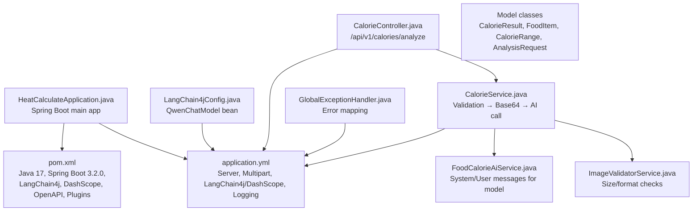
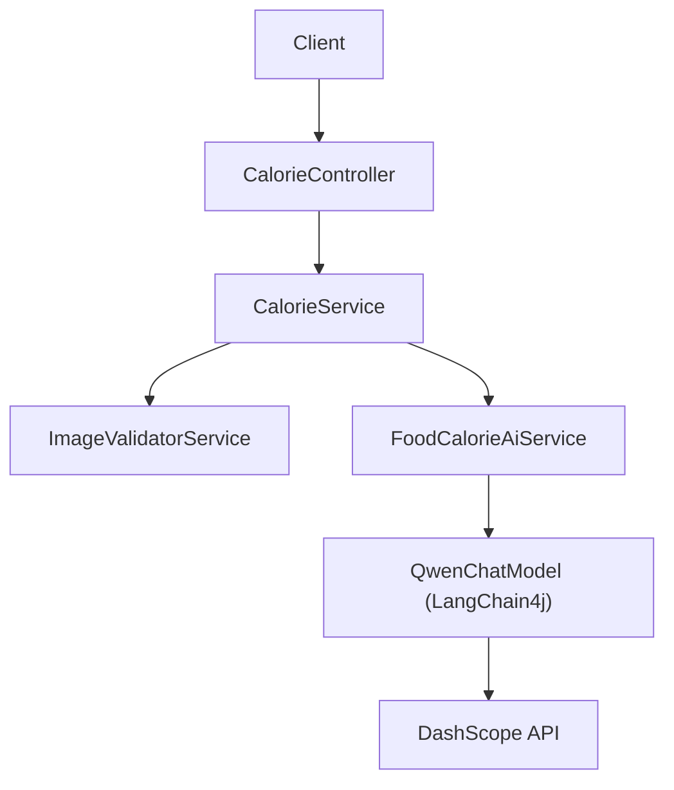
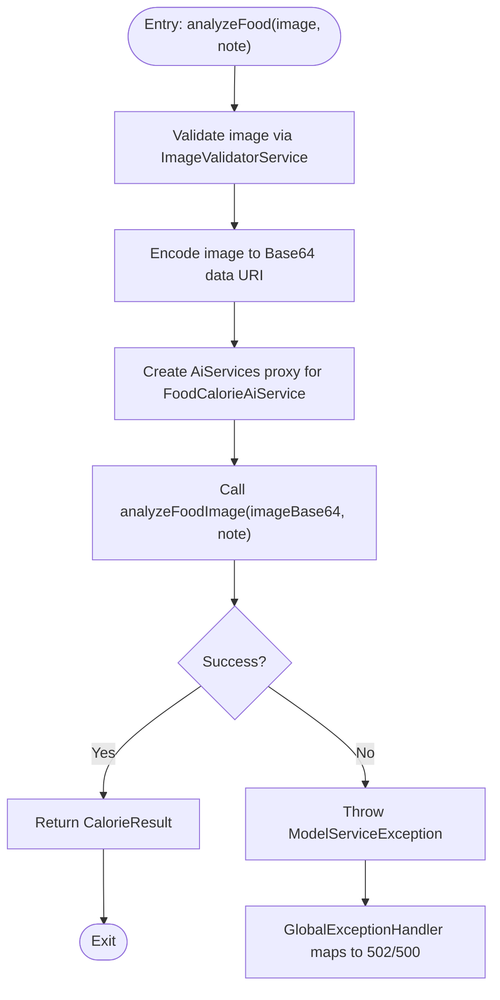

# Configuration and Deployment

<cite>
**Referenced Files in This Document**
- [application.yml](file://src/main/resources/application.yml)
- [pom.xml](file://pom.xml)
- [HeatCalculateApplication.java](file://src/main/java/com/example/heatcalculate/HeatCalculateApplication.java)
- [LangChain4jConfig.java](file://src/main/java/com/example/heatcalculate/config/LangChain4jConfig.java)
- [CalorieController.java](file://src/main/java/com/example/heatcalculate/controller/CalorieController.java)
- [CalorieService.java](file://src/main/java/com/example/heatcalculate/service/CalorieService.java)
- [ImageValidatorService.java](file://src/main/java/com/example/heatcalculate/service/ImageValidatorService.java)
- [FoodCalorieAiService.java](file://src/main/java/com/example/heatcalculate/ai/FoodCalorieAiService.java)
- [CalorieResult.java](file://src/main/java/com/example/heatcalculate/model/CalorieResult.java)
- [AnalysisRequest.java](file://src/main/java/com/example/heatcalculate/model/AnalysisRequest.java)
- [FoodItem.java](file://src/main/java/com/example/heatcalculate/model/FoodItem.java)
- [CalorieRange.java](file://src/main/java/com/example/heatcalculate/model/CalorieRange.java)
- [GlobalExceptionHandler.java](file://src/main/java/com/example/heatcalculate/exception/GlobalExceptionHandler.java)
</cite>

## Table of Contents
1. [Introduction](#introduction)
2. [Project Structure](#project-structure)
3. [Core Components](#core-components)
4. [Architecture Overview](#architecture-overview)
5. [Detailed Component Analysis](#detailed-component-analysis)
6. [Dependency Analysis](#dependency-analysis)
7. [Performance Considerations](#performance-considerations)
8. [Troubleshooting Guide](#troubleshooting-guide)
9. [Conclusion](#conclusion)
10. [Appendices](#appendices)

## Introduction
This document provides comprehensive configuration and deployment guidance for the Heat Calculate service. It covers application properties, environment variables, Maven build configuration, deployment strategies across environments, operational considerations, and troubleshooting tips. The service exposes a single API endpoint for food image-based calorie estimation powered by a DashScope model via LangChain4j.

## Project Structure
The project follows a standard Spring Boot layout with Java source under src/main/java and application configuration under src/main/resources. The primary configuration file defines server behavior, multipart limits, LangChain4j/DashScope integration, and logging. The Maven POM manages dependencies, plugins, and packaging.

**Diagram sources**
- [application.yml:1-21](file://src/main/resources/application.yml#L1-L21)
- [pom.xml:1-80](file://pom.xml#L1-L80)
- [HeatCalculateApplication.java:1-16](file://src/main/java/com/example/heatcalculate/HeatCalculateApplication.java#L1-L16)
- [LangChain4jConfig.java:1-31](file://src/main/java/com/example/heatcalculate/config/LangChain4jConfig.java#L1-L31)
- [CalorieController.java:1-96](file://src/main/java/com/example/heatcalculate/controller/CalorieController.java#L1-L96)
- [CalorieService.java:1-85](file://src/main/java/com/example/heatcalculate/service/CalorieService.java#L1-L85)
- [ImageValidatorService.java:1-48](file://src/main/java/com/example/heatcalculate/service/ImageValidatorService.java#L1-L48)
- [FoodCalorieAiService.java:1-59](file://src/main/java/com/example/heatcalculate/ai/FoodCalorieAiService.java#L1-L59)
- [CalorieResult.java:1-84](file://src/main/java/com/example/heatcalculate/model/CalorieResult.java#L1-L84)
- [AnalysisRequest.java:1-65](file://src/main/java/com/example/heatcalculate/model/AnalysisRequest.java#L1-L65)
- [FoodItem.java:1-82](file://src/main/java/com/example/heatcalculate/model/FoodItem.java#L1-L82)
- [CalorieRange.java:1-82](file://src/main/java/com/example/heatcalculate/model/CalorieRange.java#L1-L82)
- [GlobalExceptionHandler.java:1-122](file://src/main/java/com/example/heatcalculate/exception/GlobalExceptionHandler.java#L1-L122)

**Section sources**
- [application.yml:1-21](file://src/main/resources/application.yml#L1-L21)
- [pom.xml:1-80](file://pom.xml#L1-L80)
- [HeatCalculateApplication.java:1-16](file://src/main/java/com/example/heatcalculate/HeatCalculateApplication.java#L1-L16)

## Core Components
- Application entry point initializes the Spring Boot application.
- Configuration file controls server port, multipart limits, DashScope API key and model name, and logging.
- LangChain4j configuration creates a QwenChatModel bean using properties from application.yml.
- Controller exposes a single endpoint for image-based calorie analysis.
- Service orchestrates validation, Base64 encoding, and AI model invocation.
- Exception handler centralizes error responses for client visibility.

**Section sources**
- [HeatCalculateApplication.java:1-16](file://src/main/java/com/example/heatcalculate/HeatCalculateApplication.java#L1-L16)
- [application.yml:1-21](file://src/main/resources/application.yml#L1-L21)
- [LangChain4jConfig.java:1-31](file://src/main/java/com/example/heatcalculate/config/LangChain4jConfig.java#L1-L31)
- [CalorieController.java:1-96](file://src/main/java/com/example/heatcalculate/controller/CalorieController.java#L1-L96)
- [CalorieService.java:1-85](file://src/main/java/com/example/heatcalculate/service/CalorieService.java#L1-L85)
- [GlobalExceptionHandler.java:1-122](file://src/main/java/com/example/heatcalculate/exception/GlobalExceptionHandler.java#L1-L122)

## Architecture Overview
The service is a Spring MVC REST API backed by a LangChain4j AI agent that communicates with DashScope’s Qwen model. Requests are validated, encoded, and passed to the AI service, which returns structured results.

**Diagram sources**
- [CalorieController.java:1-96](file://src/main/java/com/example/heatcalculate/controller/CalorieController.java#L1-L96)
- [CalorieService.java:1-85](file://src/main/java/com/example/heatcalculate/service/CalorieService.java#L1-L85)
- [ImageValidatorService.java:1-48](file://src/main/java/com/example/heatcalculate/service/ImageValidatorService.java#L1-L48)
- [FoodCalorieAiService.java:1-59](file://src/main/java/com/example/heatcalculate/ai/FoodCalorieAiService.java#L1-L59)
- [LangChain4jConfig.java:1-31](file://src/main/java/com/example/heatcalculate/config/LangChain4jConfig.java#L1-L31)

## Detailed Component Analysis

### Application Properties (application.yml)
- Server
  - Port: 8080
- Multipart
  - Enabled: true
  - Max file size: 10 MB
  - Max request size: 10 MB
- LangChain4j/DashScope
  - API key: resolved from environment variable DASHSCOPE_API_KEY with a fallback value for testing
  - Model name: qwen-vl-max
- Logging
  - Package-level log level for the application package set to INFO
  - Console logging pattern configured

Environment variable requirements
- DASHSCOPE_API_KEY: Required for DashScope integration; the application will not function without a valid key.

Configuration references
- Server port and multipart limits: [application.yml:1-9](file://src/main/resources/application.yml#L1-L9)
- LangChain4j/DashScope integration: [application.yml:11-14](file://src/main/resources/application.yml#L11-L14)
- Logging configuration: [application.yml:16-21](file://src/main/resources/application.yml#L16-L21)

**Section sources**
- [application.yml:1-21](file://src/main/resources/application.yml#L1-L21)

### LangChain4j Configuration (LangChain4jConfig.java)
- Creates a QwenChatModel bean using the API key and model name from application.yml.
- Provides a default model name if the property is missing.

Key points
- Bean name: qwenChatModel
- Properties injected: langchain4j.dash-scope.api-key, langchain4j.dash-scope.model-name

**Section sources**
- [LangChain4jConfig.java:1-31](file://src/main/java/com/example/heatcalculate/config/LangChain4jConfig.java#L1-L31)
- [application.yml:11-14](file://src/main/resources/application.yml#L11-L14)

### API Endpoint Definition (CalorieController.java)
- Path: /api/v1/calories/analyze
- Method: POST
- Content type: multipart/form-data
- Request parameters:
  - image (required): food photo (JPG/PNG/WEBP, up to 10 MB)
  - note (optional): additional context
- Responses:
  - 200 OK: CalorieResult JSON
  - 400 Bad Request: image validation errors
  - 502 Bad Gateway: model service unavailable
  - 500 Internal Server Error: unexpected errors

OpenAPI documentation is embedded via Swagger annotations.

**Section sources**
- [CalorieController.java:1-96](file://src/main/java/com/example/heatcalculate/controller/CalorieController.java#L1-L96)

### Service Orchestration (CalorieService.java)
- Validates the uploaded image using ImageValidatorService.
- Encodes the image to a Base64 data URI for the model.
- Uses LangChain4j AiServices to create a proxy for FoodCalorieAiService and invokes analyzeFoodImage.
- Wraps exceptions into ModelServiceException for consistent error handling.

Processing flow

**Diagram sources**
- [CalorieService.java:1-85](file://src/main/java/com/example/heatcalculate/service/CalorieService.java#L1-L85)
- [ImageValidatorService.java:1-48](file://src/main/java/com/example/heatcalculate/service/ImageValidatorService.java#L1-L48)
- [FoodCalorieAiService.java:1-59](file://src/main/java/com/example/heatcalculate/ai/FoodCalorieAiService.java#L1-L59)
- [GlobalExceptionHandler.java:1-122](file://src/main/java/com/example/heatcalculate/exception/GlobalExceptionHandler.java#L1-L122)

**Section sources**
- [CalorieService.java:1-85](file://src/main/java/com/example/heatcalculate/service/CalorieService.java#L1-L85)

### Image Validation (ImageValidatorService.java)
- Enforces maximum file size (10 MB).
- Accepts content types: image/jpeg, image/jpg, image/png, image/webp.
- Throws ImageValidationException on failure.

**Section sources**
- [ImageValidatorService.java:1-48](file://src/main/java/com/example/heatcalculate/service/ImageValidatorService.java#L1-L48)

### AI Prompt Contract (FoodCalorieAiService.java)
- Defines system and user messages for the model.
- Expects a Base64-encoded image and optional note.
- Returns a CalorieResult with foods, totalCalories, and disclaimer.

**Section sources**
- [FoodCalorieAiService.java:1-59](file://src/main/java/com/example/heatcalculate/ai/FoodCalorieAiService.java#L1-L59)

### Data Models (CalorieResult, FoodItem, CalorieRange, AnalysisRequest)
- CalorieResult: list of FoodItem and totalCalories range.
- FoodItem: name, estimatedWeight, and calories range.
- CalorieRange: low, mid, high calorie estimates.
- AnalysisRequest: image and note for request binding.

**Section sources**
- [CalorieResult.java:1-84](file://src/main/java/com/example/heatcalculate/model/CalorieResult.java#L1-L84)
- [FoodItem.java:1-82](file://src/main/java/com/example/heatcalculate/model/FoodItem.java#L1-L82)
- [CalorieRange.java:1-82](file://src/main/java/com/example/heatcalculate/model/CalorieRange.java#L1-L82)
- [AnalysisRequest.java:1-65](file://src/main/java/com/example/heatcalculate/model/AnalysisRequest.java#L1-L65)

### Exception Handling (GlobalExceptionHandler.java)
- Maps ImageValidationException to 400.
- Maps ModelServiceException to 502.
- Maps ModelParseException to 500.
- Catches generic exceptions and returns 500.

**Section sources**
- [GlobalExceptionHandler.java:1-122](file://src/main/java/com/example/heatcalculate/exception/GlobalExceptionHandler.java#L1-L122)

## Dependency Analysis
Maven dependencies and build configuration:
- Parent: spring-boot-starter-parent 3.2.0
- Java: 17
- Spring Boot starters: web, validation, test
- LangChain4j: core and DashScope integrations
- SpringDoc OpenAPI UI
- Plugin: spring-boot-maven-plugin for packaging

Packaging
- Artifact type: jar
- Executable jar produced by spring-boot-maven-plugin

**Section sources**
- [pom.xml:1-80](file://pom.xml#L1-L80)

## Performance Considerations
- Image size and format: The service enforces a 10 MB limit and restricts accepted formats. Larger images increase processing time and memory usage.
- Model latency: Network latency to DashScope contributes to end-to-end response time. Consider proximity and retry/backoff policies at the client layer.
- Concurrency: Spring Boot auto-tunes thread pools; monitor CPU and memory under load.
- Logging: INFO level is set for the application package. Adjust logging levels in production if needed to reduce overhead.

[No sources needed since this section provides general guidance]

## Troubleshooting Guide
Common deployment issues and resolutions:
- Missing DASHSCOPE_API_KEY
  - Symptom: Model calls fail with 502.
  - Action: Set DASHSCOPE_API_KEY in the environment.
  - Reference: [application.yml:13-13](file://src/main/resources/application.yml#L13-L13), [LangChain4jConfig.java:14-15](file://src/main/java/com/example/heatcalculate/config/LangChain4jConfig.java#L14-L15)
- Invalid image format or size
  - Symptom: 400 Bad Request.
  - Action: Ensure JPG/PNG/WEBP under 10 MB.
  - Reference: [ImageValidatorService.java:17-23](file://src/main/java/com/example/heatcalculate/service/ImageValidatorService.java#L17-L23)
- Model service temporarily unavailable
  - Symptom: 502 Bad Gateway.
  - Action: Retry after delay; verify DashScope availability.
  - Reference: [GlobalExceptionHandler.java:30-39](file://src/main/java/com/example/heatcalculate/exception/GlobalExceptionHandler.java#L30-L39)
- Unexpected internal error
  - Symptom: 500 Internal Server Error.
  - Action: Check logs for stack traces; validate configuration and environment variables.
  - Reference: [GlobalExceptionHandler.java:52-61](file://src/main/java/com/example/heatcalculate/exception/GlobalExceptionHandler.java#L52-L61)

**Section sources**
- [application.yml:13-13](file://src/main/resources/application.yml#L13-L13)
- [LangChain4jConfig.java:14-15](file://src/main/java/com/example/heatcalculate/config/LangChain4jConfig.java#L14-L15)
- [ImageValidatorService.java:17-23](file://src/main/java/com/example/heatcalculate/service/ImageValidatorService.java#L17-L23)
- [GlobalExceptionHandler.java:30-39](file://src/main/java/com/example/heatcalculate/exception/GlobalExceptionHandler.java#L30-L39)
- [GlobalExceptionHandler.java:52-61](file://src/main/java/com/example/heatcalculate/exception/GlobalExceptionHandler.java#L52-L61)

## Conclusion
The Heat Calculate service is a compact Spring Boot application integrating DashScope via LangChain4j. Configuration centers on server settings, multipart limits, DashScope credentials, and logging. Deployment requires setting the DASHSCOPE_API_KEY, ensuring supported image formats and sizes, and packaging with Maven. Operational guidance emphasizes environment-specific configuration, secrets management, and robust error handling.

[No sources needed since this section summarizes without analyzing specific files]

## Appendices

### Environment Variables
- DASHSCOPE_API_KEY: DashScope API key for model access.

**Section sources**
- [application.yml:13-13](file://src/main/resources/application.yml#L13-L13)

### API Definition
- Endpoint: POST /api/v1/calories/analyze
- Content-Type: multipart/form-data
- Parameters:
  - image (required): JPG/PNG/WEBP, ≤ 10 MB
  - note (optional): free-form text
- Responses:
  - 200: CalorieResult JSON
  - 400: Validation error
  - 502: Model service unavailable
  - 500: Internal error

**Section sources**
- [CalorieController.java:42-94](file://src/main/java/com/example/heatcalculate/controller/CalorieController.java#L42-L94)

### Build and Packaging
- Java version: 17
- Spring Boot parent: 3.2.0
- Dependencies: web, validation, LangChain4j core/dashscope, OpenAPI UI, test
- Plugin: spring-boot-maven-plugin
- Packaging: jar

**Section sources**
- [pom.xml:23-26](file://pom.xml#L23-L26)
- [pom.xml:28-68](file://pom.xml#L28-L68)
- [pom.xml:70-78](file://pom.xml#L70-L78)

### Deployment Strategies

- Local/VM deployment
  - Export DASHSCOPE_API_KEY
  - Build: mvn clean package
  - Run: java -jar target/heat-calculate-1.0.0.jar
  - Verify: curl -X POST ... /api/v1/calories/analyze

- Docker containerization
  - Build image: docker build -t heat-calculate .
  - Run container: docker run -p 8080:8080 -e DASHSCOPE_API_KEY=... heat-calculate
  - Health check: curl http://localhost:8080

- Cloud platform deployment
  - Set DASHSCOPE_API_KEY as a secret environment variable.
  - Choose a container runtime or platform that supports environment variables and health checks.
  - Configure autoscaling based on CPU/memory and request latency.

- Load balancing and scaling
  - Horizontal scaling: deploy multiple instances behind a load balancer.
  - Sticky sessions: not required for stateless requests.
  - Health probes: use GET /actuator/health if exposed, otherwise rely on 200 responses for readiness.

- Monitoring and observability
  - Enable Spring Boot Actuator for health, metrics, and info endpoints.
  - Integrate with your platform’s logging and tracing systems.
  - Track error rates, latency, and throughput.

- Security considerations
  - Store DASHSCOPE_API_KEY as a managed secret.
  - Restrict inbound traffic to the API port.
  - Validate and sanitize inputs; the service already enforces size and format.
  - Rotate keys periodically and audit access logs.

- Rollback procedures
  - Keep previous image/tag available.
  - Re-deploy the prior version quickly.
  - Revert configuration changes if necessary.

- Maintenance guidelines
  - Regularly update LangChain4j and Spring Boot dependencies.
  - Monitor model availability and adjust retry policies as needed.
  - Review logs for recurring validation or model errors.

[No sources needed since this section provides general guidance]