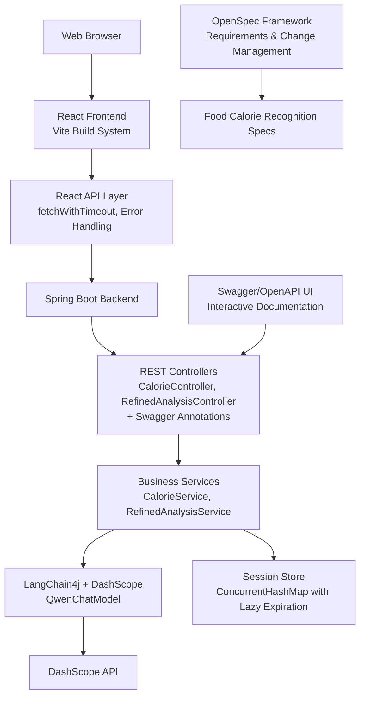

# Configuration and Deployment

<cite>
**Referenced Files in This Document**
- [application.yml](file://src/main/resources/application.yml)
- [pom.xml](file://pom.xml)
- [HeatCalculateApplication.java](file://src/main/java/com/example/heatcalculate/HeatCalculateApplication.java)
- [LangChain4jConfig.java](file://src/main/java/com/example/heatcalculate/config/LangChain4jConfig.java)
- [CalorieController.java](file://src/main/java/com/example/heatcalculate/controller/CalorieController.java)
- [RefinedAnalysisController.java](file://src/main/java/com/example/heatcalculate/controller/RefinedAnalysisController.java)
- [CalorieService.java](file://src/main/java/com/example/heatcalculate/service/CalorieService.java)
- [ImageValidatorService.java](file://src/main/java/com/example/heatcalculate/service/ImageValidatorService.java)
- [RefinedAnalysisService.java](file://src/main/java/com/example/heatcalculate/service/RefinedAnalysisService.java)
- [SessionStore.java](file://src/main/java/com/example/heatcalculate/service/SessionStore.java)
- [AnalysisSession.java](file://src/main/java/com/example/heatcalculate/model/AnalysisSession.java)
- [SessionStatus.java](file://src/main/java/com/example/heatcalculate/model/SessionStatus.java)
- [SessionExpiredException.java](file://src/main/java/com/example/heatcalculate/exception/SessionExpiredException.java)
- [config.yaml](file://openspec/config.yaml)
- [spec.md](file://openspec/specs/food-calorie-recognition/spec.md)
- [proposal.md](file://openspec/changes/archive/2026-04-20-refined-analysis-mode/proposal.md)
- [design.md](file://openspec/changes/archive/2026-04-20-refined-analysis-mode/design.md)
- [proposal.md](file://openspec/changes/result-correction/proposal.md)
- [package.json](file://frontend/package.json)
- [vite.config.js](file://frontend/vite.config.js)
- [eslint.config.js](file://frontend/eslint.config.js)
- [App.jsx](file://frontend/src/App.jsx)
- [main.jsx](file://frontend/src/main.jsx)
- [api.js](file://frontend/src/api.js)
- [UploadPage/index.jsx](file://frontend/src/components/UploadPage/index.jsx)
- [ResultPage/index.jsx](file://frontend/src/components/ResultPage/index.jsx)
- [LoadingPage/index.jsx](file://frontend/src/components/LoadingPage/index.jsx)
- [QuestionPage/index.jsx](file://frontend/src/components/QuestionPage/index.jsx)
- [global.css](file://frontend/src/styles/global.css)
- [index.html](file://src/main/resources/static/index.html)
</cite>

## Update Summary
**Changes Made**
- Added comprehensive OpenSpec development framework configuration documentation
- Documented refined analysis mode with session-based interaction and 3-minute expiration
- Enhanced API endpoint documentation with Swagger/OpenAPI integration
- Updated LangChain4j integration settings with DashScope configuration
- Added detailed session management and expiration handling documentation
- Expanded requirement specifications for food calorie recognition service

## Table of Contents
1. [Introduction](#introduction)
2. [Project Structure](#project-structure)
3. [Core Components](#core-components)
4. [Architecture Overview](#architecture-overview)
5. [Detailed Component Analysis](#detailed-component-analysis)
6. [OpenSpec Development Framework](#openspec-development-framework)
7. [Enhanced API Endpoints with Swagger](#enhanced-api-endpoints-with-swagger)
8. [Refined Analysis Mode Configuration](#refined-analysis-mode-configuration)
9. [Session Management and Expiration](#session-management-and-expiration)
10. [Frontend Application Setup](#frontend-application-setup)
11. [Dependency Analysis](#dependency-analysis)
12. [Performance Considerations](#performance-considerations)
13. [Troubleshooting Guide](#troubleshooting-guide)
14. [Conclusion](#conclusion)
15. [Appendices](#appendices)

## Introduction
This document provides comprehensive configuration and deployment guidance for the Heat Calculate service, featuring a complete React frontend application and advanced OpenSpec development framework integration. The service now includes sophisticated refined analysis capabilities with session-based interaction, Swagger/OpenAPI documentation integration, and comprehensive requirement specifications. It covers application properties, environment variables, Maven build configuration, frontend build setup, deployment strategies across environments, operational considerations, and troubleshooting tips.

## Project Structure
The project follows a modern full-stack architecture with Java backend, React frontend, and OpenSpec development framework. The backend is a Spring Boot application with REST controllers, Swagger/OpenAPI integration, and session-based refined analysis, while the frontend is a React application built with Vite. The OpenSpec framework provides structured development specifications and change management.

```mermaid
graph TB
A["Backend: application.yml<br/>Server, Multipart, LangChain4j/DashScope, Logging"]
B["Backend: pom.xml<br/>Java 17, Spring Boot 3.2.0,<br/>LangChain4j, DashScope, OpenAPI, Plugins"]
C["Backend: HeatCalculateApplication.java<br/>Spring Boot main app"]
D["OpenSpec: config.yaml<br/>Spec-driven development framework"]
E["Frontend: package.json<br/>React 19.2.5, Vite 8.0.9,<br/>ESLint, React Hooks"]
F["Frontend: vite.config.js<br/>Build to backend static dir,<br/>Dev proxy to backend"]
G["Swagger/OpenAPI: SpringDoc UI<br/>Interactive API documentation"]
H["Backend: CalorieController.java<br/>Basic calorie analysis endpoint"]
I["Backend: RefinedAnalysisController.java<br/>Swagger-enhanced refined analysis endpoints"]
J["Backend: LangChain4jConfig.java<br/>QwenChatModel bean with DashScope"]
K["Backend: CalorieService.java<br/>Validation → Base64 → AI call"]
L["Backend: RefinedAnalysisService.java<br/>Session-based analysis with 5-round limit"]
M["Backend: SessionStore.java<br/>ConcurrentHashMap with lazy expiration"]
N["OpenSpec Specs: Food Calorie Recognition<br/>Requirement specifications"]
```

**Diagram sources**
- [application.yml:1-21](file://src/main/resources/application.yml#L1-L21)
- [pom.xml:1-80](file://pom.xml#L1-L80)
- [HeatCalculateApplication.java:1-16](file://src/main/java/com/example/heatcalculate/HeatCalculateApplication.java#L1-L16)
- [config.yaml:1-21](file://openspec/config.yaml#L1-L21)
- [package.json:1-28](file://frontend/package.json#L1-L28)
- [vite.config.js:1-21](file://frontend/vite.config.js#L1-L21)
- [RefinedAnalysisController.java:1-72](file://src/main/java/com/example/heatcalculate/controller/RefinedAnalysisController.java#L1-L72)
- [LangChain4jConfig.java:1-32](file://src/main/java/com/example/heatcalculate/config/LangChain4jConfig.java#L1-L32)
- [CalorieService.java:1-85](file://src/main/java/com/example/heatcalculate/service/CalorieService.java#L1-L85)
- [RefinedAnalysisService.java:1-322](file://src/main/java/com/example/heatcalculate/service/RefinedAnalysisService.java#L1-L322)
- [SessionStore.java:1-61](file://src/main/java/com/example/heatcalculate/service/SessionStore.java#L1-L61)
- [spec.md:1-48](file://openspec/specs/food-calorie-recognition/spec.md#L1-L48)

## Core Components
- **Backend Application**: Spring Boot main application entry point with REST controllers for both basic and refined analysis, enhanced with Swagger/OpenAPI documentation.
- **OpenSpec Development Framework**: Spec-driven development configuration with structured requirements and change management.
- **Configuration Management**: Centralized application.yml controlling server behavior, multipart limits, DashScope integration, and logging.
- **LangChain4j Integration**: QwenChatModel bean creation with API key and model name configuration for vision-language analysis.
- **Swagger/OpenAPI Integration**: Interactive API documentation with endpoint tagging and operation descriptions.
- **Frontend Application**: React-based user interface with state management, image upload, real-time feedback, and responsive design.
- **Refined Analysis Mode**: Advanced session-based analysis with 5-round questioning and 3-minute expiration handling.
- **Session Management**: Concurrent session storage with lazy expiration and thread-safe access patterns.
- **Requirement Specifications**: Comprehensive OpenSpec specifications for food calorie recognition service.

**Section sources**
- [HeatCalculateApplication.java:1-16](file://src/main/java/com/example/heatcalculate/HeatCalculateApplication.java#L1-L16)
- [config.yaml:1-21](file://openspec/config.yaml#L1-L21)
- [application.yml:1-21](file://src/main/resources/application.yml#L1-L21)
- [LangChain4jConfig.java:1-32](file://src/main/java/com/example/heatcalculate/config/LangChain4jConfig.java#L1-L32)
- [RefinedAnalysisController.java:1-72](file://src/main/java/com/example/heatcalculate/controller/RefinedAnalysisController.java#L1-L72)
- [package.json:1-28](file://frontend/package.json#L1-L28)
- [vite.config.js:1-21](file://frontend/vite.config.js#L1-L21)
- [App.jsx:1-76](file://frontend/src/App.jsx#L1-L76)
- [api.js:1-153](file://frontend/src/api.js#L1-L153)

## Architecture Overview
The service operates as a full-stack application with a React frontend communicating with Spring Boot backend REST APIs. The architecture now includes enhanced Swagger/OpenAPI documentation, refined analysis capabilities with session management, and comprehensive requirement specifications through the OpenSpec framework.

**Diagram sources**
- [App.jsx:1-76](file://frontend/src/App.jsx#L1-L76)
- [api.js:1-153](file://frontend/src/api.js#L1-L153)
- [CalorieController.java:1-96](file://src/main/java/com/example/heatcalculate/controller/CalorieController.java#L1-L96)
- [RefinedAnalysisController.java:1-72](file://src/main/java/com/example/heatcalculate/controller/RefinedAnalysisController.java#L1-L72)
- [CalorieService.java:1-85](file://src/main/java/com/example/heatcalculate/service/CalorieService.java#L1-L85)
- [RefinedAnalysisService.java:1-322](file://src/main/java/com/example/heatcalculate/service/RefinedAnalysisService.java#L1-L322)
- [SessionStore.java:1-61](file://src/main/java/com/example/heatcalculate/service/SessionStore.java#L1-L61)
- [LangChain4jConfig.java:1-32](file://src/main/java/com/example/heatcalculate/config/LangChain4jConfig.java#L1-L32)

## Detailed Component Analysis

### Application Properties (application.yml)
- **Server Configuration**
  - Port: 8080 (HTTP)
  - Static resources served from `/static` directory
- **Multipart Configuration**
  - Enabled: true
  - Max file size: 10 MB
  - Max request size: 10 MB
- **LangChain4j/DashScope Integration**
  - API key: configured with fallback value for development
  - Model name: qwen-vl-max for vision-language analysis
- **Logging Configuration**
  - Package-level log level: INFO for application package
  - Console logging pattern with timestamp and logger information

**Section sources**
- [application.yml:1-21](file://src/main/resources/application.yml#L1-L21)

### LangChain4j Configuration (LangChain4jConfig.java)
- Creates a QwenChatModel bean using API key and model name from application.yml
- Provides default model name if property is missing
- Configured for vision-language understanding with image analysis capabilities

**Section sources**
- [LangChain4jConfig.java:1-32](file://src/main/java/com/example/heatcalculate/config/LangChain4jConfig.java#L1-L32)
- [application.yml:11-14](file://src/main/resources/application.yml#L11-L14)

### Backend Controllers

#### Basic Calorie Analysis Controller
- **Endpoint**: POST `/api/v1/calories/analyze`
- **Purpose**: Single-shot food calorie estimation
- **Request**: multipart/form-data with image file and optional note
- **Response**: CalorieResult with foods, total calories, and disclaimer

#### Refined Analysis Controller (Enhanced with Swagger)
- **Endpoints**:
  - POST `/api/v1/calories/analyze/refined` - Start refined analysis session
  - POST `/api/v1/calories/analyze/refined/{sessionId}/continue` - Continue analysis with user answers
- **Purpose**: Interactive fine-grained analysis with session management
- **Features**: Multi-step questioning, partial results, session persistence
- **Swagger Integration**: Tagged with "精细分析" (Refined Analysis) and detailed operation descriptions

**Section sources**
- [CalorieController.java:1-96](file://src/main/java/com/example/heatcalculate/controller/CalorieController.java#L1-L96)
- [RefinedAnalysisController.java:1-72](file://src/main/java/com/example/heatcalculate/controller/RefinedAnalysisController.java#L1-L72)

### Service Layer Orchestration

#### Calorie Service
- Validates uploaded images using ImageValidatorService
- Encodes images to Base64 data URIs for model processing
- Integrates with LangChain4j AiServices for model interaction
- Handles exception mapping for consistent error responses

#### Refined Analysis Service
- Manages session lifecycle with SessionStore
- Coordinates multi-step analysis with user interaction
- Maintains state between analysis steps
- Handles partial and final results
- Implements 5-round maximum questioning limit
- Uses calorie range width threshold (200kcal) for clarification decisions

**Section sources**
- [CalorieService.java:1-85](file://src/main/java/com/example/heatcalculate/service/CalorieService.java#L1-L85)
- [RefinedAnalysisService.java:1-322](file://src/main/java/com/example/heatcalculate/service/RefinedAnalysisService.java#L1-L322)
- [SessionStore.java:1-61](file://src/main/java/com/example/heatcalculate/service/SessionStore.java#L1-L61)

### Data Models

#### Core Models
- **CalorieResult**: Complete analysis result with foods list and total calories
- **FoodItem**: Individual food identification with name, weight, and calorie range
- **CalorieRange**: Low/mid/high calorie estimates for uncertainty representation
- **AnalysisRequest**: Request binding for image and optional note

#### Refined Analysis Models
- **AnalysisSession**: Session state management with expiration handling
- **SessionStatus**: Enum with WAITING_INPUT, COMPLETE, EXPIRED states
- **RefinedAnalysisResponse**: Session-based response with status and progression

**Section sources**
- [CalorieResult.java:1-84](file://src/main/java/com/example/heatcalculate/model/CalorieResult.java#L1-L84)
- [FoodItem.java:1-82](file://src/main/java/com/example/heatcalculate/model/FoodItem.java#L1-L82)
- [CalorieRange.java:1-82](file://src/main/java/com/example/heatcalculate/model/CalorieRange.java#L1-L82)
- [AnalysisRequest.java:1-65](file://src/main/java/com/example/heatcalculate/model/AnalysisRequest.java#L1-L65)
- [AnalysisSession.java:1-97](file://src/main/java/com/example/heatcalculate/model/AnalysisSession.java#L1-L97)
- [SessionStatus.java:1-11](file://src/main/java/com/example/heatcalculate/model/SessionStatus.java#L1-L11)

### Exception Handling
- **ImageValidationException**: Mapped to HTTP 400 for invalid uploads
- **ModelServiceException**: Mapped to HTTP 502 for AI service failures
- **ModelParseException**: Mapped to HTTP 500 for parsing errors
- **SessionExpiredException**: Mapped to HTTP 404 for expired sessions
- **Generic exceptions**: Mapped to HTTP 500 with stack trace logging

**Section sources**
- [GlobalExceptionHandler.java:1-122](file://src/main/java/com/example/heatcalculate/exception/GlobalExceptionHandler.java#L1-L122)
- [SessionExpiredException.java:1-12](file://src/main/java/com/example/heatcalculate/exception/SessionExpiredException.java#L1-L12)

## OpenSpec Development Framework

### Framework Configuration
The OpenSpec development framework provides structured specification-driven development for the heat calculate service:

- **Schema Configuration**: Spec-driven development model with YAML configuration
- **Project Context**: Optional domain knowledge and technical stack documentation
- **Per-artifact Rules**: Custom rules for specific development artifacts
- **Change Management**: Structured approach to requirements evolution

### Specification Documentation
The framework includes comprehensive requirement specifications:

- **Food Calorie Recognition**: Complete requirements for single-step and multi-round analysis
- **Prompt Engineering**: Standardized prompts with utensil size references and estimation rules
- **Response Format**: Strict JSON structure requirements with disclaimer inclusion
- **Error Handling**: Defined scenarios for model failures and parsing errors

### Change Management
Structured approach to implementing new features:

- **Refined Analysis Mode**: Multi-round questioning capability with 5-round limit
- **Result Correction**: User-driven correction of food items with session preservation
- **Session Expiration**: 3-minute timeout with lazy cleanup mechanism
- **API Evolution**: Backward-compatible endpoint additions

**Section sources**
- [config.yaml:1-21](file://openspec/config.yaml#L1-L21)
- [spec.md:1-48](file://openspec/specs/food-calorie-recognition/spec.md#L1-L48)
- [proposal.md:1-101](file://openspec/changes/archive/2026-04-20-refined-analysis-mode/proposal.md#L1-L101)
- [design.md:1-161](file://openspec/changes/archive/2026-04-20-refined-analysis-mode/design.md#L1-L161)
- [proposal.md:1-28](file://openspec/changes/result-correction/proposal.md#L1-L28)

## Enhanced API Endpoints with Swagger

### Basic Calorie Analysis
- **Method**: POST
- **Path**: `/api/v1/calories/analyze`
- **Content-Type**: multipart/form-data
- **Parameters**:
  - `image` (required): Food photo (JPG/PNG/WEBP, ≤ 10MB)
  - `note` (optional): Additional context or description
- **Response**: CalorieResult with foods, total calories, and disclaimer

### Refined Analysis (Interactive) - Swagger-Enhanced
- **Start Session**: POST `/api/v1/calories/analyze/refined`
  - **Swagger Tag**: "精细分析" (Refined Analysis)
  - **Description**: Upload food image, start multi-round questioning analysis
  - **Consumes**: multipart/form-data
  - **Produces**: application/json
- **Continue Analysis**: POST `/api/v1/calories/analyze/refined/{sessionId}/continue`
  - **Swagger Tag**: "精细分析" (Refined Analysis)
  - **Description**: Submit user answer, continue multi-round questioning
  - **Consumes**: application/json
  - **Produces**: application/json
- **Session Management**: Automatic session creation and 3-minute expiration handling
- **Multi-step Process**: Questions and clarifications for precise analysis

### API Documentation Features
- **Operation Descriptions**: Detailed summaries and descriptions for each endpoint
- **Tagging System**: Organized under "精细分析" (Refined Analysis) tag
- **Parameter Documentation**: Clear parameter specifications and constraints
- **Response Examples**: Structured response format documentation
- **Error Handling**: HTTP status codes and error scenarios

**Section sources**
- [CalorieController.java:1-96](file://src/main/java/com/example/heatcalculate/controller/CalorieController.java#L1-L96)
- [RefinedAnalysisController.java:1-72](file://src/main/java/com/example/heatcalculate/controller/RefinedAnalysisController.java#L1-L72)
- [api.js:70-135](file://frontend/src/api.js#L70-135)

## Refined Analysis Mode Configuration

### Session-Based Interaction
The refined analysis mode provides sophisticated multi-step interaction:

- **Session Creation**: Unique sessionId generated for each analysis initiation
- **Round Limit**: Maximum 5 rounds of questioning to narrow calorie estimates
- **Threshold Logic**: Questioning triggered when total calorie range width exceeds 200kcal
- **State Management**: WAITING_INPUT, COMPLETE, EXPIRED session states

### Expiration Handling
- **Timeout Duration**: 3 minutes (180 seconds) from session creation
- **Lazy Cleanup**: Expiration checked on session access, not through scheduled tasks
- **Graceful Degradation**: Returns 404 error with re-upload instruction for expired sessions
- **Memory Management**: Automatic cleanup through ConcurrentHashMap removal

### Conversation Flow
- **Initial Analysis**: Single-shot vision-language analysis with JSON response
- **Clarification Trigger**: QUESTION line in model response indicates need for input
- **Context Preservation**: Full conversation history maintained for each session
- **Final Result**: Complete calorie analysis when sufficient information gathered

**Section sources**
- [RefinedAnalysisService.java:1-322](file://src/main/java/com/example/heatcalculate/service/RefinedAnalysisService.java#L1-L322)
- [SessionStore.java:1-61](file://src/main/java/com/example/heatcalculate/service/SessionStore.java#L1-L61)
- [AnalysisSession.java:1-97](file://src/main/java/com/example/heatcalculate/model/AnalysisSession.java#L1-L97)
- [SessionStatus.java:1-11](file://src/main/java/com/example/heatcalculate/model/SessionStatus.java#L1-L11)

## Session Management and Expiration

### Session Storage Architecture
- **Data Structure**: ConcurrentHashMap for thread-safe concurrent access
- **Storage Strategy**: JVM heap memory with automatic garbage collection
- **Cleanup Mechanism**: Lazy expiration checking during session retrieval
- **Monitoring**: Active session count available for observability

### Expiration Logic
- **Time Window**: 180-second expiration from creation timestamp
- **Access-Time Checking**: Expiration validated on every session.get() call
- **Automatic Removal**: Expired sessions automatically removed from storage
- **State Transition**: Expired sessions return empty Optional to caller

### Thread Safety
- **ConcurrentHashMap**: Built-in thread safety for concurrent operations
- **Atomic Operations**: Safe session creation, retrieval, and removal
- **Memory Visibility**: Proper synchronization for session state changes
- **Race Condition Prevention**: No double-checked locking issues

### Performance Characteristics
- **Lookup Complexity**: O(1) average case for session operations
- **Memory Footprint**: Minimal overhead per session (sessionId, state, history)
- **Scalability**: Scales linearly with number of concurrent sessions
- **GC Friendly**: Automatic cleanup reduces memory pressure

**Section sources**
- [SessionStore.java:1-61](file://src/main/java/com/example/heatcalculate/service/SessionStore.java#L1-L61)
- [AnalysisSession.java:90-96](file://src/main/java/com/example/heatcalculate/model/AnalysisSession.java#L90-L96)

## Frontend Application Setup

### React Application Architecture
The frontend is a modern React 19.2.5 application built with Vite 8.0.9, featuring:
- **Component-based architecture** with reusable UI components
- **State management** using React hooks (useState, useCallback)
- **Real-time feedback** during image upload and analysis
- **Responsive design** optimized for mobile and desktop
- **Interactive error handling** with user-friendly messages

### Build Configuration (vite.config.js)
- **Development Server**: Port 3000 with hot module replacement
- **Build Output**: Assets compiled to backend static directory (`../src/main/resources/static`)
- **Development Proxy**: API requests proxied to backend (http://localhost:8080)
- **Plugin Configuration**: React plugin with JSX transformation

### Frontend Components

#### Main Application Flow
- **UploadPage**: Image selection, drag-and-drop support, compression, validation
- **LoadingPage**: Animated feedback during AI analysis
- **ResultPage**: Comprehensive calorie analysis visualization
- **QuestionPage**: Interactive fine-grained analysis with user questions
- **App Component**: State management and page routing

#### Key Features
- **Image Compression**: Automatic compression for files > 2MB
- **Format Validation**: Support for JPG, PNG, WEBP formats
- **Size Limits**: 10MB maximum file size
- **Mobile Optimization**: Touch-friendly interface with proper touch targets
- **Accessibility**: Proper ARIA labels and keyboard navigation

**Section sources**
- [package.json:1-28](file://frontend/package.json#L1-L28)
- [vite.config.js:1-21](file://frontend/vite.config.js#L1-L21)
- [App.jsx:1-76](file://frontend/src/App.jsx#L1-L76)
- [UploadPage/index.jsx:1-233](file://frontend/src/components/UploadPage/index.jsx#L1-L233)
- [ResultPage/index.jsx:1-135](file://frontend/src/components/ResultPage/index.jsx#L1-L135)
- [LoadingPage/index.jsx:1-23](file://frontend/src/components/LoadingPage/index.jsx#L1-L23)
- [QuestionPage/index.jsx:1-79](file://frontend/src/components/QuestionPage/index.jsx#L1-L79)
- [global.css:1-317](file://frontend/src/styles/global.css#L1-L317)

### API Integration Layer
The frontend communicates with backend APIs through a centralized API module:
- **analyzeFood**: Basic calorie analysis endpoint
- **startRefinedAnalysis**: Initiates interactive analysis session
- **continueRefinedAnalysis**: Submits user answers to continue analysis
- **checkHealth**: Health check for backend availability
- **Timeout Handling**: 30-second request timeout with user-friendly messages
- **Error Mapping**: Backend HTTP status mapped to user-friendly messages

**Section sources**
- [api.js:1-153](file://frontend/src/api.js#L1-153)

### Development Workflow
- **Development**: `npm run dev` starts Vite dev server on port 3000
- **Production Build**: `npm run build` compiles optimized frontend assets
- **Preview**: `npm run preview` serves built assets locally
- **Linting**: `npm run lint` runs ESLint with React hooks and refresh plugins
- **Auto-proxy**: Development server automatically proxies API calls to backend

**Section sources**
- [package.json:6-11](file://frontend/package.json#L6-L11)
- [vite.config.js:11-19](file://frontend/vite.config.js#L11-L19)

## Dependency Analysis
### Backend Dependencies
- **Spring Boot**: 3.2.0 with web, validation, and test starters
- **LangChain4j**: 0.36.2 with DashScope integration for AI model access
- **SpringDoc OpenAPI**: UI documentation for API endpoints with Swagger integration
- **Maven Plugin**: spring-boot-maven-plugin for executable JAR packaging

### Frontend Dependencies
- **React**: 19.2.5 with React DOM for UI rendering
- **Vite**: 8.0.9 for fast development and production builds
- **ESLint**: 9.39.4 with React hooks and refresh plugins
- **React Plugins**: @vitejs/plugin-react for JSX transformation

### Build and Packaging
- **Backend**: Executable JAR with embedded Tomcat server
- **Frontend**: Built assets copied to Spring Boot static resources
- **Integration**: Frontend build automatically integrated into backend artifact

**Section sources**
- [pom.xml:28-68](file://pom.xml#L28-L68)
- [package.json:12-26](file://frontend/package.json#L12-L26)

## Performance Considerations
### Frontend Performance
- **Image Optimization**: Automatic compression for large files (>2MB)
- **Lazy Loading**: Components loaded on-demand
- **Memory Management**: Proper URL object cleanup for image previews
- **Responsive Design**: Optimized for mobile devices with touch interactions

### Backend Performance
- **Image Processing**: Efficient Base64 encoding and validation
- **Model Latency**: Network latency to DashScope contributes to response time
- **Session Management**: In-memory storage for active sessions with expiration
- **Resource Limits**: 10MB file size limit prevents memory exhaustion
- **Thread Safety**: ConcurrentHashMap ensures concurrent access performance

### Caching Strategy
- **Static Assets**: Frontend assets cached by browser and CDN
- **API Responses**: Client-side caching for repeated analysis results
- **Session Persistence**: Efficient in-memory session storage with lazy cleanup

## Troubleshooting Guide

### Frontend Issues
- **Development Server Not Starting**
  - Ensure Node.js and npm are installed
  - Run `npm install` to install frontend dependencies
  - Check port 3000 availability for development server
- **API Proxy Not Working**
  - Verify backend is running on port 8080
  - Check browser console for CORS-related errors
  - Ensure development proxy configuration matches backend port

### Backend Issues
- **Missing DASHSCOPE_API_KEY**
  - Set environment variable before starting application
  - Verify API key format and permissions
  - Check DashScope service availability
- **Image Upload Failures**
  - Verify file format (JPG, PNG, WEBP)
  - Check file size does not exceed 10MB limit
  - Ensure multipart configuration is enabled

### Session Management Issues
- **Session Expiration**
  - Sessions expire after 3 minutes of inactivity
  - User receives 404 error for expired sessions
  - Restart analysis to create new session
- **Refined Analysis Stuck**
  - Check network connectivity to backend
  - Verify session ID validity
  - Look for JavaScript console errors
- **Swagger Documentation Issues**
  - Ensure SpringDoc OpenAPI dependency is present
  - Check API endpoint annotations are properly configured
  - Verify Swagger UI is accessible at /swagger-ui.html

### Build and Deployment Issues
- **Frontend Assets Not Loading**
  - Verify Vite build completes successfully
  - Check static directory contains built assets
  - Ensure Spring Boot serves static resources
- **Maven Build Failures**
  - Verify Java 17 compatibility
  - Check dependency versions in pom.xml
  - Clear Maven cache if dependency resolution fails
- **OpenSpec Framework Issues**
  - Verify config.yaml syntax is valid YAML
  - Check spec.md files follow OpenSpec format
  - Ensure change proposal documents are properly formatted

**Section sources**
- [vite.config.js:11-19](file://frontend/vite.config.js#L11-L19)
- [application.yml:13](file://src/main/resources/application.yml#L13)
- [api.js:4-15](file://frontend/src/api.js#L4-15)
- [SessionExpiredException.java:1-12](file://src/main/java/com/example/heatcalculate/exception/SessionExpiredException.java#L1-L12)

## Conclusion
The Heat Calculate service now provides a complete full-stack solution with modern React frontend, robust Spring Boot backend, enhanced Swagger/OpenAPI documentation, and comprehensive OpenSpec development framework integration. The refined analysis mode with session-based interaction and 3-minute expiration provides sophisticated multi-step questioning capabilities, while the OpenSpec framework ensures structured requirement management and change control. The dual analysis approach supports both quick results and detailed interactive analysis, making it suitable for various user needs and use cases.

## Appendices

### Environment Variables
- **DASHSCOPE_API_KEY**: Required for DashScope AI model access
- **Development**: Frontend development server runs on port 3000
- **Backend**: Spring Boot application runs on port 8080

**Section sources**
- [application.yml:13](file://src/main/resources/application.yml#L13)
- [vite.config.js:12](file://frontend/vite.config.js#L12)

### API Definitions

#### Basic Analysis
- **Endpoint**: POST `/api/v1/calories/analyze`
- **Content-Type**: multipart/form-data
- **Parameters**:
  - `image` (required): JPG/PNG/WEBP, ≤ 10MB
  - `note` (optional): Free-form text description
- **Responses**:
  - 200: CalorieResult JSON
  - 400: Validation error
  - 502: AI service unavailable
  - 500: Internal error

#### Refined Analysis - Swagger-Enhanced
- **Start Session**: POST `/api/v1/calories/analyze/refined`
  - **Swagger Tag**: "精细分析"
  - **Consumes**: multipart/form-data
  - **Produces**: application/json
- **Continue Analysis**: POST `/api/v1/calories/analyze/refined/{sessionId}/continue`
  - **Swagger Tag**: "精细分析"
  - **Consumes**: application/json
  - **Produces**: application/json
- **Session Management**: Automatic 3-minute expiration and cleanup
- **Interactive Features**: Multi-step questioning for precision with 5-round limit

**Section sources**
- [CalorieController.java:42-94](file://src/main/java/com/example/heatcalculate/controller/CalorieController.java#L42-L94)
- [RefinedAnalysisController.java:36-70](file://src/main/java/com/example/heatcalculate/controller/RefinedAnalysisController.java#L36-L70)

### Build and Packaging

#### Backend Build
- **Java Version**: 17
- **Spring Boot**: 3.2.0
- **Dependencies**: Web, Validation, LangChain4j, OpenAPI UI, Test
- **Packaging**: Executable JAR with embedded Tomcat

#### Frontend Build
- **Framework**: React 19.2.5 with Vite 8.0.9
- **Build Output**: Assets compiled to backend static directory
- **Development**: Hot reload with proxy to backend API
- **Production**: Optimized bundle with tree-shaking

#### OpenSpec Integration
- **Framework**: YAML-based specification management
- **Requirements**: Structured requirement documentation
- **Changes**: Versioned change proposals and designs
- **Documentation**: Automated specification generation

**Section sources**
- [pom.xml:23-26](file://pom.xml#L23-L26)
- [pom.xml:28-68](file://pom.xml#L28-L68)
- [package.json:12-26](file://frontend/package.json#L12-L26)
- [config.yaml:1-21](file://openspec/config.yaml#L1-L21)

### Deployment Strategies

#### Local Development
- **Prerequisites**: Java 17+, Node.js, npm
- **Backend**: `mvn spring-boot:run` or `java -jar target/*.jar`
- **Frontend**: `cd frontend && npm run dev` (port 3000)
- **Integration**: Vite proxy automatically forwards API calls to backend

#### Production Deployment
- **Build Order**: Frontend build first, then backend build
- **Asset Integration**: Frontend assets automatically copied to static resources
- **Single Artifact**: Executable JAR contains both frontend and backend
- **Runtime**: Java 17+ required

#### Docker Containerization
- **Multi-stage Build**: Separate stages for frontend and backend
- **Image Size**: Optimized base images with only runtime dependencies
- **Environment Variables**: Pass DASHSCOPE_API_KEY as container environment variable
- **Port Mapping**: Expose port 8080 for HTTP access

#### Cloud Platform Deployment
- **Container Registry**: Push built images to cloud registry
- **Environment Configuration**: Use platform-specific secrets management
- **Load Balancing**: Multiple replicas behind load balancer
- **Health Checks**: Use `/actuator/health` endpoint for readiness probes

#### Monitoring and Observability
- **Backend Metrics**: Spring Boot Actuator for health, metrics, and info
- **Frontend Monitoring**: Application performance monitoring for user interactions
- **Error Tracking**: Centralized logging with structured error reporting
- **Performance Monitoring**: Response time tracking for API endpoints
- **Swagger UI**: Interactive API documentation access

#### Security Considerations
- **Secret Management**: Store DASHSCOPE_API_KEY as managed secrets
- **Input Validation**: Both frontend and backend validation layers
- **CORS Configuration**: Proper cross-origin resource sharing settings
- **Rate Limiting**: Implement rate limiting for API endpoints
- **HTTPS**: Deploy with SSL/TLS certificates in production

#### Scaling and Load Balancing
- **Horizontal Scaling**: Multiple backend instances behind load balancer
- **Session Affinity**: Not required for stateless analysis endpoints
- **Database Considerations**: Current in-memory session store for development
- **Production Sessions**: Consider Redis or database for distributed session storage

#### Rollback Procedures
- **Version Management**: Maintain multiple container image versions
- **Blue-Green Deployment**: Zero-downtime deployment strategy
- **Rollback Steps**: Quick revert to previous working version
- **Data Migration**: Plan for session data migration if using persistent storage

#### Maintenance Guidelines
- **Dependency Updates**: Regular updates to React, Vite, and Spring Boot
- **Security Patches**: Monitor and apply security updates promptly
- **Performance Tuning**: Monitor response times and optimize bottlenecks
- **Monitoring Alerts**: Set up alerts for error rates and performance degradation
- **Specification Updates**: Regular review and update of OpenSpec requirements

**Section sources**
- [vite.config.js:7-10](file://frontend/vite.config.js#L7-L10)
- [index.html:11-12](file://src/main/resources/static/index.html#L11-L12)
- [package.json:6-11](file://frontend/package.json#L6-L11)
- [config.yaml:1-21](file://openspec/config.yaml#L1-L21)