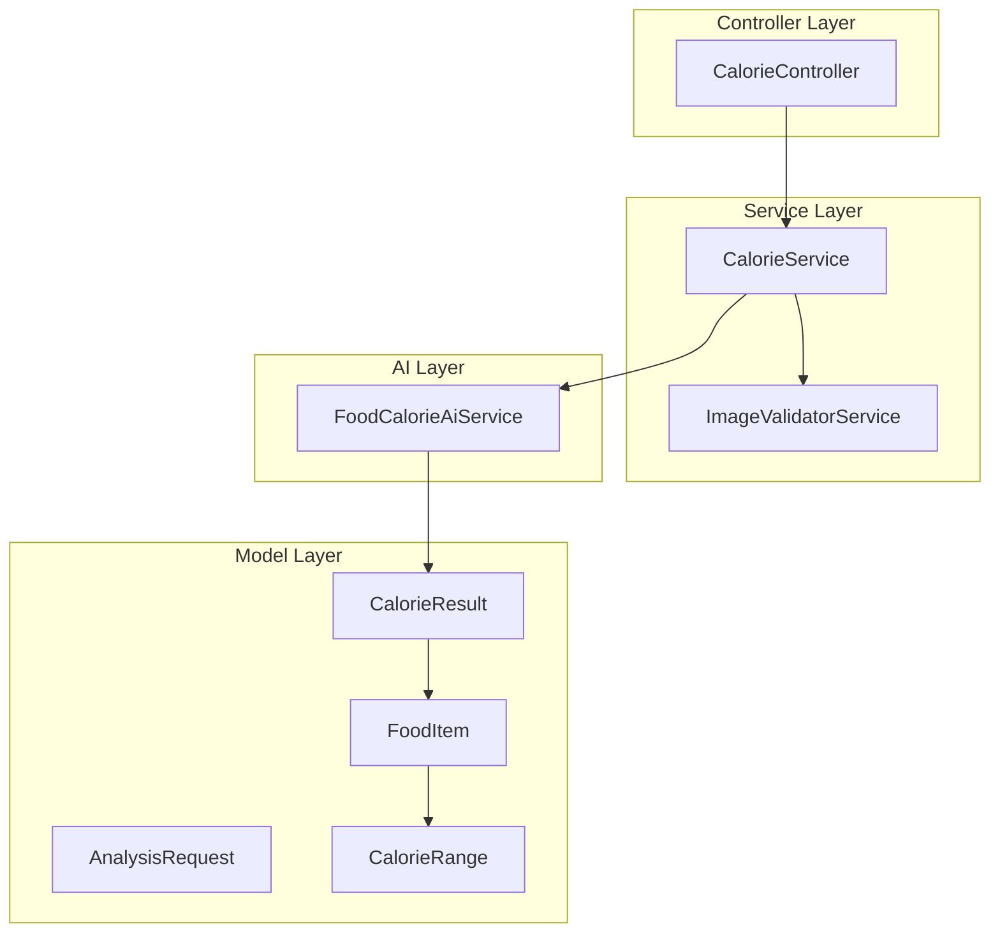
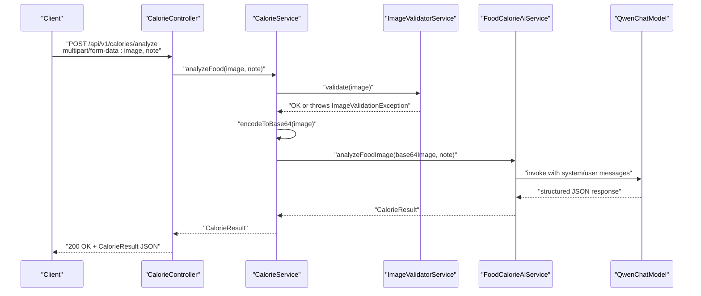
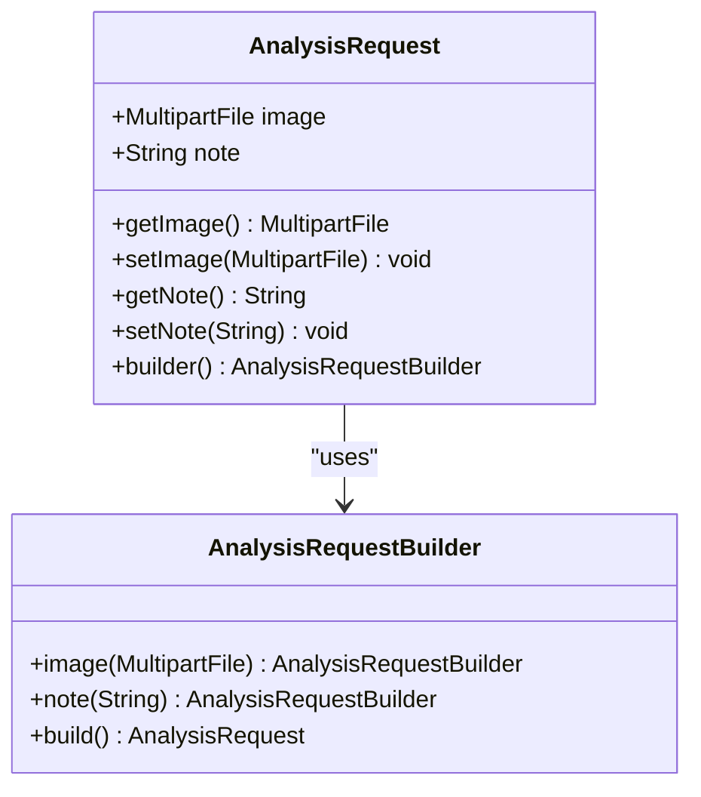
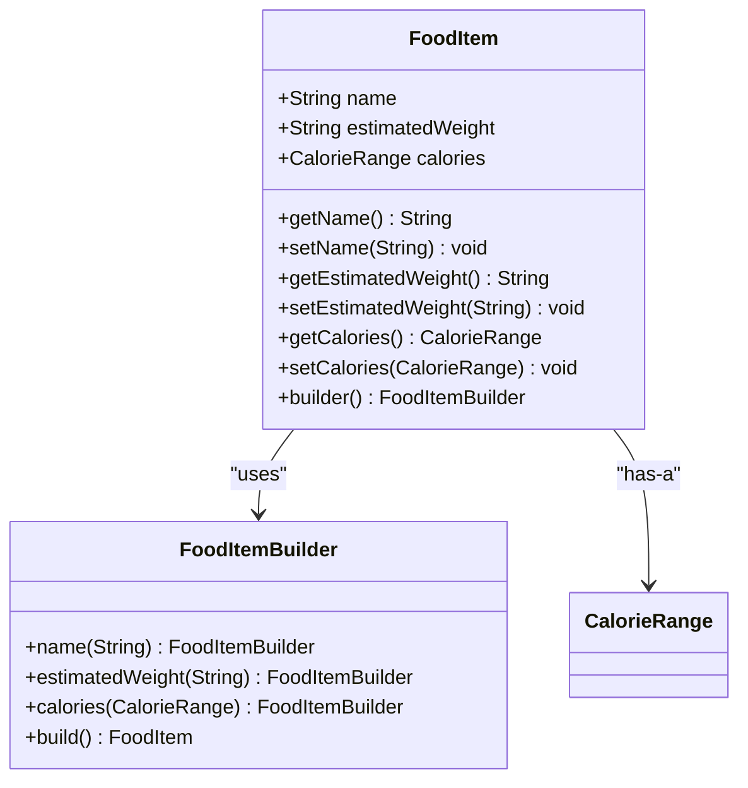
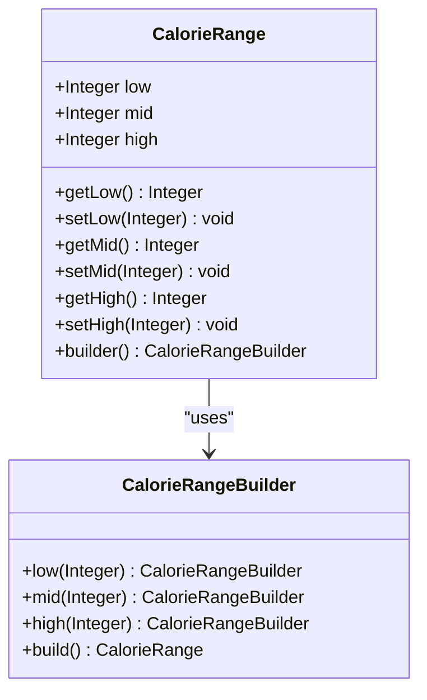
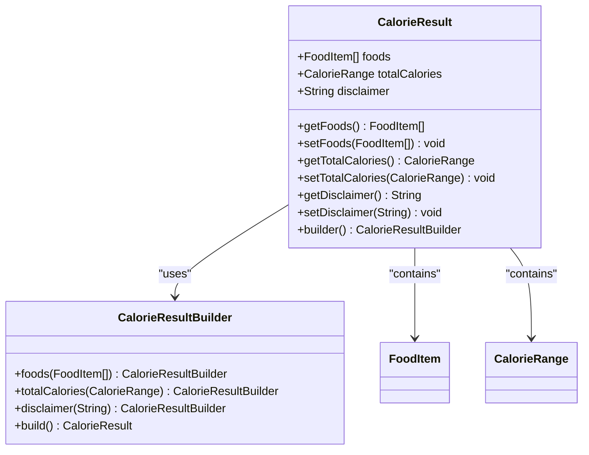
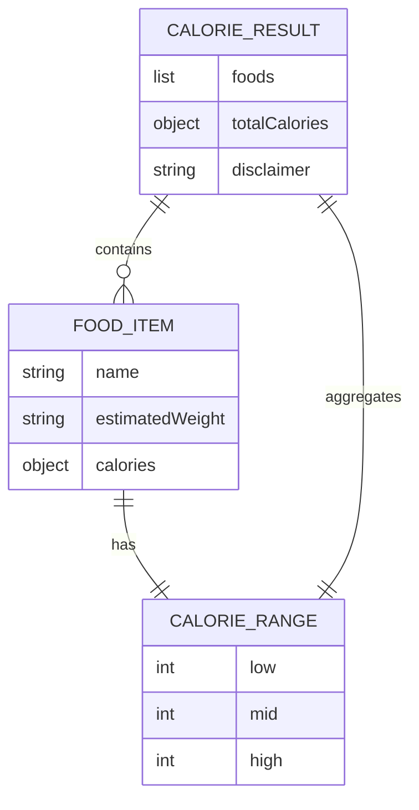
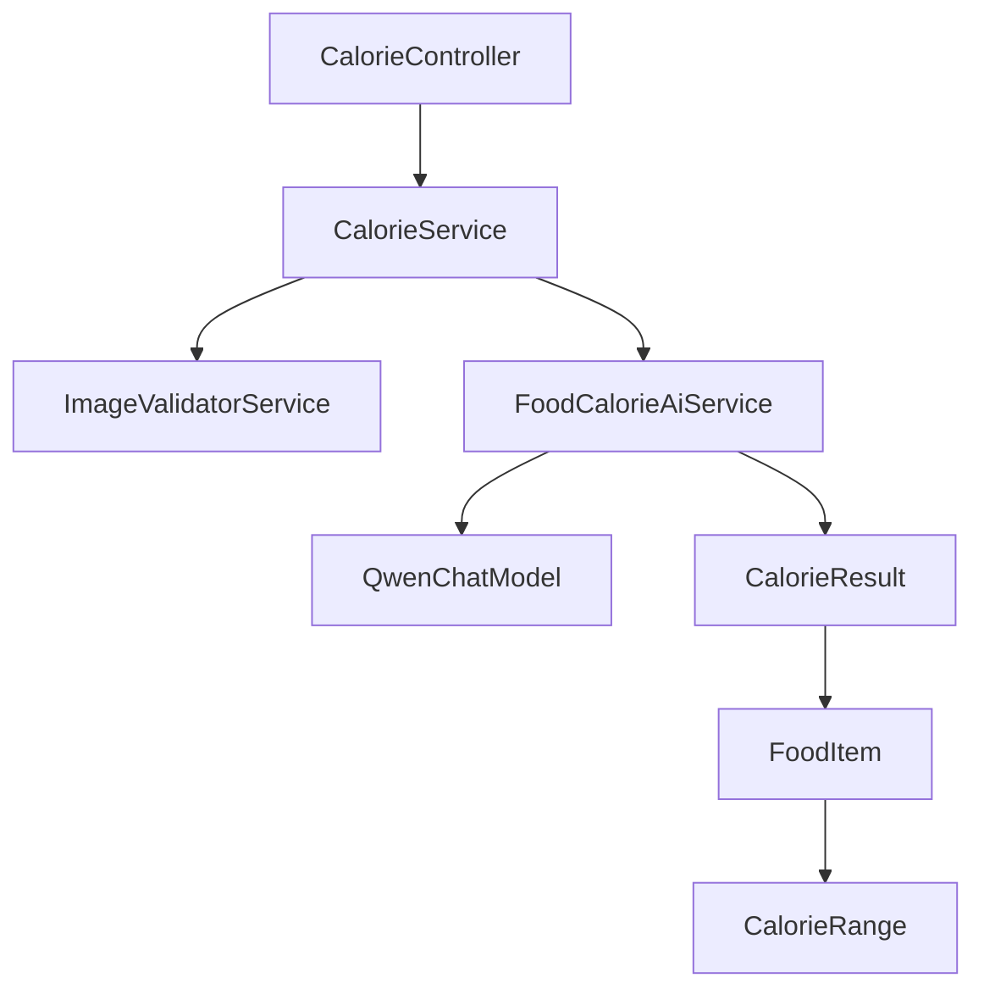
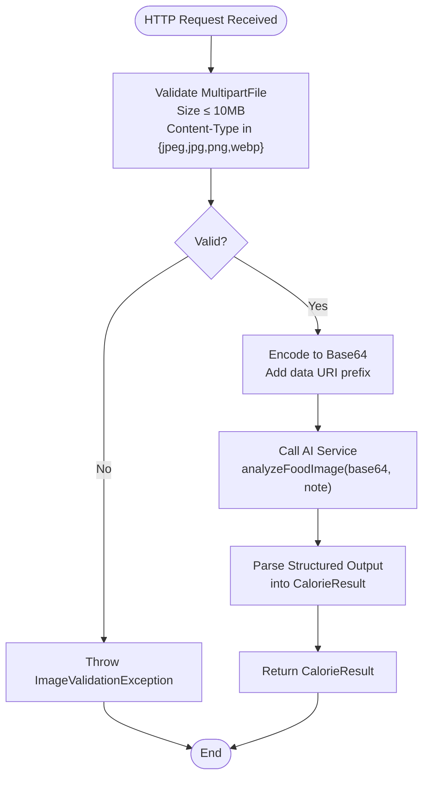

# Data Models

<cite>
**Referenced Files in This Document**
- [AnalysisRequest.java](file://src/main/java/com/example/heatcalculate/model/AnalysisRequest.java)
- [FoodItem.java](file://src/main/java/com/example/heatcalculate/model/FoodItem.java)
- [CalorieRange.java](file://src/main/java/com/example/heatcalculate/model/CalorieRange.java)
- [CalorieResult.java](file://src/main/java/com/example/heatcalculate/model/CalorieResult.java)
- [ImageValidatorService.java](file://src/main/java/com/example/heatcalculate/service/ImageValidatorService.java)
- [CalorieService.java](file://src/main/java/com/example/heatcalculate/service/CalorieService.java)
- [CalorieController.java](file://src/main/java/com/example/heatcalculate/controller/CalorieController.java)
- [FoodCalorieAiService.java](file://src/main/java/com/example/heatcalculate/ai/FoodCalorieAiService.java)
- [application.yml](file://src/main/resources/application.yml)
- [ImageValidationException.java](file://src/main/java/com/example/heatcalculate/exception/ImageValidationException.java)
- [ModelParseException.java](file://src/main/java/com/example/heatcalculate/exception/ModelParseException.java)
- [spec.md](file://openspec/changes/food-calorie-recognition/specs/food-calorie-recognition/spec.md)
</cite>

## Table of Contents
1. [Introduction](#introduction)
2. [Project Structure](#project-structure)
3. [Core Components](#core-components)
4. [Architecture Overview](#architecture-overview)
5. [Detailed Component Analysis](#detailed-component-analysis)
6. [Dependency Analysis](#dependency-analysis)
7. [Performance Considerations](#performance-considerations)
8. [Troubleshooting Guide](#troubleshooting-guide)
9. [Conclusion](#conclusion)
10. [Appendices](#appendices)

## Introduction
This document provides comprehensive data model documentation for the Heat Calculate service. It focuses on the core data structures used throughout the application, detailing the AnalysisRequest model for input validation (including file upload handling and image metadata), the FoodItem model representing individual food recognition results, the CalorieRange model defining low/mid/high confidence intervals for calorie estimates, and the CalorieResult model as the complete response structure combining all analysis results. The document explains field definitions, data types, validation rules, business constraints, serialization/deserialization behavior, and how these models work together in the request/response pipeline.

## Project Structure
The data models are part of a Spring Boot application that integrates with a vision-language model (Qwen-VL) to analyze food images and estimate calories. The models are organized under the model package and are consumed by the controller and service layers. Validation logic is encapsulated in a dedicated service that enforces file type and size constraints.

**Diagram sources**
- [CalorieController.java:25-96](file://src/main/java/com/example/heatcalculate/controller/CalorieController.java#L25-L96)
- [CalorieService.java:21-85](file://src/main/java/com/example/heatcalculate/service/CalorieService.java#L21-L85)
- [ImageValidatorService.java:15-48](file://src/main/java/com/example/heatcalculate/service/ImageValidatorService.java#L15-L48)
- [FoodCalorieAiService.java:12-59](file://src/main/java/com/example/heatcalculate/ai/FoodCalorieAiService.java#L12-L59)
- [AnalysisRequest.java:10-65](file://src/main/java/com/example/heatcalculate/model/AnalysisRequest.java#L10-L65)
- [FoodItem.java:9-82](file://src/main/java/com/example/heatcalculate/model/FoodItem.java#L9-L82)
- [CalorieRange.java:9-82](file://src/main/java/com/example/heatcalculate/model/CalorieRange.java#L9-L82)
- [CalorieResult.java:11-84](file://src/main/java/com/example/heatcalculate/model/CalorieResult.java#L11-L84)

**Section sources**
- [CalorieController.java:25-96](file://src/main/java/com/example/heatcalculate/controller/CalorieController.java#L25-L96)
- [CalorieService.java:21-85](file://src/main/java/com/example/heatcalculate/service/CalorieService.java#L21-L85)
- [ImageValidatorService.java:15-48](file://src/main/java/com/example/heatcalculate/service/ImageValidatorService.java#L15-L48)
- [FoodCalorieAiService.java:12-59](file://src/main/java/com/example/heatcalculate/ai/FoodCalorieAiService.java#L12-L59)

## Core Components
This section documents the four primary data models used in the system, including their fields, data types, validation rules, and business constraints.

- AnalysisRequest
  - Purpose: Encapsulates the incoming request for food image analysis, including the uploaded image and optional note.
  - Fields:
    - image: MultipartFile (required). Supports JPG, PNG, WEBP formats up to 10MB. Content type validation is enforced by the ImageValidatorService.
    - note: String (optional). Free-text note associated with the image.
  - Validation rules:
    - image must be present and non-empty.
    - image size must not exceed 10MB.
    - image content type must be one of: image/jpeg, image/jpg, image/png, image/webp.
  - Business constraints:
    - note is optional and can be null.
    - image is mandatory for the endpoint.
  - Serialization/deserialization:
    - MultipartFile is handled by Spring MVC during form-data processing.
    - The model itself is a POJO with standard getters/setters and a builder pattern for convenience.

- FoodItem
  - Purpose: Represents a single recognized food item with name, estimated weight, and calorie range.
  - Fields:
    - name: String (required). Human-readable food name.
    - estimatedWeight: String (required). Estimated weight range in grams (e.g., "80-120g").
    - calories: CalorieRange (required). Low/mid/high calorie estimates for the food item.
  - Validation rules:
    - All fields are required; null values are not permitted.
  - Business constraints:
    - estimatedWeight is a string representation of a range; consumers should parse appropriately.
    - calories must be a valid CalorieRange with non-null low/mid/high values.
  - Serialization/deserialization:
    - Standard POJO with getters/setters and builder pattern.

- CalorieRange
  - Purpose: Defines a confidence interval for calorie estimates with low, mid, and high values.
  - Fields:
    - low: Integer (required). Lower bound of the calorie estimate.
    - mid: Integer (required). Middle bound of the calorie estimate.
    - high: Integer (required). Upper bound of the calorie estimate.
  - Validation rules:
    - All fields are required; null values are not permitted.
    - low ≤ mid ≤ high (business rule implied by confidence interval semantics).
  - Business constraints:
    - Values represent kilocalories (kcal).
    - low, mid, high must be non-negative integers.
  - Serialization/deserialization:
    - Standard POJO with getters/setters and builder pattern.

- CalorieResult
  - Purpose: Complete response structure containing all analyzed foods, total calorie range, and disclaimer.
  - Fields:
    - foods: List<FoodItem> (required). Recognized food items. Can be empty if no food is detected.
    - totalCalories: CalorieRange (required). Aggregate low/mid/high calorie estimates across all foods.
    - disclaimer: String (required). Disclaimer stating that estimates are approximate.
  - Validation rules:
    - All fields are required; null values are not permitted.
  - Business constraints:
    - foods can be empty when no food is identified.
    - totalCalories aggregates the nutritional impact across all items.
    - disclaimer is a fixed informational message.
  - Serialization/deserialization:
    - Standard POJO with getters/setters and builder pattern.

**Section sources**
- [AnalysisRequest.java:10-65](file://src/main/java/com/example/heatcalculate/model/AnalysisRequest.java#L10-L65)
- [FoodItem.java:9-82](file://src/main/java/com/example/heatcalculate/model/FoodItem.java#L9-L82)
- [CalorieRange.java:9-82](file://src/main/java/com/example/heatcalculate/model/CalorieRange.java#L9-L82)
- [CalorieResult.java:11-84](file://src/main/java/com/example/heatcalculate/model/CalorieResult.java#L11-L84)

## Architecture Overview
The request/response pipeline integrates file upload validation, Base64 encoding, AI model invocation, and structured result composition. The controller exposes an endpoint that accepts multipart/form-data, validates the image, encodes it, and delegates to the service layer. The service orchestrates validation and calls the AI service interface, which returns a CalorieResult. The controller then returns the result to the client.

**Diagram sources**
- [CalorieController.java:81-94](file://src/main/java/com/example/heatcalculate/controller/CalorieController.java#L81-L94)
- [CalorieService.java:40-69](file://src/main/java/com/example/heatcalculate/service/CalorieService.java#L40-L69)
- [ImageValidatorService.java:31-46](file://src/main/java/com/example/heatcalculate/service/ImageValidatorService.java#L31-L46)
- [FoodCalorieAiService.java:57-57](file://src/main/java/com/example/heatcalculate/ai/FoodCalorieAiService.java#L57-L57)

**Section sources**
- [CalorieController.java:25-96](file://src/main/java/com/example/heatcalculate/controller/CalorieController.java#L25-L96)
- [CalorieService.java:21-85](file://src/main/java/com/example/heatcalculate/service/CalorieService.java#L21-L85)
- [FoodCalorieAiService.java:12-59](file://src/main/java/com/example/heatcalculate/ai/FoodCalorieAiService.java#L12-L59)

## Detailed Component Analysis

### AnalysisRequest Model
- Purpose: Encapsulate the incoming request for food image analysis.
- Fields:
  - image: MultipartFile (required). Enforced by ImageValidatorService for content type and size.
  - note: String (optional). Free-form note.
- Validation:
  - Enforced by ImageValidatorService.validate(file):
    - Non-null and non-empty file.
    - Size ≤ 10MB.
    - Content type must be one of: image/jpeg, image/jpg, image/png, image/webp.
- Builder pattern: Provides fluent setters for image and note.
- Null safety: note can be null; image must not be null for successful processing.

**Diagram sources**
- [AnalysisRequest.java:10-65](file://src/main/java/com/example/heatcalculate/model/AnalysisRequest.java#L10-L65)

**Section sources**
- [AnalysisRequest.java:10-65](file://src/main/java/com/example/heatcalculate/model/AnalysisRequest.java#L10-L65)
- [ImageValidatorService.java:31-46](file://src/main/java/com/example/heatcalculate/service/ImageValidatorService.java#L31-L46)

### FoodItem Model
- Purpose: Represent a single recognized food item.
- Fields:
  - name: String (required). Food name.
  - estimatedWeight: String (required). Weight range string (e.g., "80-120g").
  - calories: CalorieRange (required). Low/mid/high calorie estimates.
- Validation: All fields required; null not permitted.
- Builder pattern: Fluent setters for name, estimatedWeight, and calories.
- Business constraints:
  - estimatedWeight is a string range; consumers should parse to numeric bounds.
  - calories must be a valid CalorieRange with non-null values.

**Diagram sources**
- [FoodItem.java:9-82](file://src/main/java/com/example/heatcalculate/model/FoodItem.java#L9-L82)
- [CalorieRange.java:9-82](file://src/main/java/com/example/heatcalculate/model/CalorieRange.java#L9-L82)

**Section sources**
- [FoodItem.java:9-82](file://src/main/java/com/example/heatcalculate/model/FoodItem.java#L9-L82)
- [CalorieRange.java:9-82](file://src/main/java/com/example/heatcalculate/model/CalorieRange.java#L9-L82)

### CalorieRange Model
- Purpose: Define low/mid/high confidence intervals for calorie estimates.
- Fields:
  - low: Integer (required). Lower bound kcal.
  - mid: Integer (required). Middle bound kcal.
  - high: Integer (required). Upper bound kcal.
- Validation: All fields required; null not permitted.
- Business constraints:
  - low ≤ mid ≤ high (implied by confidence interval semantics).
  - Values are non-negative integers representing kcal.

**Diagram sources**
- [CalorieRange.java:9-82](file://src/main/java/com/example/heatcalculate/model/CalorieRange.java#L9-L82)

**Section sources**
- [CalorieRange.java:9-82](file://src/main/java/com/example/heatcalculate/model/CalorieRange.java#L9-L82)

### CalorieResult Model
- Purpose: Complete response structure combining all analysis results.
- Fields:
  - foods: List<FoodItem> (required). Recognized food items; can be empty.
  - totalCalories: CalorieRange (required). Aggregate kcal range across all foods.
  - disclaimer: String (required). Disclaimer message indicating estimation nature.
- Validation: All fields required; null not permitted.
- Business constraints:
  - foods can be empty when no food is detected.
  - totalCalories aggregates nutritional impact across items.
  - disclaimer is a fixed informational message.

**Diagram sources**
- [CalorieResult.java:11-84](file://src/main/java/com/example/heatcalculate/model/CalorieResult.java#L11-L84)
- [FoodItem.java:9-82](file://src/main/java/com/example/heatcalculate/model/FoodItem.java#L9-L82)
- [CalorieRange.java:9-82](file://src/main/java/com/example/heatcalculate/model/CalorieRange.java#L9-L82)

**Section sources**
- [CalorieResult.java:11-84](file://src/main/java/com/example/heatcalculate/model/CalorieResult.java#L11-L84)

### Relationship Between Models
- CalorieResult contains a list of FoodItem entries and a total CalorieRange.
- Each FoodItem contains a CalorieRange for that specific food.
- The AI service returns a CalorieResult that is directly mapped to the response payload.

**Diagram sources**
- [CalorieResult.java:11-84](file://src/main/java/com/example/heatcalculate/model/CalorieResult.java#L11-L84)
- [FoodItem.java:9-82](file://src/main/java/com/example/heatcalculate/model/FoodItem.java#L9-L82)
- [CalorieRange.java:9-82](file://src/main/java/com/example/heatcalculate/model/CalorieRange.java#L9-L82)

**Section sources**
- [CalorieResult.java:11-84](file://src/main/java/com/example/heatcalculate/model/CalorieResult.java#L11-L84)
- [FoodItem.java:9-82](file://src/main/java/com/example/heatcalculate/model/FoodItem.java#L9-L82)
- [CalorieRange.java:9-82](file://src/main/java/com/example/heatcalculate/model/CalorieRange.java#L9-L82)

## Dependency Analysis
- Controller depends on CalorieService for processing requests.
- CalorieService depends on ImageValidatorService for file validation and QwenChatModel for AI inference.
- FoodCalorieAiService defines the contract for structured output and delegates to QwenChatModel.
- CalorieResult is the primary output type used by the controller and AI service.

**Diagram sources**
- [CalorieController.java:29-33](file://src/main/java/com/example/heatcalculate/controller/CalorieController.java#L29-L33)
- [CalorieService.java:25-31](file://src/main/java/com/example/heatcalculate/service/CalorieService.java#L25-L31)
- [FoodCalorieAiService.java:57-57](file://src/main/java/com/example/heatcalculate/ai/FoodCalorieAiService.java#L57-L57)
- [CalorieResult.java:11-84](file://src/main/java/com/example/heatcalculate/model/CalorieResult.java#L11-L84)
- [FoodItem.java:9-82](file://src/main/java/com/example/heatcalculate/model/FoodItem.java#L9-L82)
- [CalorieRange.java:9-82](file://src/main/java/com/example/heatcalculate/model/CalorieRange.java#L9-L82)

**Section sources**
- [CalorieController.java:25-96](file://src/main/java/com/example/heatcalculate/controller/CalorieController.java#L25-L96)
- [CalorieService.java:21-85](file://src/main/java/com/example/heatcalculate/service/CalorieService.java#L21-L85)
- [FoodCalorieAiService.java:12-59](file://src/main/java/com/example/heatcalculate/ai/FoodCalorieAiService.java#L12-L59)

## Performance Considerations
- File size limits: The maximum file size is configured to 10MB, balancing quality and performance.
- Base64 encoding overhead: Images are encoded to Base64 and prefixed with a data URI scheme for model consumption. This increases payload size; ensure clients send appropriately sized images.
- Model invocation latency: The AI service call introduces network latency; consider caching or rate limiting at the gateway if needed.
- Memory usage: Large images increase memory footprint during encoding and processing; enforce client-side constraints and server-side limits.

[No sources needed since this section provides general guidance]

## Troubleshooting Guide
Common validation and parsing issues:

- Image validation failures:
  - Cause: Unsupported content type or file size exceeding 10MB.
  - Symptoms: ImageValidationException thrown with specific messages.
  - Resolution: Ensure the image is JPG, PNG, or WEBP and under 10MB.

- Model parsing failures:
  - Cause: AI service returns content that cannot be parsed into CalorieResult.
  - Symptoms: ModelParseException thrown; logs capture raw model output.
  - Resolution: Verify AI service configuration and retry; check logs for raw output.

- Null pointer scenarios:
  - AnalysisRequest.note can be null; handle gracefully in downstream logic.
  - CalorieResult fields are required; ensure AI service returns a valid structure.

**Section sources**
- [ImageValidatorService.java:31-46](file://src/main/java/com/example/heatcalculate/service/ImageValidatorService.java#L31-L46)
- [ImageValidationException.java:6-11](file://src/main/java/com/example/heatcalculate/exception/ImageValidationException.java#L6-L11)
- [ModelParseException.java:6-15](file://src/main/java/com/example/heatcalculate/exception/ModelParseException.java#L6-L15)

## Conclusion
The Heat Calculate service employs a clean separation of concerns around data models: AnalysisRequest captures input, FoodItem represents individual results, CalorieRange defines confidence intervals, and CalorieResult aggregates the complete response. Validation is centralized in ImageValidatorService, while the AI service produces structured output conforming to the CalorieResult schema. Together, these models enable robust, predictable processing of food image analysis requests.

[No sources needed since this section summarizes without analyzing specific files]

## Appendices

### JSON Schema Examples
The following JSON schemas reflect the structure defined by the models and enforced by the AI service:

- CalorieResult schema:
  - foods: array of FoodItem
  - totalCalories: CalorieRange
  - disclaimer: string

- FoodItem schema:
  - name: string
  - estimatedWeight: string
  - calories: CalorieRange

- CalorieRange schema:
  - low: integer
  - mid: integer
  - high: integer

These schemas align with the AI service’s system prompt and expected output format.

**Section sources**
- [FoodCalorieAiService.java:29-50](file://src/main/java/com/example/heatcalculate/ai/FoodCalorieAiService.java#L29-L50)
- [spec.md:25-43](file://openspec/changes/food-calorie-recognition/specs/food-calorie-recognition/spec.md#L25-L43)

### Sample Data Patterns
Typical usage patterns derived from the AI service’s expected output:

- Normal response:
  - foods: [{"name": "...", "estimatedWeight": "80-120g", "calories": {"low": 280, "mid": 380, "high": 480}}]
  - totalCalories: {"low": 280, "mid": 380, "high": 480}
  - disclaimer: "热量数据为估算值，实际值因食材和烹饪方式而异"

- Empty detection:
  - foods: []
  - totalCalories: {"low": 0, "mid": 0, "high": 0}
  - disclaimer: "热量数据为估算值，实际值因食材和烹饪方式而异"

These patterns are validated by the OpenSpec requirements and AI service expectations.

**Section sources**
- [spec.md:6-12](file://openspec/changes/food-calorie-recognition/specs/food-calorie-recognition/spec.md#L6-L12)
- [FoodCalorieAiService.java:29-50](file://src/main/java/com/example/heatcalculate/ai/FoodCalorieAiService.java#L29-L50)

### Request/Response Pipeline Flow

**Diagram sources**
- [ImageValidatorService.java:31-46](file://src/main/java/com/example/heatcalculate/service/ImageValidatorService.java#L31-L46)
- [CalorieService.java:74-83](file://src/main/java/com/example/heatcalculate/service/CalorieService.java#L74-L83)
- [FoodCalorieAiService.java:57-57](file://src/main/java/com/example/heatcalculate/ai/FoodCalorieAiService.java#L57-L57)