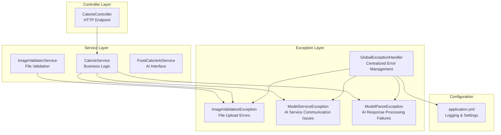
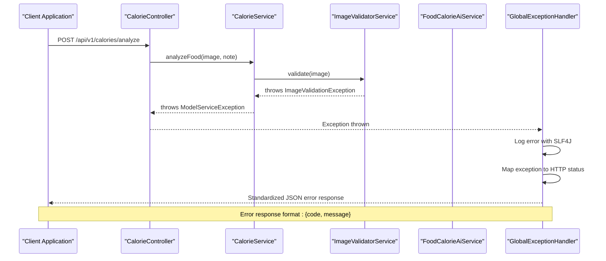
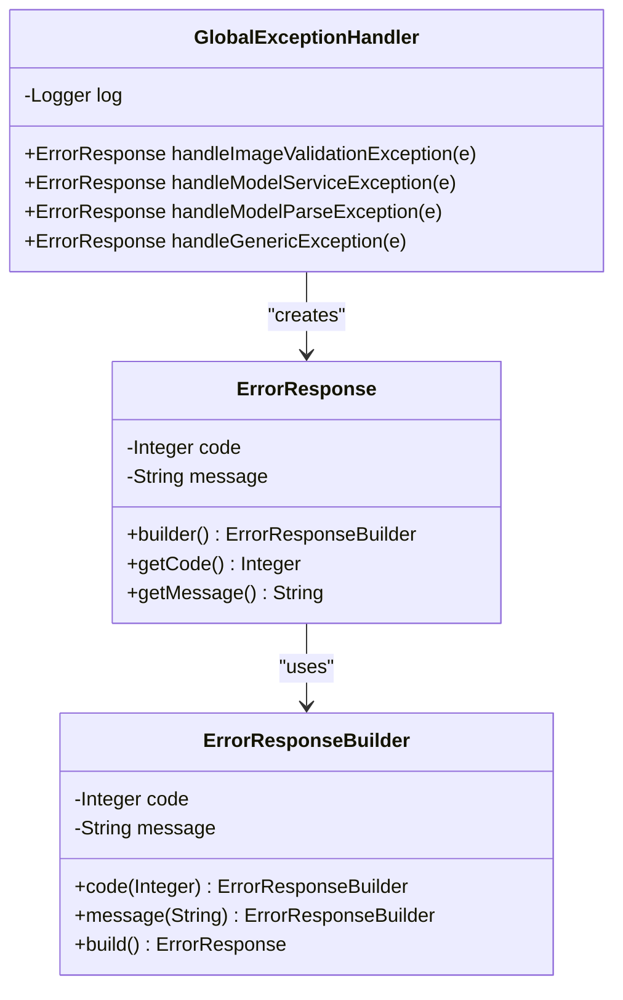
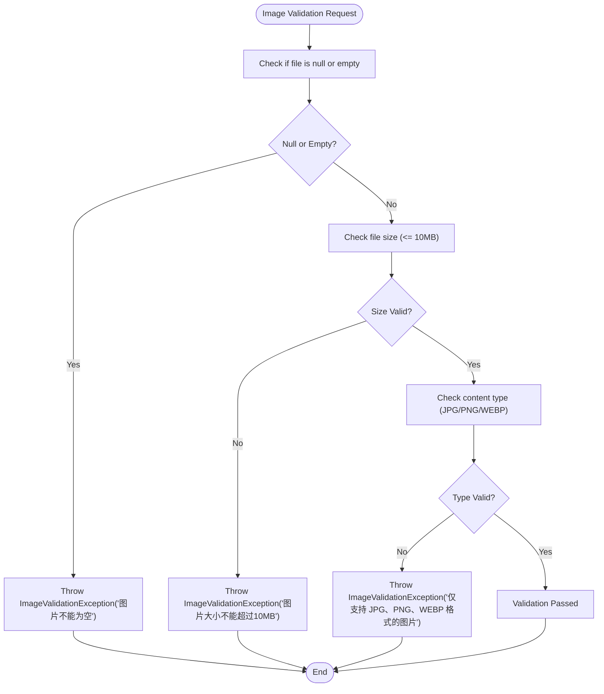
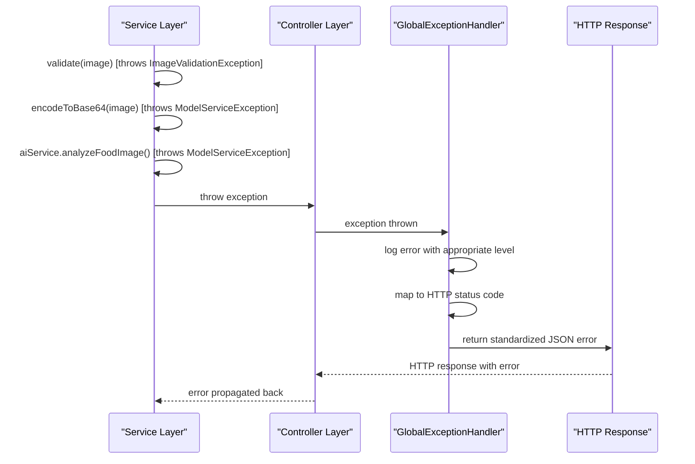
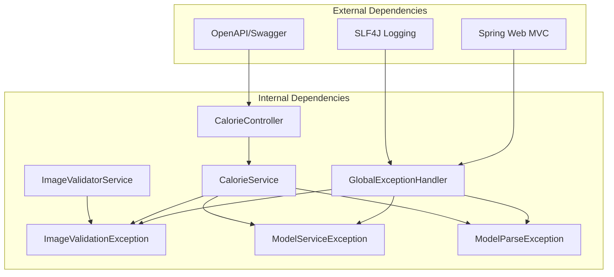

# Exception Handling

<cite>
**Referenced Files in This Document**
- [GlobalExceptionHandler.java](file://src/main/java/com/example/heatcalculate/exception/GlobalExceptionHandler.java)
- [ImageValidationException.java](file://src/main/java/com/example/heatcalculate/exception/ImageValidationException.java)
- [ModelParseException.java](file://src/main/java/com/example/heatcalculate/exception/ModelParseException.java)
- [ModelServiceException.java](file://src/main/java/com/example/heatcalculate/exception/ModelServiceException.java)
- [CalorieController.java](file://src/main/java/com/example/heatcalculate/controller/CalorieController.java)
- [CalorieService.java](file://src/main/java/com/example/heatcalculate/service/CalorieService.java)
- [ImageValidatorService.java](file://src/main/java/com/example/heatcalculate/service/ImageValidatorService.java)
- [FoodCalorieAiService.java](file://src/main/java/com/example/heatcalculate/ai/FoodCalorieAiService.java)
- [application.yml](file://src/main/resources/application.yml)
- [ImageValidatorServiceTest.java](file://src/test/java/com/example/heatcalculate/service/ImageValidatorServiceTest.java)
</cite>

## Table of Contents
1. [Introduction](#introduction)
2. [Project Structure](#project-structure)
3. [Core Components](#core-components)
4. [Architecture Overview](#architecture-overview)
5. [Detailed Component Analysis](#detailed-component-analysis)
6. [Dependency Analysis](#dependency-analysis)
7. [Performance Considerations](#performance-considerations)
8. [Troubleshooting Guide](#troubleshooting-guide)
9. [Conclusion](#conclusion)

## Introduction
This document provides comprehensive exception handling documentation for the Heat Calculate service. It focuses on the global error management strategy and custom exception types, detailing the centralized error response generation with standardized JSON error format. The documentation covers exception propagation patterns from the service layer through the controller layer to HTTP response generation, error response schemas, HTTP status code mappings, and practical troubleshooting guidance for common error scenarios.

## Project Structure
The exception handling system is organized around a centralized GlobalExceptionHandler that manages all custom exceptions and generates standardized error responses. The service layer throws specific exceptions that are caught and transformed into HTTP responses by the GlobalExceptionHandler.

**Diagram sources**
- [GlobalExceptionHandler.java:14-61](file://src/main/java/com/example/heatcalculate/exception/GlobalExceptionHandler.java#L14-L61)
- [ImageValidatorService.java:31-46](file://src/main/java/com/example/heatcalculate/service/ImageValidatorService.java#L31-L46)
- [CalorieService.java:40-69](file://src/main/java/com/example/heatcalculate/service/CalorieService.java#L40-L69)
- [CalorieController.java:81-94](file://src/main/java/com/example/heatcalculate/controller/CalorieController.java#L81-L94)

**Section sources**
- [GlobalExceptionHandler.java:14-122](file://src/main/java/com/example/heatcalculate/exception/GlobalExceptionHandler.java#L14-L122)
- [CalorieController.java:22-96](file://src/main/java/com/example/heatcalculate/controller/CalorieController.java#L22-L96)

## Core Components
The exception handling system consists of four primary components:

### GlobalExceptionHandler
The central error management component that handles all custom exceptions and generates standardized JSON error responses. It provides centralized logging and HTTP status code mapping for different exception types.

### Custom Exception Types
Three specialized exception classes handle specific error scenarios:
- ImageValidationException: Handles file upload validation errors
- ModelServiceException: Manages AI service communication failures
- ModelParseException: Processes AI response parsing failures

### Service Layer Integration
The service layer validates inputs and communicates with AI services, throwing appropriate exceptions when errors occur.

### Controller Layer
The controller exposes HTTP endpoints and delegates business logic to services while relying on GlobalExceptionHandler for error processing.

**Section sources**
- [GlobalExceptionHandler.java:14-122](file://src/main/java/com/example/heatcalculate/exception/GlobalExceptionHandler.java#L14-L122)
- [ImageValidationException.java:6-11](file://src/main/java/com/example/heatcalculate/exception/ImageValidationException.java#L6-L11)
- [ModelServiceException.java:6-15](file://src/main/java/com/example/heatcalculate/exception/ModelServiceException.java#L6-L15)
- [ModelParseException.java:6-15](file://src/main/java/com/example/heatcalculate/exception/ModelParseException.java#L6-L15)

## Architecture Overview
The exception handling architecture follows a layered approach with clear separation of concerns:

**Diagram sources**
- [CalorieController.java:81-94](file://src/main/java/com/example/heatcalculate/controller/CalorieController.java#L81-L94)
- [CalorieService.java:40-69](file://src/main/java/com/example/heatcalculate/service/CalorieService.java#L40-L69)
- [ImageValidatorService.java:31-46](file://src/main/java/com/example/heatcalculate/service/ImageValidatorService.java#L31-L46)
- [GlobalExceptionHandler.java:19-61](file://src/main/java/com/example/heatcalculate/exception/GlobalExceptionHandler.java#L19-L61)

The architecture ensures that:
- All exceptions are centrally managed
- Error responses follow a standardized JSON format
- Logging occurs at appropriate levels for each exception type
- HTTP status codes are mapped consistently

## Detailed Component Analysis

### GlobalExceptionHandler Implementation
The GlobalExceptionHandler serves as the central error management component with the following key characteristics:

#### Error Response Schema
The error response follows a standardized JSON format with two primary fields:
- `code`: HTTP status code integer value
- `message`: Human-readable error description

**Diagram sources**
- [GlobalExceptionHandler.java:67-120](file://src/main/java/com/example/heatcalculate/exception/GlobalExceptionHandler.java#L67-L120)

#### Exception Type Handling
The handler processes four distinct exception types with specific HTTP status mappings:

| Exception Type | HTTP Status | Log Level | Client Message |
|---|---|---|---|
| ImageValidationException | 400 Bad Request | WARN | Original validation message |
| ModelServiceException | 502 Bad Gateway | ERROR | Generic service unavailable message |
| ModelParseException | 500 Internal Server Error | ERROR | Generic parse failure message |
| Generic Exception | 500 Internal Server Error | ERROR | Generic internal error message |

**Section sources**
- [GlobalExceptionHandler.java:19-61](file://src/main/java/com/example/heatcalculate/exception/GlobalExceptionHandler.java#L19-L61)

### Custom Exception Types

#### ImageValidationException
Handles file upload validation errors with the following validation rules:
- Null or empty file detection
- File size validation (maximum 10MB)
- Content type validation (JPG, PNG, WEBP only)

**Diagram sources**
- [ImageValidatorService.java:31-46](file://src/main/java/com/example/heatcalculate/service/ImageValidatorService.java#L31-L46)

**Section sources**
- [ImageValidationException.java:6-11](file://src/main/java/com/example/heatcalculate/exception/ImageValidationException.java#L6-L11)
- [ImageValidatorService.java:17-46](file://src/main/java/com/example/heatcalculate/service/ImageValidatorService.java#L17-L46)

#### ModelServiceException
Manages AI service communication failures during the calorie calculation process. This exception is thrown when:
- Image encoding fails during Base64 conversion
- AI service calls fail or timeout
- Network connectivity issues occur

**Section sources**
- [ModelServiceException.java:6-15](file://src/main/java/com/example/heatcalculate/exception/ModelServiceException.java#L6-L15)
- [CalorieService.java:51-68](file://src/main/java/com/example/heatcalculate/service/CalorieService.java#L51-L68)

#### ModelParseException
Handles AI response parsing failures when the model returns unexpected or malformed data. This exception type is designed for structured output parsing errors.

**Section sources**
- [ModelParseException.java:6-15](file://src/main/java/com/example/heatcalculate/exception/ModelParseException.java#L6-L15)

### Exception Propagation Flow
The exception propagation follows a clear path from service layer to controller to HTTP response:

**Diagram sources**
- [CalorieService.java:40-69](file://src/main/java/com/example/heatcalculate/service/CalorieService.java#L40-L69)
- [CalorieController.java:81-94](file://src/main/java/com/example/heatcalculate/controller/CalorieController.java#L81-L94)
- [GlobalExceptionHandler.java:19-61](file://src/main/java/com/example/heatcalculate/exception/GlobalExceptionHandler.java#L19-L61)

**Section sources**
- [CalorieService.java:40-84](file://src/main/java/com/example/heatcalculate/service/CalorieService.java#L40-L84)
- [CalorieController.java:81-94](file://src/main/java/com/example/heatcalculate/controller/CalorieController.java#L81-L94)

## Dependency Analysis
The exception handling system exhibits clean dependency relationships with minimal coupling:

**Diagram sources**
- [GlobalExceptionHandler.java:1-9](file://src/main/java/com/example/heatcalculate/exception/GlobalExceptionHandler.java#L1-L9)
- [ImageValidatorService.java:1-5](file://src/main/java/com/example/heatcalculate/service/ImageValidatorService.java#L1-L5)
- [CalorieService.java:1-15](file://src/main/java/com/example/heatcalculate/service/CalorieService.java#L1-L15)
- [CalorieController.java:1-17](file://src/main/java/com/example/heatcalculate/controller/CalorieController.java#L1-L17)

Key dependency characteristics:
- **Low Coupling**: Exceptions are simple runtime exceptions with no cross-dependencies
- **Centralized Logging**: All exceptions pass through GlobalExceptionHandler for consistent logging
- **Minimal External Dependencies**: Only requires SLF4J for logging and Spring for exception handling
- **Clean Separation**: Business logic remains separate from error handling concerns

**Section sources**
- [GlobalExceptionHandler.java:14-122](file://src/main/java/com/example/heatcalculate/exception/GlobalExceptionHandler.java#L14-L122)
- [CalorieService.java:1-15](file://src/main/java/com/example/heatcalculate/service/CalorieService.java#L1-L15)

## Performance Considerations
The exception handling system is designed for minimal performance impact:

### Logging Performance
- **Selective Logging Levels**: Different exception types use appropriate log levels (WARN vs ERROR)
- **Conditional Logging**: Only logs when exceptions occur, avoiding continuous overhead
- **Structured Logging**: Uses SLF4J with parameterized messages for efficient string concatenation

### Memory Efficiency
- **Simple Exception Types**: All custom exceptions extend RuntimeException with minimal overhead
- **Standardized Response Format**: Consistent JSON structure reduces serialization complexity
- **No Circular Dependencies**: Clean dependency graph prevents memory leaks

### HTTP Response Optimization
- **Consistent Status Codes**: Predictable HTTP status mapping enables efficient client handling
- **Minimal Response Payload**: Compact JSON error format reduces bandwidth usage
- **Centralized Processing**: Single handler reduces processing overhead compared to scattered error handling

## Troubleshooting Guide

### Common Error Scenarios and Solutions

#### Invalid File Formats
**Symptoms**: HTTP 400 Bad Request with error message about unsupported formats
**Causes**: 
- GIF, BMP, or other unsupported formats
- Missing or incorrect content-type headers
- Null content-type values

**Solutions**:
- Verify file extension matches content-type header
- Ensure images are JPG, PNG, or WEBP format
- Check file upload configuration limits

**Section sources**
- [ImageValidatorService.java:31-46](file://src/main/java/com/example/heatcalculate/service/ImageValidatorService.java#L31-L46)
- [ImageValidatorServiceTest.java:70-105](file://src/test/java/com/example/heatcalculate/service/ImageValidatorServiceTest.java#L70-L105)

#### File Size Exceeds Limits
**Symptoms**: HTTP 400 Bad Request with "图片大小不能超过10MB" message
**Causes**: 
- Files larger than 10MB limit
- Large image resolution causing oversized encoded data

**Solutions**:
- Compress images before upload
- Reduce image resolution to meet size requirements
- Use appropriate image formats that compress better

**Section sources**
- [ImageValidatorService.java:37-39](file://src/main/java/com/example/heatcalculate/service/ImageValidatorService.java#L37-L39)
- [ImageValidatorServiceTest.java:108-125](file://src/test/java/com/example/heatcalculate/service/ImageValidatorServiceTest.java#L108-L125)

#### AI Service Timeouts
**Symptoms**: HTTP 502 Bad Gateway with "模型服务暂时不可用" message
**Causes**:
- Network connectivity issues
- AI service unavailability
- Timeout during model inference
- API key configuration problems

**Solutions**:
- Check network connectivity to AI service
- Verify DASHSCOPE_API_KEY environment variable
- Implement retry logic with exponential backoff
- Monitor AI service health indicators

**Section sources**
- [CalorieService.java:65-68](file://src/main/java/com/example/heatcalculate/service/CalorieService.java#L65-L68)
- [application.yml:13](file://src/main/resources/application.yml#L13)

#### Network Connectivity Issues
**Symptoms**: HTTP 502 Bad Gateway with service unavailable messages
**Causes**:
- DNS resolution failures
- Firewall blocking outbound connections
- Proxy configuration issues
- Load balancer timeouts

**Solutions**:
- Test network connectivity using ping/traceroute
- Verify proxy settings if applicable
- Check firewall rules and security groups
- Monitor network latency and packet loss

**Section sources**
- [application.yml:1-21](file://src/main/resources/application.yml#L1-L21)

### Debugging Techniques

#### Production Environment Debugging
1. **Enable Detailed Logging**: Increase log level for heat calculate package
2. **Monitor Error Rates**: Track exception frequencies and patterns
3. **Health Checks**: Implement periodic AI service availability checks
4. **Error Tracking**: Integrate with error monitoring platforms

#### Local Development Debugging
1. **Unit Tests**: Run ImageValidatorServiceTest to verify validation logic
2. **Integration Tests**: Test complete exception flow from controller to handler
3. **Mock Services**: Use mock AI services for isolated testing
4. **Log Analysis**: Review application logs for error patterns

**Section sources**
- [ImageValidatorServiceTest.java:24-206](file://src/test/java/com/example/heatcalculate/service/ImageValidatorServiceTest.java#L24-L206)

### Error Monitoring and Alerting
Recommended monitoring setup:
- **Error Rate Thresholds**: Alert on >1% error rate for critical endpoints
- **Latency Monitoring**: Track response times for AI service calls
- **Service Health Checks**: Monitor AI service availability metrics
- **Log Aggregation**: Centralize logs for correlation and analysis

## Conclusion
The Heat Calculate service implements a robust exception handling strategy through its centralized GlobalExceptionHandler and well-defined custom exception types. The system provides:

- **Consistent Error Responses**: Standardized JSON format with HTTP status code mapping
- **Clear Exception Hierarchy**: Specialized exceptions for different error categories
- **Centralized Logging**: Appropriate log levels for different exception severity
- **Predictable Behavior**: Clear propagation patterns from service to HTTP response
- **Production Ready**: Comprehensive error monitoring and troubleshooting capabilities

The architecture successfully separates error handling concerns from business logic while maintaining performance and reliability. The documented patterns provide a solid foundation for extending error handling capabilities and maintaining system stability in production environments.