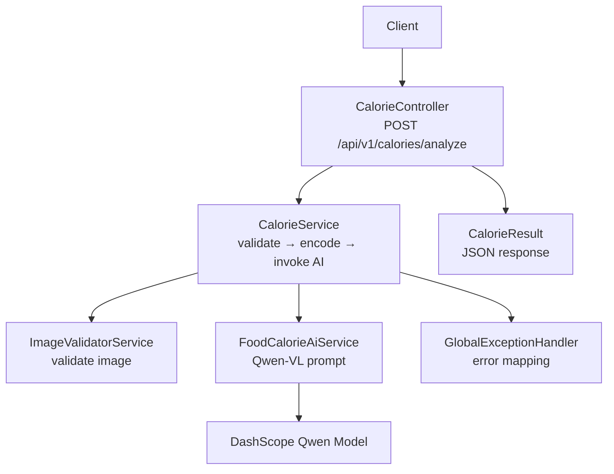

# Getting Started

<cite>
**Referenced Files in This Document**
- [application.yml](file://src/main/resources/application.yml)
- [pom.xml](file://pom.xml)
- [HeatCalculateApplication.java](file://src/main/java/com/example/heatcalculate/HeatCalculateApplication.java)
- [LangChain4jConfig.java](file://src/main/java/com/example/heatcalculate/config/LangChain4jConfig.java)
- [CalorieController.java](file://src/main/java/com/example/heatcalculate/controller/CalorieController.java)
- [CalorieService.java](file://src/main/java/com/example/heatcalculate/service/CalorieService.java)
- [FoodCalorieAiService.java](file://src/main/java/com/example/heatcalculate/ai/FoodCalorieAiService.java)
- [ImageValidatorService.java](file://src/main/java/com/example/heatcalculate/service/ImageValidatorService.java)
- [CalorieResult.java](file://src/main/java/com/example/heatcalculate/model/CalorieResult.java)
- [FoodItem.java](file://src/main/java/com/example/heatcalculate/model/FoodItem.java)
- [CalorieRange.java](file://src/main/java/com/example/heatcalculate/model/CalorieRange.java)
- [GlobalExceptionHandler.java](file://src/main/java/com/example/heatcalculate/exception/GlobalExceptionHandler.java)
- [ImageValidationException.java](file://src/main/java/com/example/heatcalculate/exception/ImageValidationException.java)
</cite>

## Table of Contents
1. [Introduction](#introduction)
2. [Prerequisites](#prerequisites)
3. [Quick Setup](#quick-setup)
4. [Environment Configuration](#environment-configuration)
5. [First API Call](#first-api-call)
6. [Expected Response Format](#expected-response-format)
7. [Common Error Scenarios](#common-error-scenarios)
8. [Verification and Troubleshooting](#verification-and-troubleshooting)
9. [Local Development vs Docker Deployment](#local-development-vs-docker-deployment)
10. [Architecture Overview](#architecture-overview)
11. [Conclusion](#conclusion)

## Introduction
This guide helps you quickly set up and use the Heat Calculate service, a Spring Boot application that estimates food calorie intake from images using the DashScope AI model via LangChain4j. It covers prerequisites, installation, environment configuration, running the app, and making your first API call.

## Prerequisites
- Java 17 runtime and SDK installed
- Apache Maven configured
- Basic understanding of Spring Boot and REST APIs
- A DashScope API key for the Qwen-VL model

## Quick Setup
Follow these steps to get the service running locally:

1. Clone the repository to your machine.
2. Navigate to the project root directory.
3. Build the project using Maven.
4. Export the DashScope API key as an environment variable.
5. Run the Spring Boot application.

After startup, the service listens on the configured port and exposes the `/api/v1/calories/analyze` endpoint for image-based calorie analysis.

**Section sources**
- [pom.xml:23-26](file://pom.xml#L23-L26)
- [application.yml:1-21](file://src/main/resources/application.yml#L1-L21)
- [HeatCalculateApplication.java:12-14](file://src/main/java/com/example/heatcalculate/HeatCalculateApplication.java#L12-L14)

## Environment Configuration
Configure the service by setting the DashScope API key and optional model name. The application reads these values from environment variables and applies them at startup.

- Required environment variable:
  - DASHSCOPE_API_KEY: Your DashScope API key
- Optional configuration (via application.yml):
  - langchain4j.dash-scope.model-name: AI model name (default value present in configuration)

Additional server and multipart settings are defined in application.yml, including the HTTP port and upload limits.

**Section sources**
- [application.yml:11-14](file://src/main/resources/application.yml#L11-L14)
- [LangChain4jConfig.java:14-29](file://src/main/java/com/example/heatcalculate/config/LangChain4jConfig.java#L14-L29)
- [application.yml:1-9](file://src/main/resources/application.yml#L1-L9)

## First API Call
Send a multipart/form-data POST request to the analyze endpoint with a food image. Optionally include a note parameter.

- Endpoint: POST /api/v1/calories/analyze
- Content-Type: multipart/form-data
- Form fields:
  - image (required): Food image file (JPG, PNG, WEBP; max 10 MB)
  - note (optional): Additional note text

Example curl command:
```bash
curl -X POST "http://localhost:8080/api/v1/calories/analyze" \
  -H "Content-Type: multipart/form-data" \
  -F "image=@/path/to/your/food-image.jpg" \
  -F "note=Optional note text" \
  -o response.json
```

Notes:
- Replace localhost:8080 with your configured server.port if changed.
- The image file path must point to a valid JPG, PNG, or WEBP file under 10 MB.

**Section sources**
- [CalorieController.java:42-94](file://src/main/java/com/example/heatcalculate/controller/CalorieController.java#L42-L94)
- [application.yml:1-2](file://src/main/resources/application.yml#L1-L2)

## Expected Response Format
On success, the endpoint returns a JSON object containing:
- foods: array of identified food items
- totalCalories: low/mid/high calorie range for the meal
- disclaimer: explanatory note about estimation nature

Each food item includes:
- name: food name
- estimatedWeight: weight range (e.g., "80-120g")
- calories: low/mid/high calorie values

The totalCalories object includes low, mid, and high integer values representing total estimated calories.

**Section sources**
- [CalorieResult.java:10-33](file://src/main/java/com/example/heatcalculate/model/CalorieResult.java#L10-L33)
- [FoodItem.java:8-31](file://src/main/java/com/example/heatcalculate/model/FoodItem.java#L8-L31)
- [CalorieRange.java:8-31](file://src/main/java/com/example/heatcalculate/model/CalorieRange.java#L8-L31)

## Common Error Scenarios
The service returns structured error responses for common failure modes:

- Bad Request (HTTP 400)
  - Cause: invalid or missing image, unsupported format, or file too large
  - Typical messages: empty image, unsupported format, or size exceeded
- Bad Gateway (HTTP 502)
  - Cause: model service temporarily unavailable
  - Message indicates retry later
- Internal Server Error (HTTP 500)
  - Cause: unexpected system errors

These statuses are handled globally and returned as JSON with code and message fields.

**Section sources**
- [ImageValidatorService.java:31-46](file://src/main/java/com/example/heatcalculate/service/ImageValidatorService.java#L31-L46)
- [GlobalExceptionHandler.java:19-61](file://src/main/java/com/example/heatcalculate/exception/GlobalExceptionHandler.java#L19-L61)

## Verification and Troubleshooting
Verify your setup with these steps:

- Confirm the server is listening on the configured port.
- Ensure the DASHSCOPE_API_KEY environment variable is exported and accessible to the process.
- Test the analyze endpoint with a small, valid image file.
- Review logs for warnings or errors during image validation and model calls.

Common issues and fixes:
- Missing or incorrect DASHSCOPE_API_KEY leads to model service failures; export the correct key and restart.
- Unsupported image formats or files larger than 10 MB trigger validation errors; convert to JPG/PNG/WEBP and reduce size.
- If the model becomes unavailable, expect a 502 response; retry after some time.

**Section sources**
- [application.yml:11-14](file://src/main/resources/application.yml#L11-L14)
- [ImageValidatorService.java:17-23](file://src/main/java/com/example/heatcalculate/service/ImageValidatorService.java#L17-L23)
- [GlobalExceptionHandler.java:30-40](file://src/main/java/com/example/heatcalculate/exception/GlobalExceptionHandler.java#L30-L40)

## Local Development vs Docker Deployment
- Local development: Use the Spring Boot Maven plugin to run the application directly with Java 17 and Maven.
- Docker deployment: No Dockerfile or containerization configuration is included in this repository. To deploy with Docker, package the application JAR and build a container image yourself, ensuring the DASHSCOPE_API_KEY is provided at runtime.

**Section sources**
- [pom.xml:70-78](file://pom.xml#L70-L78)
- [application.yml:11-14](file://src/main/resources/application.yml#L11-L14)

## Architecture Overview
The service follows a layered Spring Boot architecture:
- Controller layer handles HTTP requests and delegates to services.
- Service layer orchestrates image validation, Base64 encoding, and AI model invocation.
- AI service interface defines the model contract and prompt structure.
- Configuration wires the DashScope model using the API key from environment variables.
- Exception handling centralizes error responses.



**Diagram sources**
- [CalorieController.java:22-94](file://src/main/java/com/example/heatcalculate/controller/CalorieController.java#L22-L94)
- [CalorieService.java:20-84](file://src/main/java/com/example/heatcalculate/service/CalorieService.java#L20-L84)
- [ImageValidatorService.java:14-47](file://src/main/java/com/example/heatcalculate/service/ImageValidatorService.java#L14-L47)
- [FoodCalorieAiService.java:12-58](file://src/main/java/com/example/heatcalculate/ai/FoodCalorieAiService.java#L12-L58)
- [GlobalExceptionHandler.java:14-61](file://src/main/java/com/example/heatcalculate/exception/GlobalExceptionHandler.java#L14-L61)

## Conclusion
You now have the essentials to install, configure, and use the Heat Calculate service. Export your DashScope API key, run the application, and test the analyze endpoint with a food image. For production deployments, consider packaging and containerizing the service while keeping the API key secure and accessible at runtime.