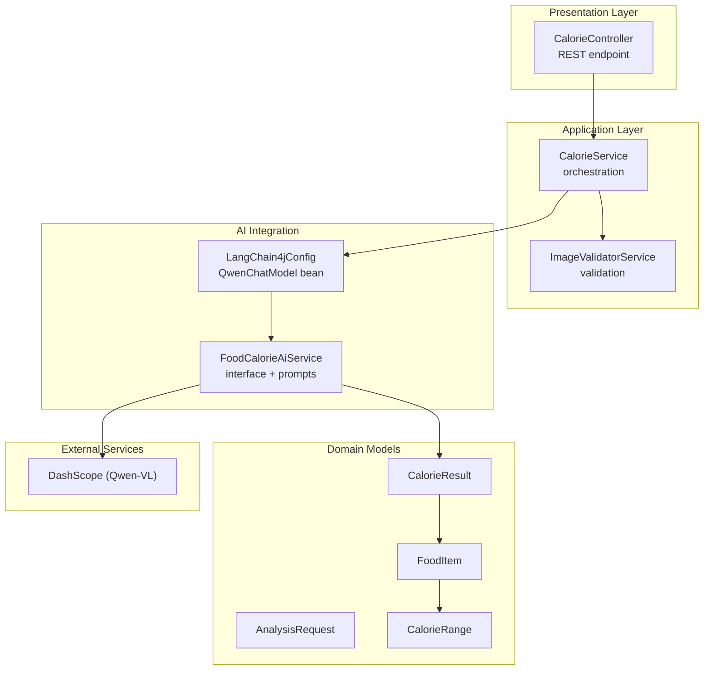
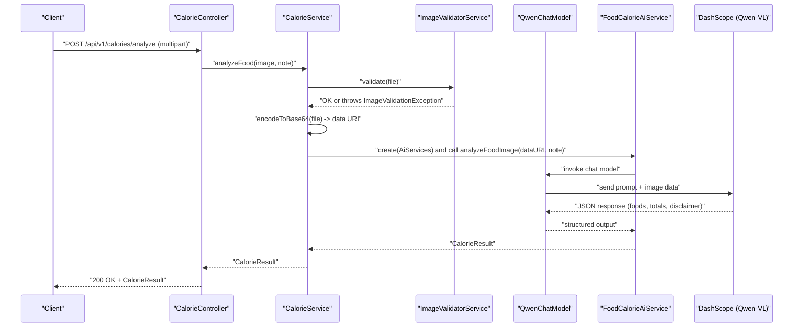
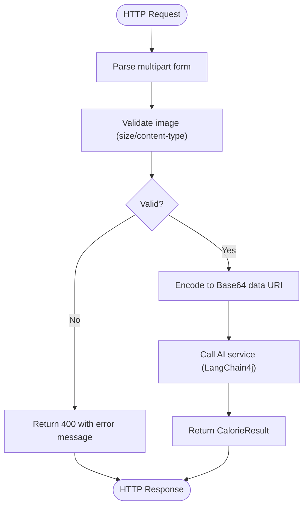
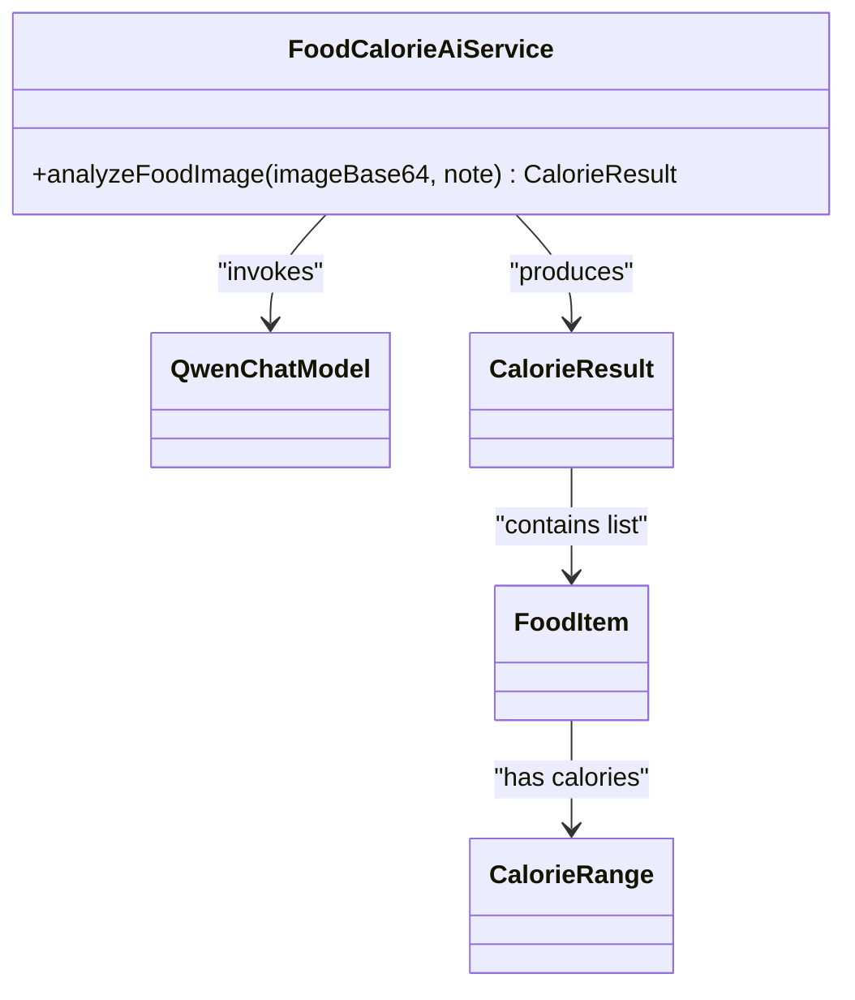
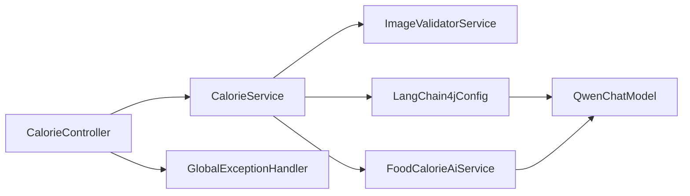

# Project Overview

<cite>
**Referenced Files in This Document**
- [HeatCalculateApplication.java](file://src/main/java/com/example/heatcalculate/HeatCalculateApplication.java)
- [CalorieController.java](file://src/main/java/com/example/heatcalculate/controller/CalorieController.java)
- [CalorieService.java](file://src/main/java/com/example/heatcalculate/service/CalorieService.java)
- [ImageValidatorService.java](file://src/main/java/com/example/heatcalculate/service/ImageValidatorService.java)
- [FoodCalorieAiService.java](file://src/main/java/com/example/heatcalculate/ai/FoodCalorieAiService.java)
- [LangChain4jConfig.java](file://src/main/java/com/example/heatcalculate/config/LangChain4jConfig.java)
- [AnalysisRequest.java](file://src/main/java/com/example/heatcalculate/model/AnalysisRequest.java)
- [FoodItem.java](file://src/main/java/com/example/heatcalculate/model/FoodItem.java)
- [CalorieRange.java](file://src/main/java/com/example/heatcalculate/model/CalorieRange.java)
- [CalorieResult.java](file://src/main/java/com/example/heatcalculate/model/CalorieResult.java)
- [GlobalExceptionHandler.java](file://src/main/java/com/example/heatcalculate/exception/GlobalExceptionHandler.java)
- [ImageValidationException.java](file://src/main/java/com/example/heatcalculate/exception/ImageValidationException.java)
- [ModelParseException.java](file://src/main/java/com/example/heatcalculate/exception/ModelParseException.java)
- [ModelServiceException.java](file://src/main/java/com/example/heatcalculate/exception/ModelServiceException.java)
- [application.yml](file://src/main/resources/application.yml)
</cite>

## Table of Contents
1. [Introduction](#introduction)
2. [Project Structure](#project-structure)
3. [Core Components](#core-components)
4. [Architecture Overview](#architecture-overview)
5. [Detailed Component Analysis](#detailed-component-analysis)
6. [Dependency Analysis](#dependency-analysis)
7. [Performance Considerations](#performance-considerations)
8. [Troubleshooting Guide](#troubleshooting-guide)
9. [Conclusion](#conclusion)

## Introduction
The Heat Calculate project is a Spring Boot RESTful service that leverages AI-powered image analysis to recognize food items from uploaded images and estimate their nutritional values in terms of calorie ranges. It provides a practical solution for users to quickly assess the approximate caloric content of meals by simply uploading a photo, with built-in image validation and robust error handling.

At a high level, the service:
- Accepts food images via a REST endpoint
- Validates image format and size constraints
- Encodes the image to a Base64 data URI
- Sends the encoded image to an AI model (Tongyi Qianwen-VL via DashScope) through LangChain4j
- Parses the AI’s structured JSON response into domain models (FoodItem, CalorieRange, CalorieResult)
- Returns a comprehensive result including per-item and total calorie estimates with low/mid/high confidence intervals

This project targets both beginner users who want a quick calorie check and experienced developers who need a clean, extensible architecture for AI image analysis integration.

## Project Structure
The project follows a layered Spring Boot structure:
- Application bootstrap and configuration
- REST controller exposing the public API
- Service layer orchestrating validation, encoding, and AI interaction
- AI integration via LangChain4j and DashScope
- Domain models representing AnalysisRequest, FoodItem, CalorieRange, and CalorieResult
- Exception handling and global error responses
- Externalized configuration for API keys and model selection



**Diagram sources**
- [CalorieController.java:22-96](file://src/main/java/com/example/heatcalculate/controller/CalorieController.java#L22-L96)
- [CalorieService.java:20-85](file://src/main/java/com/example/heatcalculate/service/CalorieService.java#L20-L85)
- [ImageValidatorService.java:14-48](file://src/main/java/com/example/heatcalculate/service/ImageValidatorService.java#L14-L48)
- [LangChain4jConfig.java:11-31](file://src/main/java/com/example/heatcalculate/config/LangChain4jConfig.java#L11-L31)
- [FoodCalorieAiService.java:12-59](file://src/main/java/com/example/heatcalculate/ai/FoodCalorieAiService.java#L12-L59)
- [AnalysisRequest.java:10-65](file://src/main/java/com/example/heatcalculate/model/AnalysisRequest.java#L10-L65)
- [FoodItem.java:9-82](file://src/main/java/com/example/heatcalculate/model/FoodItem.java#L9-L82)
- [CalorieRange.java:9-82](file://src/main/java/com/example/heatcalculate/model/CalorieRange.java#L9-L82)
- [CalorieResult.java:11-84](file://src/main/java/com/example/heatcalculate/model/CalorieResult.java#L11-L84)

**Section sources**
- [HeatCalculateApplication.java:9-15](file://src/main/java/com/example/heatcalculate/HeatCalculateApplication.java#L9-L15)
- [application.yml:1-21](file://src/main/resources/application.yml#L1-L21)

## Core Components
- REST Controller: Exposes a single endpoint to analyze food images, returning structured calorie results.
- Calorie Service: Coordinates image validation, Base64 encoding, and AI model invocation.
- Image Validator: Enforces file size and content-type constraints.
- AI Service Interface: Defines system and user messages for Qwen-VL to produce a structured JSON response.
- LangChain4j Configuration: Provides the QwenChatModel bean wired to DashScope.
- Domain Models: Represent AnalysisRequest, FoodItem, CalorieRange, and CalorieResult for type-safe data exchange.
- Global Exception Handler: Centralizes error responses for validation, model service, and parsing failures.

Practical examples:
- Upload a JPG/PNG/WEBP image under 10MB to receive a JSON response containing recognized foods, per-item calorie ranges, and total calorie range.
- Optional note field allows contextual information (e.g., “This is my lunch”).
- The service returns confidence intervals (low/mid/high) to reflect estimation uncertainty.

**Section sources**
- [CalorieController.java:35-94](file://src/main/java/com/example/heatcalculate/controller/CalorieController.java#L35-L94)
- [CalorieService.java:40-84](file://src/main/java/com/example/heatcalculate/service/CalorieService.java#L40-L84)
- [ImageValidatorService.java:31-46](file://src/main/java/com/example/heatcalculate/service/ImageValidatorService.java#L31-L46)
- [FoodCalorieAiService.java:14-57](file://src/main/java/com/example/heatcalculate/ai/FoodCalorieAiService.java#L14-L57)
- [LangChain4jConfig.java:23-29](file://src/main/java/com/example/heatcalculate/config/LangChain4jConfig.java#L23-L29)
- [AnalysisRequest.java:18-44](file://src/main/java/com/example/heatcalculate/model/AnalysisRequest.java#L18-L44)
- [FoodItem.java:23-54](file://src/main/java/com/example/heatcalculate/model/FoodItem.java#L23-L54)
- [CalorieRange.java:23-54](file://src/main/java/com/example/heatcalculate/model/CalorieRange.java#L23-L54)
- [CalorieResult.java:25-57](file://src/main/java/com/example/heatcalculate/model/CalorieResult.java#L25-L57)

## Architecture Overview
The system is a Spring MVC REST API backed by LangChain4j and DashScope’s Qwen-VL model. The flow is request-driven and structured:



**Diagram sources**
- [CalorieController.java:81-94](file://src/main/java/com/example/heatcalculate/controller/CalorieController.java#L81-L94)
- [CalorieService.java:40-69](file://src/main/java/com/example/heatcalculate/service/CalorieService.java#L40-L69)
- [ImageValidatorService.java:31-46](file://src/main/java/com/example/heatcalculate/service/ImageValidatorService.java#L31-L46)
- [FoodCalorieAiService.java:57-57](file://src/main/java/com/example/heatcalculate/ai/FoodCalorieAiService.java#L57-L57)
- [LangChain4jConfig.java:24-28](file://src/main/java/com/example/heatcalculate/config/LangChain4jConfig.java#L24-L28)

## Detailed Component Analysis

### REST Endpoint and Request Model
- Endpoint: POST /api/v1/calories/analyze
- Accepts: multipart/form-data with image and optional note
- Returns: CalorieResult with foods, totalCalories, and disclaimer
- Validation: 400 responses for invalid images; 502/500 for model/service errors



**Diagram sources**
- [CalorieController.java:42-94](file://src/main/java/com/example/heatcalculate/controller/CalorieController.java#L42-L94)
- [ImageValidatorService.java:31-46](file://src/main/java/com/example/heatcalculate/service/ImageValidatorService.java#L31-L46)
- [CalorieService.java:74-83](file://src/main/java/com/example/heatcalculate/service/CalorieService.java#L74-L83)

**Section sources**
- [CalorieController.java:42-94](file://src/main/java/com/example/heatcalculate/controller/CalorieController.java#L42-L94)
- [AnalysisRequest.java:18-44](file://src/main/java/com/example/heatcalculate/model/AnalysisRequest.java#L18-L44)

### AI Integration with Tongyi Qianwen-VL (DashScope)
- LangChain4j integration creates a typed AI service proxy
- System message defines the role, reference measurements, estimation rules, and required JSON schema
- User message includes the Base64 image data and optional note
- The model returns a structured JSON that maps to CalorieResult



**Diagram sources**
- [FoodCalorieAiService.java:12-59](file://src/main/java/com/example/heatcalculate/ai/FoodCalorieAiService.java#L12-L59)
- [LangChain4jConfig.java:23-29](file://src/main/java/com/example/heatcalculate/config/LangChain4jConfig.java#L23-L29)
- [CalorieResult.java:11-84](file://src/main/java/com/example/heatcalculate/model/CalorieResult.java#L11-L84)
- [FoodItem.java:9-82](file://src/main/java/com/example/heatcalculate/model/FoodItem.java#L9-L82)
- [CalorieRange.java:9-82](file://src/main/java/com/example/heatcalculate/model/CalorieRange.java#L9-L82)

**Section sources**
- [FoodCalorieAiService.java:14-57](file://src/main/java/com/example/heatcalculate/ai/FoodCalorieAiService.java#L14-L57)
- [LangChain4jConfig.java:24-28](file://src/main/java/com/example/heatcalculate/config/LangChain4jConfig.java#L24-L28)

### Data Models and Confidence Intervals
- CalorieRange: low/mid/high integer values representing confidence bands
- FoodItem: name, estimatedWeight, and CalorieRange
- CalorieResult: list of FoodItem, totalCalories (CalorieRange), and disclaimer
- AnalysisRequest: image and optional note for building requests programmatically

```mermaid
erDiagram
CALORIE_RESULT {
list~FOOD_ITEM foods
CALORIE_RANGE totalCalories
string disclaimer
}
FOOD_ITEM {
string name
string estimatedWeight
CALORIE_RANGE calories
}
CALORIE_RANGE {
int low
int mid
int high
}
CALORIE_RESULT ||--o{ FOOD_ITEM : "contains"
FOOD_ITEM ||--|| CALORIE_RANGE : "has"
CALORIE_RESULT ||--|| CALORIE_RANGE : "total"
```

**Diagram sources**
- [CalorieResult.java:11-84](file://src/main/java/com/example/heatcalculate/model/CalorieResult.java#L11-L84)
- [FoodItem.java:9-82](file://src/main/java/com/example/heatcalculate/model/FoodItem.java#L9-L82)
- [CalorieRange.java:9-82](file://src/main/java/com/example/heatcalculate/model/CalorieRange.java#L9-L82)

**Section sources**
- [CalorieResult.java:25-57](file://src/main/java/com/example/heatcalculate/model/CalorieResult.java#L25-L57)
- [FoodItem.java:23-54](file://src/main/java/com/example/heatcalculate/model/FoodItem.java#L23-L54)
- [CalorieRange.java:23-54](file://src/main/java/com/example/heatcalculate/model/CalorieRange.java#L23-L54)
- [AnalysisRequest.java:18-44](file://src/main/java/com/example/heatcalculate/model/AnalysisRequest.java#L18-L44)

### Technology Stack
- Spring Boot 3.2.0: Application framework and web layer
- LangChain4j 0.25.0: AI orchestration and structured output support
- DashScope integration: Tongyi Qianwen-VL (Qwen-VL Max) via QwenChatModel
- Swagger/OpenAPI annotations: Documented endpoint behavior and response schemas
- SLF4J logging: Structured logs for observability

**Section sources**
- [application.yml:11-14](file://src/main/resources/application.yml#L11-L14)
- [LangChain4jConfig.java:24-28](file://src/main/java/com/example/heatcalculate/config/LangChain4jConfig.java#L24-L28)
- [CalorieController.java:4-17](file://src/main/java/com/example/heatcalculate/controller/CalorieController.java#L4-L17)

## Dependency Analysis
The system exhibits clear layering and dependency direction:
- Controller depends on CalorieService
- CalorieService depends on ImageValidatorService and QwenChatModel
- QwenChatModel bean is configured via LangChain4jConfig
- FoodCalorieAiService defines the contract and expected JSON schema
- GlobalExceptionHandler centralizes error mapping



**Diagram sources**
- [CalorieController.java:29-33](file://src/main/java/com/example/heatcalculate/controller/CalorieController.java#L29-L33)
- [CalorieService.java:25-31](file://src/main/java/com/example/heatcalculate/service/CalorieService.java#L25-L31)
- [LangChain4jConfig.java:24-28](file://src/main/java/com/example/heatcalculate/config/LangChain4jConfig.java#L24-L28)
- [FoodCalorieAiService.java:12-12](file://src/main/java/com/example/heatcalculate/ai/FoodCalorieAiService.java#L12-L12)
- [GlobalExceptionHandler.java:14-61](file://src/main/java/com/example/heatcalculate/exception/GlobalExceptionHandler.java#L14-L61)

**Section sources**
- [CalorieController.java:29-33](file://src/main/java/com/example/heatcalculate/controller/CalorieController.java#L29-L33)
- [CalorieService.java:25-31](file://src/main/java/com/example/heatcalculate/service/CalorieService.java#L25-L31)
- [LangChain4jConfig.java:24-28](file://src/main/java/com/example/heatcalculate/config/LangChain4jConfig.java#L24-L28)
- [FoodCalorieAiService.java:12-12](file://src/main/java/com/example/heatcalculate/ai/FoodCalorieAiService.java#L12-L12)
- [GlobalExceptionHandler.java:19-61](file://src/main/java/com/example/heatcalculate/exception/GlobalExceptionHandler.java#L19-L61)

## Performance Considerations
- Image size limit: 10 MB to balance quality and latency
- Base64 encoding overhead: Keep images reasonably sized to minimize payload and processing time
- Model latency: Network-bound; consider retries and timeouts at the client layer
- Concurrency: Spring Boot handles concurrent requests; ensure adequate JVM heap and thread pool sizing
- Logging: INFO level is sufficient for production; avoid excessive debug logging

## Troubleshooting Guide
Common issues and resolutions:
- 400 Bad Request: Image validation failure (empty, unsupported type, or exceeds 10 MB)
- 502 Bad Gateway: Model service temporarily unavailable; retry after delay
- 500 Internal Server Error: Unexpected server error; check logs and configuration
- Parsing errors: Model output did not match expected JSON schema; verify model response format and API key

Operational checks:
- Verify DASHSCOPE_API_KEY is set and model name matches configuration
- Confirm multipart limits align with application.yml
- Review logs for detailed error messages during validation and AI invocation

**Section sources**
- [ImageValidationException.java:6-11](file://src/main/java/com/example/heatcalculate/exception/ImageValidationException.java#L6-L11)
- [ModelServiceException.java:6-15](file://src/main/java/com/example/heatcalculate/exception/ModelServiceException.java#L6-L15)
- [ModelParseException.java:6-15](file://src/main/java/com/example/heatcalculate/exception/ModelParseException.java#L6-L15)
- [GlobalExceptionHandler.java:19-61](file://src/main/java/com/example/heatcalculate/exception/GlobalExceptionHandler.java#L19-L61)
- [application.yml:6-9](file://src/main/resources/application.yml#L6-L9)

## Conclusion
The Heat Calculate service delivers a concise, reliable pipeline for food calorie recognition from images. By combining Spring Boot’s REST capabilities with LangChain4j and DashScope’s Qwen-VL, it provides structured, confidence-weighted results suitable for everyday use and integration. The modular design supports easy extension, testing, and maintenance.