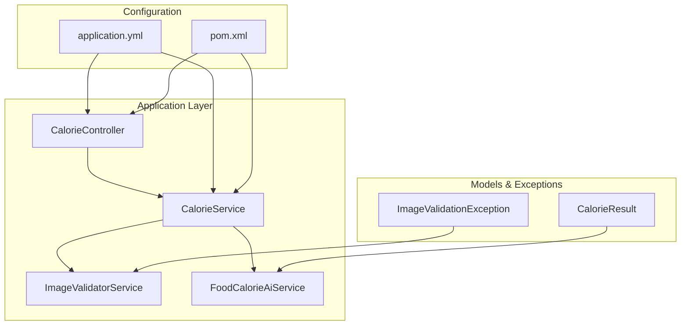
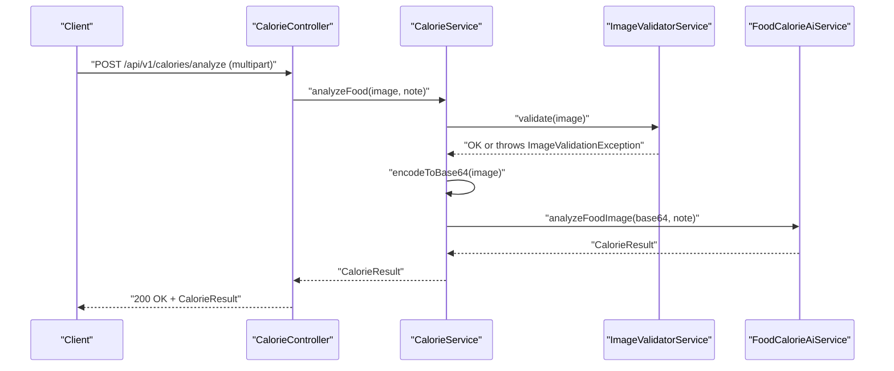
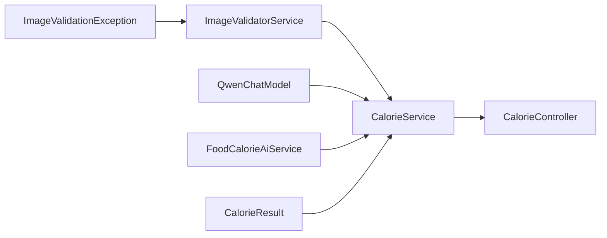

# Testing Strategy

<cite>
**Referenced Files in This Document**
- [ImageValidatorServiceTest.java](file://src/test/java/com/example/heatcalculate/service/ImageValidatorServiceTest.java)
- [ImageValidatorService.java](file://src/main/java/com/example/heatcalculate/service/ImageValidatorService.java)
- [CalorieService.java](file://src/main/java/com/example/heatcalculate/service/CalorieService.java)
- [CalorieController.java](file://src/main/java/com/example/heatcalculate/controller/CalorieController.java)
- [FoodCalorieAiService.java](file://src/main/java/com/example/heatcalculate/ai/FoodCalorieAiService.java)
- [application.yml](file://src/main/resources/application.yml)
- [pom.xml](file://pom.xml)
- [ImageValidationException.java](file://src/main/java/com/example/heatcalculate/exception/ImageValidationException.java)
- [CalorieResult.java](file://src/main/java/com/example/heatcalculate/model/CalorieResult.java)
- [HeatCalculateApplication.java](file://src/main/java/com/example/heatcalculate/HeatCalculateApplication.java)
</cite>

## Table of Contents
1. [Introduction](#introduction)
2. [Project Structure](#project-structure)
3. [Core Components](#core-components)
4. [Architecture Overview](#architecture-overview)
5. [Detailed Component Analysis](#detailed-component-analysis)
6. [Dependency Analysis](#dependency-analysis)
7. [Performance Considerations](#performance-considerations)
8. [Troubleshooting Guide](#troubleshooting-guide)
9. [Conclusion](#conclusion)
10. [Appendices](#appendices)

## Introduction
This document provides comprehensive testing documentation for the Heat Calculate service, focusing on unit testing approaches and validation logic testing. It covers the JUnit-based testing strategy using Spring Boot test annotations and mock implementations, with detailed guidance for testing the ImageValidatorServiceTest suite. The document explains test configuration, mock object setup, assertion patterns, and best practices for testing REST controllers, service layers, and integration scenarios. It also addresses test coverage requirements, mocking strategies for external dependencies like AI services, and continuous integration testing setup.

## Project Structure
The project follows a layered architecture with clear separation between controllers, services, models, exceptions, and AI integration. The testing strategy targets:
- Unit tests for service-layer validation logic
- Integration tests for controller endpoints
- Mock-based testing for external AI services
- Configuration-driven testing using application properties

**Diagram sources**
- [CalorieController.java:1-96](file://src/main/java/com/example/heatcalculate/controller/CalorieController.java#L1-L96)
- [CalorieService.java:1-85](file://src/main/java/com/example/heatcalculate/service/CalorieService.java#L1-L85)
- [ImageValidatorService.java:1-48](file://src/main/java/com/example/heatcalculate/service/ImageValidatorService.java#L1-L48)
- [FoodCalorieAiService.java:1-59](file://src/main/java/com/example/heatcalculate/ai/FoodCalorieAiService.java#L1-L59)
- [application.yml:1-21](file://src/main/resources/application.yml#L1-L21)
- [pom.xml:1-80](file://pom.xml#L1-L80)

**Section sources**
- [pom.xml:1-80](file://pom.xml#L1-L80)
- [application.yml:1-21](file://src/main/resources/application.yml#L1-L21)

## Core Components
This section focuses on the validation logic under test and the surrounding components involved in testing.

- ImageValidatorService: Validates uploaded images for content type, size, and emptiness. It defines constants for maximum file size and allowed content types.
- CalorieService: Orchestrates image validation, Base64 encoding, and AI service invocation. It depends on ImageValidatorService and QwenChatModel.
- CalorieController: Exposes the /api/v1/calories/analyze endpoint, delegates to CalorieService, and handles exceptions via global handlers.
- FoodCalorieAiService: Defines the AI service contract for food calorie recognition using LangChain4j.
- ImageValidationException: Custom runtime exception thrown during validation failures.
- CalorieResult: Data model representing the AI-generated result with foods, total calories, and disclaimer.

Key testing focus areas:
- Valid image formats: JPG, PNG, WEBP
- Size validation limits: up to 10MB
- Error scenarios: unsupported formats, oversized files, empty/null inputs, case-insensitive content types
- Boundary conditions: exactly 10MB files

**Section sources**
- [ImageValidatorService.java:1-48](file://src/main/java/com/example/heatcalculate/service/ImageValidatorService.java#L1-L48)
- [CalorieService.java:1-85](file://src/main/java/com/example/heatcalculate/service/CalorieService.java#L1-L85)
- [CalorieController.java:1-96](file://src/main/java/com/example/heatcalculate/controller/CalorieController.java#L1-L96)
- [FoodCalorieAiService.java:1-59](file://src/main/java/com/example/heatcalculate/ai/FoodCalorieAiService.java#L1-L59)
- [ImageValidationException.java:1-12](file://src/main/java/com/example/heatcalculate/exception/ImageValidationException.java#L1-L12)
- [CalorieResult.java:1-84](file://src/main/java/com/example/heatcalculate/model/CalorieResult.java#L1-L84)

## Architecture Overview
The testing architecture emphasizes layered testing:
- Unit tests for ImageValidatorServiceTest validate validation logic in isolation.
- Service-level tests can verify CalorieService orchestration and exception propagation.
- Integration tests validate controller endpoints and request/response handling.
- Mocking replaces external AI services to ensure deterministic and fast tests.

**Diagram sources**
- [CalorieController.java:81-94](file://src/main/java/com/example/heatcalculate/controller/CalorieController.java#L81-L94)
- [CalorieService.java:40-69](file://src/main/java/com/example/heatcalculate/service/CalorieService.java#L40-L69)
- [ImageValidatorService.java:31-46](file://src/main/java/com/example/heatcalculate/service/ImageValidatorService.java#L31-L46)
- [FoodCalorieAiService.java:57](file://src/main/java/com/example/heatcalculate/ai/FoodCalorieAiService.java#L57)

## Detailed Component Analysis

### ImageValidatorServiceTest: Validation Logic Coverage
The ImageValidatorServiceTest suite validates the ImageValidatorService behavior comprehensively. It uses JUnit 5 assertions and Spring’s MockMultipartFile to simulate various upload scenarios.

- Valid formats: Tests pass for JPG, PNG, and WEBP content types.
- Invalid formats: Ensures exceptions are thrown for GIF and BMP.
- Size limits: Validates failure for files larger than 10MB and success for exactly 10MB.
- Edge cases: Handles empty files, null files, and null content types.
- Case-insensitivity: Confirms content type matching is case-insensitive.

Assertion patterns used:
- Positive cases: assertDoesNotThrow to verify successful validation.
- Negative cases: assertThrows to capture ImageValidationException and assert message equality.

Mock object setup:
- Uses MockMultipartFile to construct test files with specific names, content types, and byte arrays.
- No external mocks are required for this unit test; validation logic is self-contained.

Boundary condition testing:
- Exactly 10MB boundary is validated to ensure inclusive upper limit.

Error scenario testing:
- Null content type triggers format validation failure.
- Empty/null inputs trigger “cannot be empty” validation.

Best practices demonstrated:
- Descriptive @DisplayName annotations improve readability.
- Each test isolates a single behavior for clarity.
- Byte arrays are used to precisely control file sizes without external assets.

**Section sources**
- [ImageValidatorServiceTest.java:1-207](file://src/test/java/com/example/heatcalculate/service/ImageValidatorServiceTest.java#L1-L207)

### ImageValidatorService: Implementation Patterns
The ImageValidatorService encapsulates validation logic with:
- Static constants for maximum file size and allowed content types.
- Defensive checks for null/empty inputs.
- Case-insensitive content type comparison.
- Clear exception messages for user feedback.

Complexity analysis:
- Time complexity: O(1) for validation checks.
- Space complexity: O(1) for storing allowed content types in a hash set.

Optimization opportunities:
- Content type normalization could be centralized for reuse across the application.
- Consider adding MIME type detection fallback if content type is missing.

Error handling:
- Throws ImageValidationException with precise messages for different failure modes.

**Section sources**
- [ImageValidatorService.java:1-48](file://src/main/java/com/example/heatcalculate/service/ImageValidatorService.java#L1-L48)
- [ImageValidationException.java:1-12](file://src/main/java/com/example/heatcalculate/exception/ImageValidationException.java#L1-L12)

### CalorieService: Orchestration and Exception Propagation
CalorieService coordinates:
- Image validation via ImageValidatorService
- Base64 encoding with data URI prefix
- AI service creation and invocation using LangChain4j
- Exception wrapping for IO and model errors

Processing logic:
- Validates image, encodes to Base64, creates AI service proxy, and invokes analyzeFoodImage.
- Wraps IOException as ModelServiceException and catches AI invocation exceptions to propagate ModelServiceException.

Mocking strategies:
- For unit tests, inject a mock QwenChatModel or use AiServices.create with a mock to avoid real network calls.
- For integration tests, configure a test-friendly model provider.

**Section sources**
- [CalorieService.java:1-85](file://src/main/java/com/example/heatcalculate/service/CalorieService.java#L1-L85)
- [FoodCalorieAiService.java:1-59](file://src/main/java/com/example/heatcalculate/ai/FoodCalorieAiService.java#L1-L59)

### CalorieController: REST Endpoint Testing
CalorieController exposes a multipart endpoint that:
- Accepts an image parameter and optional note
- Delegates to CalorieService for processing
- Logs request metadata
- Returns CalorieResult on success

Testing approaches:
- Unit tests: Verify controller behavior with mocked CalorieService, asserting ResponseEntity and status codes.
- Integration tests: Use @WebMvcTest or @SpringBootTest to validate end-to-end request handling, including multipart uploads and error responses.

**Section sources**
- [CalorieController.java:1-96](file://src/main/java/com/example/heatcalculate/controller/CalorieController.java#L1-L96)
- [CalorieResult.java:1-84](file://src/main/java/com/example/heatcalculate/model/CalorieResult.java#L1-L84)

### Test Configuration and Environment
Application configuration impacts testing:
- Maximum file size and request size are configured to 10MB, aligning with validation logic.
- Logging levels and patterns support test observability.
- LangChain4j configuration includes a dummy API key for testing environments.

Maven dependencies:
- spring-boot-starter-test provides JUnit 5, Mockito, and Spring Boot test starters.
- LangChain4j and DashScope dependencies enable AI service integration in tests.

**Section sources**
- [application.yml:1-21](file://src/main/resources/application.yml#L1-L21)
- [pom.xml:1-80](file://pom.xml#L1-L80)

## Dependency Analysis
The testing strategy relies on clear dependency boundaries:
- ImageValidatorService is a pure validator with no external dependencies.
- CalorieService depends on ImageValidatorService and QwenChatModel; mocking QwenChatModel enables isolated testing.
- CalorieController depends on CalorieService; mocking CalorieService enables controller tests.

**Diagram sources**
- [ImageValidatorService.java:1-48](file://src/main/java/com/example/heatcalculate/service/ImageValidatorService.java#L1-L48)
- [CalorieService.java:1-85](file://src/main/java/com/example/heatcalculate/service/CalorieService.java#L1-L85)
- [CalorieController.java:1-96](file://src/main/java/com/example/heatcalculate/controller/CalorieController.java#L1-L96)
- [FoodCalorieAiService.java:1-59](file://src/main/java/com/example/heatcalculate/ai/FoodCalorieAiService.java#L1-L59)
- [ImageValidationException.java:1-12](file://src/main/java/com/example/heatcalculate/exception/ImageValidationException.java#L1-L12)
- [CalorieResult.java:1-84](file://src/main/java/com/example/heatcalculate/model/CalorieResult.java#L1-L84)

**Section sources**
- [ImageValidatorService.java:1-48](file://src/main/java/com/example/heatcalculate/service/ImageValidatorService.java#L1-L48)
- [CalorieService.java:1-85](file://src/main/java/com/example/heatcalculate/service/CalorieService.java#L1-L85)
- [CalorieController.java:1-96](file://src/main/java/com/example/heatcalculate/controller/CalorieController.java#L1-L96)

## Performance Considerations
- Validation logic is O(1); tests should remain lightweight by avoiding large binary assets.
- Use small byte arrays to simulate file sizes and reduce test execution time.
- Prefer mocking external AI services to avoid network latency and flakiness.
- Configure logging levels appropriately to minimize overhead during tests.

## Troubleshooting Guide
Common issues and resolutions:
- Validation failures: Confirm content type normalization and boundary conditions.
- Encoding errors: Ensure Base64 encoding handles null content types gracefully.
- AI service failures: Wrap exceptions consistently and verify error propagation.
- Configuration mismatches: Align application.yml limits with validation logic.

**Section sources**
- [ImageValidatorService.java:31-46](file://src/main/java/com/example/heatcalculate/service/ImageValidatorService.java#L31-L46)
- [CalorieService.java:74-83](file://src/main/java/com/example/heatcalculate/service/CalorieService.java#L74-L83)
- [application.yml:6-9](file://src/main/resources/application.yml#L6-L9)

## Conclusion
The testing strategy for the Heat Calculate service emphasizes robust unit tests for validation logic, clear separation of concerns, and pragmatic mocking of external dependencies. By validating edge cases and boundary conditions, and by leveraging Spring Boot test annotations and configuration, the suite ensures reliable behavior across the service layer and controller endpoints. Extending the strategy to integration tests and CI pipelines will further strengthen quality assurance.

## Appendices

### Testing Best Practices
- Write focused unit tests with descriptive names and minimal setup.
- Use MockMultipartFile for multipart scenarios and precise byte arrays for size control.
- Mock external services to isolate logic and ensure determinism.
- Assert both success and failure paths, including edge cases and error messages.
- Keep test data small and deterministic; avoid relying on external resources.

### Test Coverage Requirements
- Aim for high coverage of validation logic and service orchestration.
- Include boundary tests around 10MB limits and content type normalization.
- Validate error propagation and exception handling paths.

### Continuous Integration Setup
- Integrate Maven Surefire/Failsafe plugins for test execution.
- Configure environment variables for AI service keys in CI runners.
- Use containerized environments to replicate production configuration.

### Example Test Scenarios
- Valid image formats: JPG, PNG, WEBP
- Invalid formats: GIF, BMP
- Size validation: below 10MB, exactly 10MB, above 10MB
- Edge cases: empty file, null file, null content type
- Case-insensitive content types

[No sources needed since this section provides general guidance]