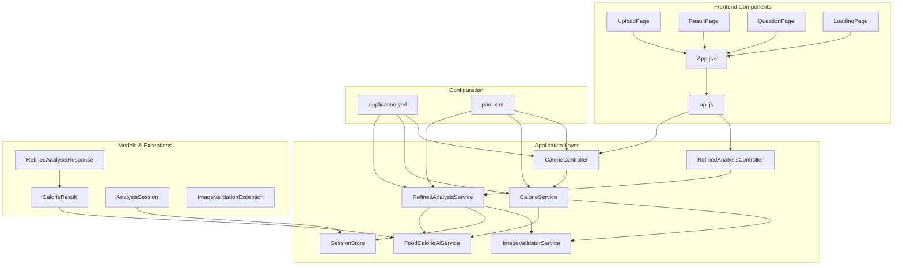
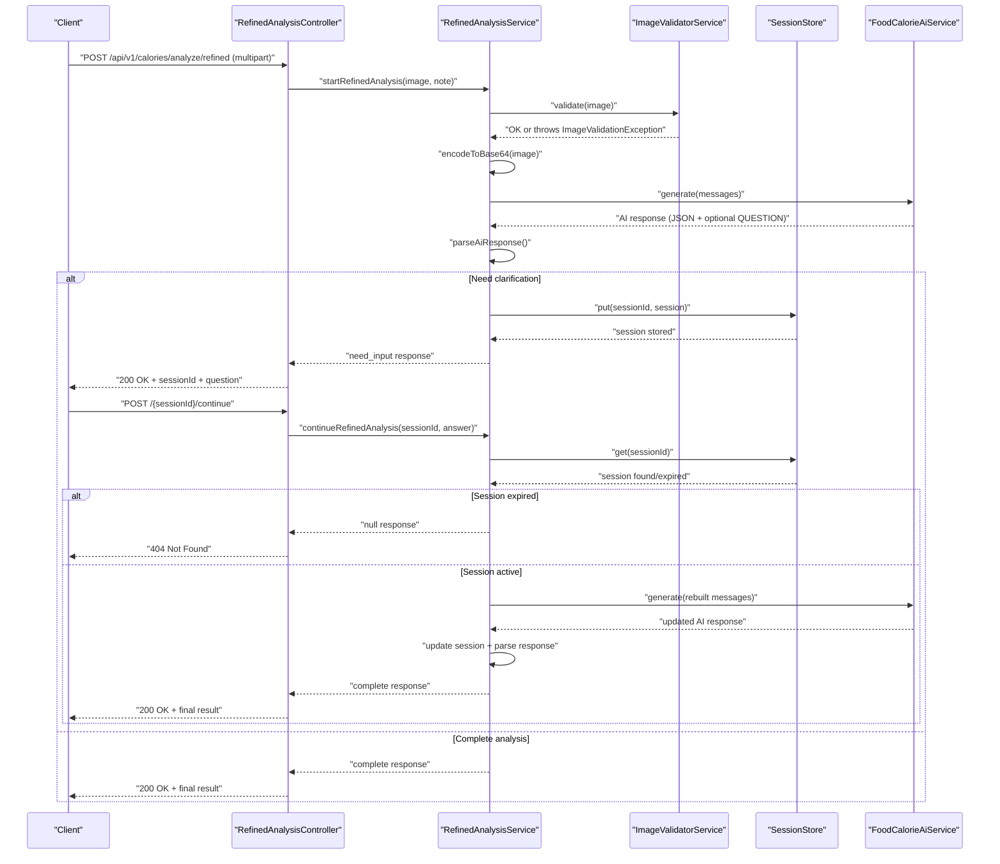
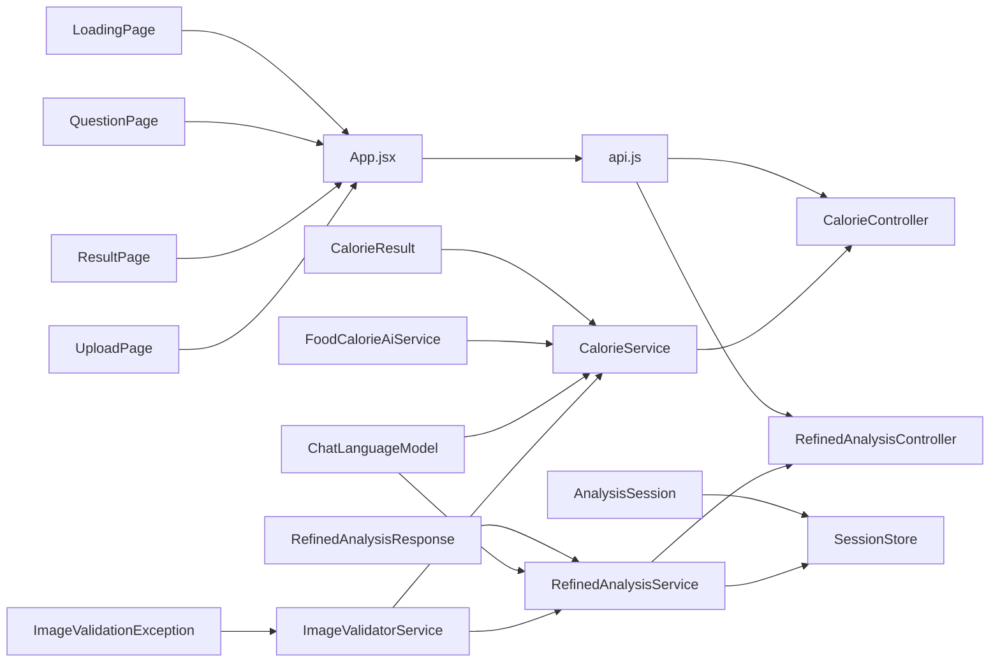

# Testing Strategy

<cite>
**Referenced Files in This Document**
- [ImageValidatorServiceTest.java](file://src/test/java/com/example/heatcalculate/service/ImageValidatorServiceTest.java)
- [ImageValidatorService.java](file://src/main/java/com/example/heatcalculate/service/ImageValidatorService.java)
- [CalorieService.java](file://src/main/java/com/example/heatcalculate/service/CalorieService.java)
- [CalorieServiceTest.java](file://src/test/java/com/example/heatcalculate/service/CalorieServiceTest.java)
- [CalorieController.java](file://src/main/java/com/example/heatcalculate/controller/CalorieController.java)
- [RefinedAnalysisService.java](file://src/main/java/com/example/heatcalculate/service/RefinedAnalysisService.java)
- [RefinedAnalysisServiceTest.java](file://src/test/java/com/example/heatcalculate/service/RefinedAnalysisServiceTest.java)
- [RefinedAnalysisController.java](file://src/main/java/com/example/heatcalculate/controller/RefinedAnalysisController.java)
- [SessionStore.java](file://src/main/java/com/example/heatcalculate/service/SessionStore.java)
- [SessionStoreTest.java](file://src/test/java/com/example/heatcalculate/service/SessionStoreTest.java)
- [AnalysisSession.java](file://src/main/java/com/example/heatcalculate/model/AnalysisSession.java)
- [RefinedAnalysisResponse.java](file://src/main/java/com/example/heatcalculate/model/RefinedAnalysisResponse.java)
- [SessionStatus.java](file://src/main/java/com/example/heatcalculate/model/SessionStatus.java)
- [FoodCalorieAiService.java](file://src/main/java/com/example/heatcalculate/ai/FoodCalorieAiService.java)
- [application.yml](file://src/main/resources/application.yml)
- [pom.xml](file://pom.xml)
- [ImageValidationException.java](file://src/main/java/com/example/heatcalculate/exception/ImageValidationException.java)
- [CalorieResult.java](file://src/main/java/com/example/heatcalculate/model/CalorieResult.java)
- [HeatCalculateApplication.java](file://src/main/java/com/example/heatcalculate/HeatCalculateApplication.java)
- [App.jsx](file://frontend/src/App.jsx)
- [api.js](file://frontend/src/api.js)
- [UploadPage/index.jsx](file://frontend/src/components/UploadPage/index.jsx)
- [ResultPage/index.jsx](file://frontend/src/components/ResultPage/index.jsx)
- [QuestionPage/index.jsx](file://frontend/src/components/QuestionPage/index.jsx)
- [LoadingPage/index.jsx](file://frontend/src/components/LoadingPage/index.jsx)
</cite>

## Update Summary
**Changes Made**
- Added comprehensive test coverage documentation for SessionStoreTest, CalorieServiceTest, and RefinedAnalysisServiceTest
- Enhanced testing strategy to cover multi-turn conversation flows and session management scenarios
- Updated architecture overview to reflect refined analysis service testing
- Expanded detailed component analysis with new service layer testing patterns
- Added performance considerations for refined analysis service testing
- Enhanced troubleshooting guide with refined analysis specific issues

## Table of Contents
1. [Introduction](#introduction)
2. [Project Structure](#project-structure)
3. [Core Components](#core-components)
4. [Architecture Overview](#architecture-overview)
5. [Detailed Component Analysis](#detailed-component-analysis)
6. [Dependency Analysis](#dependency-analysis)
7. [Performance Considerations](#performance-considerations)
8. [Troubleshooting Guide](#troubleshooting-guide)
9. [Conclusion](#conclusion)
10. [Appendices](#appendices)

## Introduction
This document provides comprehensive testing documentation for the Heat Calculate service, focusing on unit testing approaches and validation logic testing. It covers the JUnit-based testing strategy using Spring Boot test annotations and mock implementations, with detailed guidance for testing the ImageValidatorServiceTest suite, CalorieServiceTest, SessionStoreTest, and the newly added refined analysis service testing. The document explains test configuration, mock object setup, assertion patterns, and best practices for testing REST controllers, service layers, and integration scenarios. It also addresses test coverage requirements, mocking strategies for external dependencies like AI services, and continuous integration testing setup.

**Updated** Added comprehensive test coverage for refined analysis service, session management, CalorieService testing, and enhanced testing strategy for multi-turn conversation flows and session management scenarios.

## Project Structure
The project follows a layered architecture with clear separation between controllers, services, models, exceptions, and AI integration. The testing strategy targets:
- Unit tests for service-layer validation logic
- Integration tests for controller endpoints
- Mock-based testing for external AI services
- Configuration-driven testing using application properties
- Multi-round conversation testing for refined analysis
- Session management testing with expiration handling
- Frontend component testing for user interface validation
- Comprehensive service layer testing for CalorieService and RefinedAnalysisService



**Diagram sources**
- [CalorieController.java:1-96](file://src/main/java/com/example/heatcalculate/controller/CalorieController.java#L1-L96)
- [RefinedAnalysisController.java:1-72](file://src/main/java/com/example/heatcalculate/controller/RefinedAnalysisController.java#L1-L72)
- [CalorieService.java:1-145](file://src/main/java/com/example/heatcalculate/service/CalorieService.java#L1-L145)
- [RefinedAnalysisService.java:1-322](file://src/main/java/com/example/heatcalculate/service/RefinedAnalysisService.java#L1-L322)
- [ImageValidatorService.java:1-48](file://src/main/java/com/example/heatcalculate/service/ImageValidatorService.java#L1-L48)
- [SessionStore.java:1-61](file://src/main/java/com/example/heatcalculate/service/SessionStore.java#L1-L61)
- [FoodCalorieAiService.java:1-59](file://src/main/java/com/example/heatcalculate/ai/FoodCalorieAiService.java#L1-L59)
- [RefinedAnalysisResponse.java:1-77](file://src/main/java/com/example/heatcalculate/model/RefinedAnalysisResponse.java#L1-L77)
- [AnalysisSession.java:1-97](file://src/main/java/com/example/heatcalculate/model/AnalysisSession.java#L1-L97)
- [App.jsx:1-76](file://frontend/src/App.jsx#L1-L76)
- [UploadPage/index.jsx:1-233](file://frontend/src/components/UploadPage/index.jsx#L1-L233)
- [ResultPage/index.jsx:1-135](file://frontend/src/components/ResultPage/index.jsx#L1-L135)
- [QuestionPage/index.jsx:1-79](file://frontend/src/components/QuestionPage/index.jsx#L1-L79)
- [LoadingPage/index.jsx:1-23](file://frontend/src/components/LoadingPage/index.jsx#L1-L23)
- [api.js:1-153](file://frontend/src/api.js#L1-L153)

**Section sources**
- [pom.xml:1-80](file://pom.xml#L1-L80)
- [application.yml:1-21](file://src/main/resources/application.yml#L1-L21)

## Core Components
This section focuses on the validation logic under test and the surrounding components involved in testing.

- ImageValidatorService: Validates uploaded images for content type, size, and emptiness. It defines constants for maximum file size and allowed content types.
- CalorieService: Orchestrates image validation, Base64 encoding, and AI service invocation. It depends on ImageValidatorService and ChatLanguageModel. Features LangChain4j ImageContent for proper image transmission.
- RefinedAnalysisService: Manages multi-round conversation analysis with session management, question asking logic, and response parsing. It supports up to 5 rounds of questioning with calorie threshold checking.
- SessionStore: Thread-safe session storage with automatic expiration handling (3-minute TTL).
- AnalysisSession: Stores conversation state including chat history, current question, round count, and timestamps.
- RefinedAnalysisResponse: DTO for multi-round analysis responses with status tracking (need_input/complete).
- CalorieController: Exposes the /api/v1/calories/analyze endpoint, delegates to CalorieService, and handles exceptions via global handlers.
- RefinedAnalysisController: Exposes /api/v1/calories/analyze/refined endpoints for multi-round analysis with session ID management.
- FoodCalorieAiService: Defines the AI service contract for food calorie recognition using LangChain4j.
- ImageValidationException: Custom runtime exception thrown during validation failures.
- CalorieResult: Data model representing the AI-generated result with foods, total calories, and disclaimer.

Key testing focus areas:
- Valid image formats: JPG, PNG, WEBP
- Size validation limits: up to 10MB
- Error scenarios: unsupported formats, oversized files, empty/null inputs, case-insensitive content types
- Boundary conditions: exactly 10MB files
- Multi-round conversation testing: session management, question asking logic, response parsing
- Session expiration: 3-minute TTL handling, cleanup logic
- CalorieService testing: LangChain4j ImageContent usage, response parsing, exception handling
- Frontend integration: upload validation, image compression, multi-round UI flows

**Section sources**
- [ImageValidatorService.java:1-48](file://src/main/java/com/example/heatcalculate/service/ImageValidatorService.java#L1-L48)
- [CalorieService.java:1-145](file://src/main/java/com/example/heatcalculate/service/CalorieService.java#L1-L145)
- [RefinedAnalysisService.java:1-322](file://src/main/java/com/example/heatcalculate/service/RefinedAnalysisService.java#L1-L322)
- [SessionStore.java:1-61](file://src/main/java/com/example/heatcalculate/service/SessionStore.java#L1-L61)
- [AnalysisSession.java:1-97](file://src/main/java/com/example/heatcalculate/model/AnalysisSession.java#L1-L97)
- [RefinedAnalysisResponse.java:1-77](file://src/main/java/com/example/heatcalculate/model/RefinedAnalysisResponse.java#L1-L77)
- [CalorieController.java:1-96](file://src/main/java/com/example/heatcalculate/controller/CalorieController.java#L1-L96)
- [RefinedAnalysisController.java:1-72](file://src/main/java/com/example/heatcalculate/controller/RefinedAnalysisController.java#L1-L72)
- [FoodCalorieAiService.java:1-59](file://src/main/java/com/example/heatcalculate/ai/FoodCalorieAiService.java#L1-L59)
- [ImageValidationException.java:1-12](file://src/main/java/com/example/heatcalculate/exception/ImageValidationException.java#L1-L12)
- [CalorieResult.java:1-84](file://src/main/java/com/example/heatcalculate/model/CalorieResult.java#L1-L84)

## Architecture Overview
The testing architecture emphasizes layered testing with enhanced coverage for the refined analysis feature and comprehensive service layer testing:
- Unit tests for ImageValidatorServiceTest validate validation logic in isolation.
- Service-level tests for CalorieServiceTest cover LangChain4j integration, response parsing, and exception handling.
- Service-level tests for RefinedAnalysisServiceTest cover multi-round conversation logic, session management, and response parsing.
- SessionStoreTest validates thread-safe session operations and expiration handling.
- Integration tests validate controller endpoints and request/response handling.
- Frontend component testing validates user interface behavior and API integration.
- Mocking replaces external AI services to ensure deterministic and fast tests.



**Diagram sources**
- [RefinedAnalysisController.java:36-70](file://src/main/java/com/example/heatcalculate/controller/RefinedAnalysisController.java#L36-L70)
- [RefinedAnalysisService.java:88-218](file://src/main/java/com/example/heatcalculate/service/RefinedAnalysisService.java#L88-L218)
- [ImageValidatorService.java:31-46](file://src/main/java/com/example/heatcalculate/service/ImageValidatorService.java#L31-L46)
- [SessionStore.java:24-44](file://src/main/java/com/example/heatcalculate/service/SessionStore.java#L24-L44)
- [FoodCalorieAiService.java:57](file://src/main/java/com/example/heatcalculate/ai/FoodCalorieAiService.java#L57)

## Detailed Component Analysis

### ImageValidatorServiceTest: Validation Logic Coverage
The ImageValidatorServiceTest suite validates the ImageValidatorService behavior comprehensively. It uses JUnit 5 assertions and Spring's MockMultipartFile to simulate various upload scenarios.

- Valid formats: Tests pass for JPG, PNG, and WEBP content types.
- Invalid formats: Ensures exceptions are thrown for GIF and BMP.
- Size limits: Validates failure for files larger than 10MB and success for exactly 10MB.
- Edge cases: Handles empty files, null files, and null content types.
- Case-insensitivity: Confirms content type matching is case-insensitive.

Assertion patterns used:
- Positive cases: assertDoesNotThrow to verify successful validation.
- Negative cases: assertThrows to capture ImageValidationException and assert message equality.

Mock object setup:
- Uses MockMultipartFile to construct test files with specific names, content types, and byte arrays.
- No external mocks are required for this unit test; validation logic is self-contained.

Boundary condition testing:
- Exactly 10MB boundary is validated to ensure inclusive upper limit.

Error scenario testing:
- Null content type triggers format validation failure.
- Empty/null inputs trigger "cannot be empty" validation.

Best practices demonstrated:
- Descriptive @DisplayName annotations improve readability.
- Each test isolates a single behavior for clarity.
- Byte arrays are used to precisely control file sizes without external assets.

**Section sources**
- [ImageValidatorServiceTest.java:1-207](file://src/test/java/com/example/heatcalculate/service/ImageValidatorServiceTest.java#L1-L207)

### CalorieServiceTest: Comprehensive Service Layer Testing
The CalorieServiceTest suite validates the CalorieService behavior with comprehensive testing covering both unit and integration scenarios. It demonstrates advanced testing patterns for LangChain4j integration.

**Unit Tests (parseResponse):**
- JSON parsing: Validates successful parsing of valid JSON responses
- Markdown code blocks: Tests stripping of ```json and plain ``` markers
- Fallback handling: Ensures graceful degradation for invalid JSON
- Response structure: Verifies food items, calorie ranges, and disclaimer handling

**Integration Tests (analyzeFood):**
- Happy path testing: Validates complete workflow from image upload to result parsing
- Note handling: Confirms user notes are included in AI messages
- ImageContent validation: Ensures proper LangChain4j ImageContent usage over Base64 text
- Exception handling: Tests wrapping of AI service exceptions as ModelServiceException
- Validation integration: Confirms ImageValidatorService integration and proper exception propagation

Mock object setup:
- Uses ChatLanguageModel mock for deterministic AI responses
- Leverages ArgumentCaptor for detailed message inspection
- Uses real ImageValidatorService for input validation

Advanced assertion patterns:
- Response verification: assertEquals for result structure and values
- Message inspection: Stream-based content filtering for ImageContent and TextContent validation
- Exception testing: assertThrows with specific exception type and message validation
- Interaction verification: verify() and verifyNoInteractions() for proper mock usage

**Updated** Comprehensive service layer testing for CalorieService with advanced LangChain4j integration patterns and detailed response parsing validation.

**Section sources**
- [CalorieServiceTest.java:1-201](file://src/test/java/com/example/heatcalculate/service/CalorieServiceTest.java#L1-L201)

### SessionStoreTest: Session Management Testing
The SessionStoreTest validates the thread-safe session storage and expiration handling logic.

Key test scenarios:
- Basic CRUD operations: put/get/remove methods work correctly.
- Non-existent session retrieval: Returns Optional.empty() for invalid IDs.
- Expiration handling: Session expires after 3 minutes (180 seconds), removed from store.
- Active session preservation: Sessions created within 3 minutes remain accessible.
- Concurrent access: Validates thread safety of ConcurrentHashMap operations.

Expiration logic:
- Session.isExpired() compares createdAt + 180 seconds with current time.
- Lazy cleanup removes expired sessions on get() operation.
- size() method provides monitoring capability.

**Updated** Added dedicated session store testing for expiration and thread-safety validation.

**Section sources**
- [SessionStoreTest.java:1-63](file://src/test/java/com/example/heatcalculate/service/SessionStoreTest.java#L1-L63)

### RefinedAnalysisServiceTest: Multi-Round Conversation Testing
The RefinedAnalysisServiceTest suite validates the sophisticated multi-round conversation logic of the refined analysis service. It covers session management, question asking logic, and response parsing.

Key test scenarios:
- Calorie threshold checking: Tests shouldAskClarification method with wide (400kcal range) and narrow (80kcal range) calorie intervals.
- Complete analysis without questions: Validates successful completion when AI returns narrow calorie range.
- Analysis needing clarification: Tests session creation, question extraction, and partial result handling.
- Maximum round enforcement: Validates completion after 5 rounds regardless of remaining uncertainty.
- Session expiration handling: Tests null response for non-existent sessions.
- Response parsing: Validates JSON parsing with optional QUESTION line handling.

Mock object setup:
- Uses ChatLanguageModel mock for deterministic AI responses.
- Uses real SessionStore for concurrent access testing.
- Uses ImageValidatorService for input validation.

Assertion patterns:
- Status verification: assertEquals for "need_input" vs "complete" status.
- Session validation: assertNotNull for sessionId, question, and partialResult.
- Round counting: Verifies roundCount progression and MAX_ROUNDS enforcement.
- Expiration handling: assertNull for expired session responses.

**Updated** Comprehensive test coverage for multi-round conversation logic, session management, and response parsing.

**Section sources**
- [RefinedAnalysisServiceTest.java:1-125](file://src/test/java/com/example/heatcalculate/service/RefinedAnalysisServiceTest.java#L1-L125)

### ImageValidatorService: Implementation Patterns
The ImageValidatorService encapsulates validation logic with:
- Static constants for maximum file size and allowed content types.
- Defensive checks for null/empty inputs.
- Case-insensitive content type comparison.
- Clear exception messages for user feedback.

Complexity analysis:
- Time complexity: O(1) for validation checks.
- Space complexity: O(1) for storing allowed content types in a hash set.

Optimization opportunities:
- Content type normalization could be centralized for reuse across the application.
- Consider adding MIME type detection fallback if content type is missing.

Error handling:
- Throws ImageValidationException with precise messages for different failure modes.

**Section sources**
- [ImageValidatorService.java:1-48](file://src/main/java/com/example/heatcalculate/service/ImageValidatorService.java#L1-L48)
- [ImageValidationException.java:1-12](file://src/main/java/com/example/heatcalculate/exception/ImageValidationException.java#L1-L12)

### CalorieService: Orchestration and Exception Propagation
CalorieService coordinates:
- Image validation via ImageValidatorService
- Base64 encoding with data URI prefix
- AI service creation and invocation using LangChain4j
- Exception wrapping for IO and model errors

Processing logic:
- Validates image, encodes to Base64, creates AI service proxy, and invokes analyzeFoodImage.
- Wraps IOException as ModelServiceException and catches AI invocation exceptions to propagate ModelServiceException.
- Uses LangChain4j ImageContent for proper image transmission instead of Base64 text embedding.

Mocking strategies:
- For unit tests, inject a mock ChatLanguageModel or use AiServices.create with a mock to avoid real network calls.
- For integration tests, configure a test-friendly model provider.

**Updated** Enhanced service with comprehensive LangChain4j integration testing and proper image content handling.

**Section sources**
- [CalorieService.java:1-145](file://src/main/java/com/example/heatcalculate/service/CalorieService.java#L1-L145)
- [FoodCalorieAiService.java:1-59](file://src/main/java/com/example/heatcalculate/ai/FoodCalorieAiService.java#L1-L59)

### RefinedAnalysisService: Multi-Round Conversation Logic
The RefinedAnalysisService implements sophisticated multi-round conversation analysis with the following key features:

**Core Logic:**
- System prompt with detailed food identification guidelines and JSON response format
- Calorie threshold checking (200kcal wide range triggers questioning)
- Maximum round limit (5 rounds) enforcement
- Session-based conversation state management
- Response parsing with markdown code block handling

**Conversation Flow:**
1. Start analysis: Validate image → encode to Base64 → send to AI → parse response
2. Decision point: Check if calorie range > 200kcal
3. If yes: Create session, store chat history, return need_input
4. If no: Return complete result immediately
5. Continue analysis: Rebuild messages with user answer → call AI → update session

**Session Management:**
- UUID-based session IDs
- Chat history preservation for multi-round conversations
- Automatic cleanup on completion or failure
- 3-minute expiration handling

**Response Parsing:**
- Extract JSON portion from AI response
- Handle optional QUESTION line after JSON
- Fallback to safe default when parsing fails
- Support for markdown code block delimiters

**Updated** Enhanced service with comprehensive multi-round conversation capabilities, session management, and sophisticated response parsing logic.

**Section sources**
- [RefinedAnalysisService.java:1-322](file://src/main/java/com/example/heatcalculate/service/RefinedAnalysisService.java#L1-L322)
- [AnalysisSession.java:1-97](file://src/main/java/com/example/heatcalculate/model/AnalysisSession.java#L1-L97)
- [RefinedAnalysisResponse.java:1-77](file://src/main/java/com/example/heatcalculate/model/RefinedAnalysisResponse.java#L1-L77)

### SessionStore: Thread-Safe Session Management
The SessionStore provides thread-safe session storage with automatic expiration handling:

**Core Operations:**
- put(): Store session with debug logging
- get(): Retrieve session with lazy expiration cleanup
- remove(): Explicit session removal
- size(): Monitor active session count

**Expiration Logic:**
- 3-minute TTL (180 seconds) from creation time
- Lazy cleanup on get() operations
- Automatic removal of expired sessions
- Thread-safe operations using ConcurrentHashMap

**Monitoring:**
- Debug logging for session operations
- Size tracking for health monitoring
- Proper resource cleanup on expiration

**Updated** Added dedicated session store component with comprehensive expiration and thread-safety testing.

**Section sources**
- [SessionStore.java:1-61](file://src/main/java/com/example/heatcalculate/service/SessionStore.java#L1-L61)
- [AnalysisSession.java:90-96](file://src/main/java/com/example/heatcalculate/model/AnalysisSession.java#L90-L96)

### CalorieController: REST Endpoint Testing
CalorieController exposes a multipart endpoint that:
- Accepts an image parameter and optional note
- Delegates to CalorieService for processing
- Logs request metadata
- Returns CalorieResult on success

Testing approaches:
- Unit tests: Verify controller behavior with mocked CalorieService, asserting ResponseEntity and status codes.
- Integration tests: Use @WebMvcTest or @SpringBootTest to validate end-to-end request handling, including multipart uploads and error responses.

**Section sources**
- [CalorieController.java:1-96](file://src/main/java/com/example/heatcalculate/controller/CalorieController.java#L1-L96)
- [CalorieResult.java:1-84](file://src/main/java/com/example/heatcalculate/model/CalorieResult.java#L1-L84)

### RefinedAnalysisController: Multi-Round REST Endpoint Testing
RefinedAnalysisController exposes two key endpoints for multi-round analysis:

**Endpoints:**
- POST `/api/v1/calories/analyze/refined`: Start refined analysis with image upload
- POST `/api/v1/calories/analyze/refined/{sessionId}/continue`: Continue analysis with user answer

**Request Handling:**
- Multipart form data for image upload with optional note parameter
- JSON body for continuation with answer field
- Session ID validation and error handling
- Proper HTTP status codes (200 OK, 404 Not Found, 400 Bad Request)

**Business Logic:**
- Delegates to RefinedAnalysisService for processing
- Handles SessionExpiredException for expired sessions
- Returns RefinedAnalysisResponse objects with appropriate status

**Testing Approaches:**
- Unit tests: Mock RefinedAnalysisService, verify ResponseEntity and status codes
- Integration tests: Validate end-to-end multipart upload and response handling
- Session validation: Test 404 responses for expired/non-existent sessions

**Updated** New controller for multi-round conversation analysis with comprehensive session management.

**Section sources**
- [RefinedAnalysisController.java:1-72](file://src/main/java/com/example/heatcalculate/controller/RefinedAnalysisController.java#L1-L72)
- [RefinedAnalysisResponse.java:1-77](file://src/main/java/com/example/heatcalculate/model/RefinedAnalysisResponse.java#L1-L77)

### Frontend Component Testing: User Interface Validation
The frontend components provide comprehensive user interface testing coverage:

**UploadPage Component:**
- File validation: Tests MIME type and extension validation
- Size limits: Validates 10MB maximum file size
- Image compression: Tests compression for files > 2MB
- Drag-and-drop: Validates drag-and-drop functionality
- Mode selection: Tests rough vs refined analysis modes
- Preview generation: Validates image preview functionality

**ResultPage Component:**
- Food item rendering: Tests food list display with icons
- Calorie visualization: Validates calorie range bar rendering
- Empty state handling: Tests no-food recognition scenario
- Disclaimer display: Validates disclaimer text rendering

**QuestionPage Component:**
- Answer validation: Tests required answer field
- Enter key handling: Validates keyboard navigation
- Partial result display: Tests current estimate display
- State management: Validates answer input handling

**App Component:**
- State management: Tests upload/loading/result state transitions
- Error handling: Validates error state restoration
- API integration: Tests analyzeFood function integration

**api.js Functions:**
- Timeout handling: Tests 30-second request timeout
- Error mapping: Validates HTTP status to user-friendly error messages
- Health check: Tests backend service availability
- Multi-round API: Validates refined analysis API integration

**Updated** Added comprehensive frontend component testing for user interface validation and API integration.

**Section sources**
- [UploadPage/index.jsx:1-233](file://frontend/src/components/UploadPage/index.jsx#L1-L233)
- [ResultPage/index.jsx:1-135](file://frontend/src/components/ResultPage/index.jsx#L1-L135)
- [QuestionPage/index.jsx:1-79](file://frontend/src/components/QuestionPage/index.jsx#L1-L79)
- [App.jsx:1-76](file://frontend/src/App.jsx#L1-L76)
- [api.js:1-153](file://frontend/src/api.js#L1-L153)

### Test Configuration and Environment
Application configuration impacts testing:
- Maximum file size and request size are configured to 10MB, aligning with validation logic.
- Logging levels and patterns support test observability.
- LangChain4j configuration includes a dummy API key for testing environments.
- Session expiration configured for 3-minute TTL in SessionStore.

Maven dependencies:
- spring-boot-starter-test provides JUnit 5, Mockito, and Spring Boot test starters.
- LangChain4j and DashScope dependencies enable AI service integration in tests.
- Frontend testing dependencies for React component testing.

**Updated** Enhanced configuration for refined analysis service and frontend component testing.

**Section sources**
- [application.yml:1-21](file://src/main/resources/application.yml#L1-L21)
- [pom.xml:1-80](file://pom.xml#L1-L80)

## Dependency Analysis
The testing strategy relies on clear dependency boundaries with enhanced coverage for refined analysis and comprehensive service layer testing:
- ImageValidatorService is a pure validator with no external dependencies.
- CalorieService depends on ImageValidatorService and ChatLanguageModel; mocking ChatLanguageModel enables isolated testing.
- RefinedAnalysisService depends on ImageValidatorService, ChatLanguageModel, and SessionStore; requires comprehensive mocking strategy.
- SessionStore provides thread-safe session management with expiration handling.
- RefinedAnalysisController depends on RefinedAnalysisService; requires session validation testing.
- CalorieController depends on CalorieService; mocking CalorieService enables controller tests.
- Frontend components depend on api.js functions and React testing utilities.



**Diagram sources**
- [ImageValidatorService.java:1-48](file://src/main/java/com/example/heatcalculate/service/ImageValidatorService.java#L1-L48)
- [CalorieService.java:1-145](file://src/main/java/com/example/heatcalculate/service/CalorieService.java#L1-L145)
- [RefinedAnalysisService.java:1-322](file://src/main/java/com/example/heatcalculate/service/RefinedAnalysisService.java#L1-L322)
- [SessionStore.java:1-61](file://src/main/java/com/example/heatcalculate/service/SessionStore.java#L1-L61)
- [RefinedAnalysisController.java:1-72](file://src/main/java/com/example/heatcalculate/controller/RefinedAnalysisController.java#L1-L72)
- [CalorieController.java:1-96](file://src/main/java/com/example/heatcalculate/controller/CalorieController.java#L1-L96)
- [FoodCalorieAiService.java:1-59](file://src/main/java/com/example/heatcalculate/ai/FoodCalorieAiService.java#L1-L59)
- [ImageValidationException.java:1-12](file://src/main/java/com/example/heatcalculate/exception/ImageValidationException.java#L1-L12)
- [CalorieResult.java:1-84](file://src/main/java/com/example/heatcalculate/model/CalorieResult.java#L1-L84)
- [RefinedAnalysisResponse.java:1-77](file://src/main/java/com/example/heatcalculate/model/RefinedAnalysisResponse.java#L1-L77)
- [AnalysisSession.java:1-97](file://src/main/java/com/example/heatcalculate/model/AnalysisSession.java#L1-L97)
- [App.jsx:1-76](file://frontend/src/App.jsx#L1-L76)
- [api.js:1-153](file://frontend/src/api.js#L1-L153)

**Section sources**
- [ImageValidatorService.java:1-48](file://src/main/java/com/example/heatcalculate/service/ImageValidatorService.java#L1-L48)
- [CalorieService.java:1-145](file://src/main/java/com/example/heatcalculate/service/CalorieService.java#L1-L145)
- [RefinedAnalysisService.java:1-322](file://src/main/java/com/example/heatcalculate/service/RefinedAnalysisService.java#L1-L322)
- [SessionStore.java:1-61](file://src/main/java/com/example/heatcalculate/service/SessionStore.java#L1-L61)
- [RefinedAnalysisController.java:1-72](file://src/main/java/com/example/heatcalculate/controller/RefinedAnalysisController.java#L1-L72)
- [CalorieController.java:1-96](file://src/main/java/com/example/heatcalculate/controller/CalorieController.java#L1-L96)

## Performance Considerations
- Validation logic is O(1); tests should remain lightweight by avoiding large binary assets.
- Use small byte arrays to simulate file sizes and reduce test execution time.
- Prefer mocking external AI services to avoid network latency and flakiness.
- Configure logging levels appropriately to minimize overhead during tests.
- SessionStore uses ConcurrentHashMap for efficient concurrent access.
- Frontend components use client-side image compression to reduce upload sizes.
- Multi-round conversation testing should use minimal AI response data to maintain test speed.
- CalorieService testing benefits from deterministic AI responses to ensure consistent test execution.
- RefinedAnalysisService testing requires careful mock setup to simulate realistic conversation flows.

**Updated** Added performance considerations for refined analysis service, CalorieService testing, and comprehensive service layer testing.

## Troubleshooting Guide
Common issues and resolutions:
- Validation failures: Confirm content type normalization and boundary conditions.
- Encoding errors: Ensure Base64 encoding handles null content types gracefully.
- AI service failures: Wrap exceptions consistently and verify error propagation.
- Configuration mismatches: Align application.yml limits with validation logic.
- Session expiration: Verify 3-minute TTL and lazy cleanup logic.
- Multi-round conversation: Check session ID handling and message rebuilding.
- Frontend validation: Validate file type, size, and compression logic.
- API integration: Test timeout handling and error message mapping.
- CalorieService testing: Verify LangChain4j ImageContent usage and proper message construction.
- RefinedAnalysisService testing: Ensure proper session management and response parsing logic.

**Updated** Added troubleshooting guidance for refined analysis service, CalorieService testing, and comprehensive service layer testing.

**Section sources**
- [ImageValidatorService.java:31-46](file://src/main/java/com/example/heatcalculate/service/ImageValidatorService.java#L31-L46)
- [CalorieService.java:74-83](file://src/main/java/com/example/heatcalculate/service/CalorieService.java#L74-L83)
- [RefinedAnalysisService.java:223-232](file://src/main/java/com/example/heatcalculate/service/RefinedAnalysisService.java#L223-L232)
- [SessionStore.java:33-44](file://src/main/java/com/example/heatcalculate/service/SessionStore.java#L33-L44)
- [application.yml:6-9](file://src/main/resources/application.yml#L6-L9)

## Conclusion
The testing strategy for the Heat Calculate service emphasizes robust unit tests for validation logic, comprehensive multi-round conversation testing, and thorough session management validation. The addition of CalorieServiceTest, SessionStoreTest, and enhanced RefinedAnalysisServiceTest significantly improves the overall test coverage. By validating edge cases, boundary conditions, and complex interaction patterns, and by leveraging Spring Boot test annotations and configuration, the suite ensures reliable behavior across the service layer, controller endpoints, and user interface components. Extending the strategy to integration tests and CI pipelines will further strengthen quality assurance for both traditional and refined analysis modes.

**Updated** Enhanced conclusion reflecting comprehensive test coverage for refined analysis service, session management, CalorieService testing, and frontend components.

## Appendices

### Testing Best Practices
- Write focused unit tests with descriptive names and minimal setup.
- Use MockMultipartFile for multipart scenarios and precise byte arrays for size control.
- Mock external services to isolate logic and ensure determinism.
- Assert both success and failure paths, including edge cases and error messages.
- Keep test data small and deterministic; avoid relying on external resources.
- Test multi-round conversation logic thoroughly with session expiration scenarios.
- Validate frontend component interactions and API integration endpoints.
- Implement proper timeout handling and error propagation testing.
- Use ArgumentCaptor for detailed message inspection in LangChain4j testing.
- Test both happy path and error scenarios for AI service integration.
- Validate session expiration and cleanup logic in multi-round conversations.

### Test Coverage Requirements
- Aim for high coverage of validation logic and service orchestration.
- Include boundary tests around 10MB limits and content type normalization.
- Validate error propagation and exception handling paths.
- Test multi-round conversation scenarios with various calorie ranges.
- Cover session expiration and cleanup logic.
- Validate frontend component functionality and user interactions.
- Test API integration endpoints for both coarse and refined analysis modes.
- Ensure comprehensive coverage of CalorieService LangChain4j integration.
- Validate RefinedAnalysisService multi-round conversation logic.
- Test SessionStore thread-safety and expiration handling.

### Continuous Integration Setup
- Integrate Maven Surefire/Failsafe plugins for test execution.
- Configure environment variables for AI service keys in CI runners.
- Use containerized environments to replicate production configuration.
- Set up frontend build and test automation in CI pipeline.
- Configure parallel test execution for improved CI performance.
- Implement coverage reporting and quality gates.
- Include service layer testing in CI pipeline for comprehensive coverage.

### Example Test Scenarios
- Valid image formats: JPG, PNG, WEBP
- Invalid formats: GIF, BMP
- Size validation: below 10MB, exactly 10MB, above 10MB
- Edge cases: empty file, null file, null content type
- Case-insensitive content types
- Multi-round conversation: wide calorie range (>200kcal), narrow range (<200kcal)
- Session expiration: 3-minute TTL, lazy cleanup
- Frontend validation: file type validation, size limits, compression
- API integration: timeout handling, error mapping, session management
- CalorieService testing: LangChain4j ImageContent usage, response parsing
- RefinedAnalysisService testing: multi-round conversation logic, session management

### Frontend Testing Examples
- UploadPage: File validation, compression, drag-and-drop, mode switching
- ResultPage: Food list rendering, calorie visualization, empty state handling
- QuestionPage: Answer validation, keyboard navigation, partial result display
- App: State transitions, error handling, API integration
- api.js: Timeout handling, error mapping, health check, multi-round API calls

**Updated** Added comprehensive testing examples for refined analysis service, session management, CalorieService testing, and frontend components.